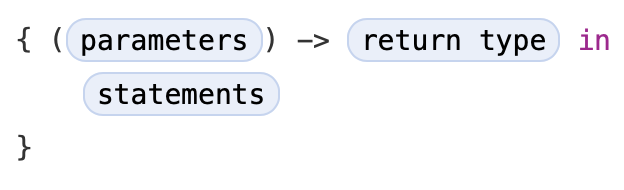

# 클로저 \(Closures\)

<!--
Closures are self-contained blocks of functionality that can be passed around and used in your code. Closures in Swift are similar to blocks in C and Objective-C and to lambdas in other programming languages.

Closures can capture and store references to any constants and variables from the context in which they’re defined. This is known as closing over those constants and variables. Swift handles all of the memory management of capturing for you.
-->

_클로저 \(Closures\)_ 는 코드에서 주변에 전달과 사용할 수 있는 자체 포함된 기능 블럭입니다. 다른 프로그래밍 언어에선 Swift의 클로저는 C와 Objective-C의 블럭과 람다와 유사합니다.

클로저는 정의된 컨텍스트에서 모든 상수와 변수에 대한 참조를 캡처하고 저장할 수 있습니다. 이러한 상수와 변수를 _폐쇄 \(closing over\)_ 라고 합니다. Swift는 캡처의 모든 메모리 관리를 처리합니다.

<!--
NOTE
Don’t worry if you aren’t familiar with the concept of capturing. It’s explained in detail below in Capturing Values.
-->

> NOTE  
> 캡처에 대한 개념이 생소하더라도 걱정하지 마십시오. 아래 [캡처값 \(Capturing Values\)](closures.md#capturing-values) 에서 자세히 다루도록 하겠습니다.

<!--
Global and nested functions, as introduced in Functions, are actually special cases of closures. Closures take one of three forms:

* Global functions are closures that have a name and don’t capture any values.
* Nested functions are closures that have a name and can capture values from their enclosing function.
* Closure expressions are unnamed closures written in a lightweight syntax that can capture values from their surrounding context.

Swift’s closure expressions have a clean, clear style, with optimizations that encourage brief, clutter-free syntax in common scenarios. These optimizations include:

* Inferring parameter and return value types from context
* Implicit returns from single-expression closures
* Shorthand argument names
* Trailing closure syntax
-->

[함수 \(Functions\)](functions.md) 에서 소개한 전역과 중첩 함수는 클로저의 특별한 케이스 입니다. 클로저는 3가지 형태 중 하나를 취합니다:

* 전역 함수는 이름을 가지고 어떠한 값도 캡처하지 않는 클로저입니다.
* 중첩 함수는 이름을 가지고 둘러싼 함수로 부터 값을 캡처할 수 있는 클로저입니다.
* 클로저 표현식은 주변 컨텍스트에서 값을 캡처할 수 있는 경량 구문으로 작성된 이름이 없는 클로저입니다.

Swift의 클로저 표현식은 일반 시나리오에서 간단하고 깔끔한 구문을 장려하는 최적화를 통해 깔끔하고 명확한 스타일을 가지고 있습니다. 이러한 최적화에는 다음이 포함됩니다:

* 컨텍스트에서 파라미터와 반환값 타입 유추
* 단일 표현식 클로저의 암시적 반환
* 약식 인수 이름
* 후행 클로저 구문

## 클로저 표현식 \(Closure Expressions\)

<!--
Nested functions, as introduced in Nested Functions, are a convenient means of naming and defining self-contained blocks of code as part of a larger function. However, it’s sometimes useful to write shorter versions of function-like constructs without a full declaration and name. This is particularly true when you work with functions or methods that take functions as one or more of their arguments.

Closure expressions are a way to write inline closures in a brief, focused syntax. Closure expressions provide several syntax optimizations for writing closures in a shortened form without loss of clarity or intent. The closure expression examples below illustrate these optimizations by refining a single example of the sorted(by:) method over several iterations, each of which expresses the same functionality in a more succinct way.
-->

[중첩 함수 \(Nested Functions\)](functions.md#nested-functions) 에서 소개된 중첩 함수는 더 큰 함수에 부분으로 자체 포함된 코드 블럭의 이름을 지정하고 정의하기 편리한 수단입니다. 그러나 완전한 선언과 이름없이 함수와 유사한 구조의 짧은 버전을 작성하는 것이 때때로 유용합니다. 함수를 하나 이상의 인수로 사용하는 함수 또는 메서드로 작업할 때 특히 그렇습니다.

_클로저 표현식 \(Closure expressions\)_ 은 간단하고 집중적인 구문으로 인라인 클로저로 작성하는 방법입니다. 클로저 표현식은 명확성이나 의도를 잃지 않고 짧은 형태로 클로저를 작성 하기위한 몇가지 구문 최적화를 제공합니다. 아래의 클로저 표현식 예제는 여러 반복에 걸쳐 `sorted(by:)` 메서드의 단일 예제를 구체화하는 최적화를 나타냅니다. 각 예제는 동일한 기능을 보다 간결한 방식으로 표현합니다.

### 정렬 메서드 \(The Sorted Method\)

<!--
Swift’s standard library provides a method called sorted(by:), which sorts an array of values of a known type, based on the output of a sorting closure that you provide. Once it completes the sorting process, the sorted(by:) method returns a new array of the same type and size as the old one, with its elements in the correct sorted order. The original array isn’t modified by the sorted(by:) method.

The closure expression examples below use the sorted(by:) method to sort an array of String values in reverse alphabetical order. Here’s the initial array to be sorted:
-->

Swift의 표준 라이브러리는 사용자가 제공하는 정렬 클로저의 출력을 기반으로 알려진 타입의 값 배열을 정렬하는 `sorted(by:)` 라는 메서드를 제공합니다. 정렬 프로세스가 완료되면 `sorted(by:)` 메서드는 원본 배열과 같은 타입과 같은 크기의 올바르게 정렬된 요소의 새로운 배열로 반환합니다. 기존 배열은 `sorted(by:)` 메서드로 수정되지 않습니다.

아래 예제의 클로저 표현식은 알파벳 역순으로 `String` 값의 배열을 정렬하기 위해 `sorted(by:)` 메서드를 사용합니다. 다음은 정렬하기 위한 초기화 배열입니다:

```swift
let names = ["Chris", "Alex", "Ewa", "Barry", "Daniella"]
```

<!--
The sorted(by:) method accepts a closure that takes two arguments of the same type as the array’s contents, and returns a Bool value to say whether the first value should appear before or after the second value once the values are sorted. The sorting closure needs to return true if the first value should appear before the second value, and false otherwise.

This example is sorting an array of String values, and so the sorting closure needs to be a function of type (String, String) -> Bool.

One way to provide the sorting closure is to write a normal function of the correct type, and to pass it in as an argument to the sorted(by:) method:
-->

`sorted(by:)` 메서드는 배열 내용과 동일한 타입의 두 인수를 사용하는 클로저를 허용하고 값이 정렬된 후 첫번째 값이 두번째 값의 앞 또는 뒤에 표시되어야 하는지 여부를 나타내는 `Bool` 값을 반환합니다. 정렬 클로저는 첫번째 값이 두번째 값 앞에 나타나야 하는 경우 `true` 를 반환하고 그렇지 않으면 `false` 를 반환해야 합니다.

이 예제는 `String` 값의 배열을 정렬하고 정렬 클로저는 `(String, String) -> Bool` 타입의 함수를 필요로 합니다.

정렬 클로저를 제공하는 한가지 방법은 올바른 타입의 일반 함수를 작성하고 `sorted(by:)` 메서드에 인수로 전달하는 것입니다:

```swift
func backward(_ s1: String, _ s2: String) -> Bool {
    return s1 > s2
}
var reversedNames = names.sorted(by: backward)
// reversedNames is equal to ["Ewa", "Daniella", "Chris", "Barry", "Alex"]
```

<!--
If the first string (s1) is greater than the second string (s2), the backward(_:_:) function will return true, indicating that s1 should appear before s2 in the sorted array. For characters in strings, “greater than” means “appears later in the alphabet than”. This means that the letter "B" is “greater than” the letter "A", and the string "Tom" is greater than the string "Tim". This gives a reverse alphabetical sort, with "Barry" being placed before "Alex", and so on.

However, this is a rather long-winded way to write what is essentially a single-expression function (a > b). In this example, it would be preferable to write the sorting closure inline, using closure expression syntax.
-->

첫번째 문자열 \(`s1`\)이 두번째 문자열 \(`s2`\)보다 크다면 `backward(_:_:)` 함수는 `true` 를 반환하고 이것은 정렬된 배열에 `s1` 은 `s2` 전에 나타납니다. 문자열의 문자가 "더 크다"는 "알파벳 순으로 더 뒤에 나타난다"는 의미입니다. 이것은 문자 `B` 는 문자 `A` 보다 "더 크다"이고 문자열 `"Tom"` 은 문자열 `"Tim"` 보다 더 큽니다. 알파벳 역순으로 정렬될 때 `"Barry"` 는 `"Alex"` 보다 앞에 위치합니다.

그러나 이것은 본질적으로 단일 표현식 함수 \(`a > b`\)를 작성하는 다소 긴 방식입니다. 이 예제에서는 클로저 표현식 구문을 사용하여 정렬 클로저를 인라인으로 작성하는 것이 좋습니다.

### 클로저 표현구 \(Closure Expression Syntax\)

<!--
Closure expression syntax has the following general form:
-->

클로저 표현구는 아래와 같이 일반적인 형태를 가지고 있습니다:



<!--
The parameters in closure expression syntax can be in-out parameters, but they can’t have a default value. Variadic parameters can be used if you name the variadic parameter. Tuples can also be used as parameter types and return types.

The example below shows a closure expression version of the backward(_:_:) function from above:
-->

클로저 표현구의 _파라미터_ 는 in-out 파라미터 일 수 있지만 기본값을 가질 수 없습니다. 가변 파라미터의 이름을 지정하면 가변 파라미터를 사용할 수 있습니다. 튜플은 파라미터 타입과 반환 타입으로 사용될 수도 있습니다.

아래 예제는 위에서 `backward(_:_:)` 함수의 클로저 표현 버전입니다:

```swift
reversedNames = names.sorted(by: { (s1: String, s2: String) -> Bool in
    return s1 > s2
})
```

<!--
Note that the declaration of parameters and return type for this inline closure is identical to the declaration from the backward(_:_:) function. In both cases, it’s written as (s1: String, s2: String) -> Bool. However, for the inline closure expression, the parameters and return type are written inside the curly braces, not outside of them.

The start of the closure’s body is introduced by the in keyword. This keyword indicates that the definition of the closure’s parameters and return type has finished, and the body of the closure is about to begin.

Because the body of the closure is so short, it can even be written on a single line:
-->

이 인라인 클로저를 위한 파라미터와 반환 타입의 선언은 `backward(_:_:)` 함수에서 선언한 것과 동일합니다. 두 경우 모두 `(s1: String, s2: String) -> Bool` 로 작성합니다. 그러나 인라인 클로저 표현식을 위한 파라미터와 반환 타입은 중괄호 바깥이 아닌 _안에_ 작성합니다.

클로저의 본문의 시작은 `in` 키워드로 시작합니다. 이 키워드는 클로저의 파라미터와 리턴 타입 정의가 끝남을 나타내며 클로저의 본문이 시작함을 나타냅니다.

클로저의 본문이 너무 짧기 때문에 한줄로 작성할 수 있습니다:

```swift
reversedNames = names.sorted(by: { (s1: String, s2: String) -> Bool in return s1 > s2 } )
```

<!--
This illustrates that the overall call to the sorted(by:) method has remained the same. A pair of parentheses still wrap the entire argument for the method. However, that argument is now an inline closure.
-->

이것은 `sorted(by:)` 메서드에 대한 전체 호출이 동일하게 유지되었음을 보여줍니다. 소괄호는 여전히 메서드의 전체 인수를 둘러싸고 있습니다. 그러나 인수는 이제 인라인 클로저입니다.

### 컨텍스트로 타입 유추 \(Inferring Type From Context\)

<!--
Because the sorting closure is passed as an argument to a method, Swift can infer the types of its parameters and the type of the value it returns. The sorted(by:) method is being called on an array of strings, so its argument must be a function of type (String, String) -> Bool. This means that the (String, String) and Bool types don’t need to be written as part of the closure expression’s definition. Because all of the types can be inferred, the return arrow (->) and the parentheses around the names of the parameters can also be omitted:
-->

정렬 클로저는 메서드에 인수로 전달되기 때문에 Swift는 파라미터 타입과 반환되는 값의 타입을 유추할 수 있습니다. `sorted(by:)` 메서드는 문자열 배열에서 호출되므로 인수는 `(String, String) -> Bool` 타입의 함수이어야 합니다. 이는 `(String, String)` 과 `Bool` 타입을 클로저 표현식 정의에 일부러 작성할 필요가 없음을 의미합니다. 모든 타입은 유추할 수 있기 때문에 반환 화살표 \(`->`\)와 파라미터의 이름을 둘러싼 소괄호를 생략할 수 있습니다:

```swift
reversedNames = names.sorted(by: { s1, s2 in return s1 > s2 } )
```

<!--
It’s always possible to infer the parameter types and return type when passing a closure to a function or method as an inline closure expression. As a result, you never need to write an inline closure in its fullest form when the closure is used as a function or method argument.

Nonetheless, you can still make the types explicit if you wish, and doing so is encouraged if it avoids ambiguity for readers of your code. In the case of the sorted(by:) method, the purpose of the closure is clear from the fact that sorting is taking place, and it’s safe for a reader to assume that the closure is likely to be working with String values, because it’s assisting with the sorting of an array of strings.
-->

함수나 메서드에 클로저를 인라인 클로저 표현식으로 전달할 때 항상 파라미터 타입과 반환 타입을 유추할 수 있습니다. 결과적으로 클로저가 함수 또는 메서드 인수로 사용될 때 완전한 형태로 인라인 클로저를 작성할 필요가 없습니다.

그럼에도 불구하고 원하는 경우 타입을 명시적으로 만들 수 있으며 코드를 읽는 자가 모호성을 피할 수 있다면 그렇게 하는 것이 좋습니다. `sorted(by:)` 메서드의 경우 정렬이 발생한다는 사실에서 클로저의 목적이 명확하며 문자열 배열의 정렬을 지원하기 때문에 코드를 읽는 사람이 클로저가 `String` 값으로 작동할 가능성이 있다고 가정하는 것이 안전합니다.

### 단일 표현 클로저의 암시적 반환 \(Implicit Returns from Single-Expression Closures\)

<!--
Single-expression closures can implicitly return the result of their single expression by omitting the return keyword from their declaration, as in this version of the previous example:
-->

단일 표현 클로저 \(Single-expression closures\)는 이전 예제에서 `return` 키워드를 생략하여 단일 표현식으로 암시적으로 값을 반환할 수 있습니다:

```swift
reversedNames = names.sorted(by: { s1, s2 in s1 > s2 } )
```

<!--
Here, the function type of the sorted(by:) method’s argument makes it clear that a Bool value must be returned by the closure. Because the closure’s body contains a single expression (s1 > s2) that returns a Bool value, there’s no ambiguity, and the return keyword can be omitted.
-->

여기서 `sorted(by:)` 메서드의 인수의 함수 타입은 클로저에서 `Bool` 값이 반환되어야 하기 때문에 명확합니다. 클로저의 본문에 `Bool` 값을 반환하는 단일 표현식 \(`s1 > s2`\)가 포함되므로 모호하지 않고 `return` 키워드를 생략할 수 있습니다.

### 짧은 인수 이름 \(Shorthand Argument Names\)

<!--
Swift automatically provides shorthand argument names to inline closures, which can be used to refer to the values of the closure’s arguments by the names $0, $1, $2, and so on.

If you use these shorthand argument names within your closure expression, you can omit the closure’s argument list from its definition. The type of the shorthand argument names is inferred from the expected function type, and the highest numbered shorthand argument you use determines the number of arguments that the closure takes. The in keyword can also be omitted, because the closure expression is made up entirely of its body:
-->

Swift는 인라인 클로저에 `$0`, `$1`, `$2` 등 클로저의 인수값으로 참조하는데 사용할 수 있는 자동적으로 짧은 인수 이름 \(shorthand argument names\)을 제공합니다.

클로저 표현식에 이런 짧은 인수 이름을 사용한다면 선언에 클로저의 인수 목록을 생략할 수 있고 짧은 인수 이름의 수와 타입은 함수 타입에서 유추됩니다. 클로저 표현식이 본문으로 전체가 구성되기 때문에 `in` 키워드를 생략할 수도 있습니다:

```swift
reversedNames = names.sorted(by: { $0 > $1 } )
```

<!--
Here, $0 and $1 refer to the closure’s first and second String arguments. Because $1 is the shorthand argument with highest number, the closure is understood to take two arguments. Because the sorted(by:) function here expects a closure whose arguments are both strings, the shorthand arguments $0 and $1 are both of type String.
-->

여기서 `$0` 와 `$1` 은 클로저의 첫번째와 두번째 `String` 인수를 참조합니다. `$1` 이 짧은 인수에서 가장 높은 숫자이므로 클로저는 2개의 인수가 있다고 이해합니다. 여기서 `sorted(by:)` 함수는 인수가 모두 문자열인 클로저로 기대하므로 짧은 인수 `$0` 과 `$1` 은 모두 타입 `String` 입니다.

### 연산자 메서드 \(Operator Methods\)

<!--
There’s actually an even shorter way to write the closure expression above. Swift’s String type defines its string-specific implementation of the greater-than operator (>) as a method that has two parameters of type String, and returns a value of type Bool. This exactly matches the method type needed by the sorted(by:) method. Therefore, you can simply pass in the greater-than operator, and Swift will infer that you want to use its string-specific implementation:
-->

실제로 위의 클로저 표현식을 _더 짧게_ 작성하는 방법이 있습니다. Swift의 `String` 타입은 보다 큰 연산자 \(`>`\)의 문자열 별 구현을 `String` 타입의 파라미터 2개가 있는 메서드로 정의하고 `Bool` 타입의 값을 반환합니다. 이것은 `sorted(by:)` 메서드에 필요한 메서드 타입과 정확하게 일치합니다. 따라서 간단하게 보다 큰 연산자를 전달할 수 있고 Swift는 문자열 특정 구현을 사용하기 원한다고 유추합니다:

```swift
reversedNames = names.sorted(by: >)
```

<!--
For more about operator methods, see Operator Methods.
-->

자세한 내용은 [연산자 메서드 \(Operator Methods\)](advanced-operators.md#operator-methods) 를 참고 바랍니다.

## 후행 클로저 \(Trailing Closures\)

<!--
If you need to pass a closure expression to a function as the function’s final argument and the closure expression is long, it can be useful to write it as a trailing closure instead. You write a trailing closure after the function call’s parentheses, even though the trailing closure is still an argument to the function. When you use the trailing closure syntax, you don’t write the argument label for the first closure as part of the function call. A function call can include multiple trailing closures; however, the first few examples below use a single trailing closure.
-->

함수의 마지막 인수로 함수에 클로저 표현식을 전달해야하고 클로저 표현식이 긴 경우 _후행 클로저 \(trailing closure\)_ 로 작성하는 것이 유용할 수 있습니다. 후행 클로저는 함수의 인수이지만 함수 호출의 소괄호 다음에 작성합니다. 후행 클로저 구문을 사용할 때 함수 호출의 일부로 첫번째 클로저 인수 라벨을 작성하지 않아도 됩니다. 함수 호출은 여러개의 후행 클로저를 포함할 수 있지만 아래 몇가지 예제에서는 단일 후행 클로저를 사용합니다.

```swift
func someFunctionThatTakesAClosure(closure: () -> Void) {
    // function body goes here
}

// Here's how you call this function without using a trailing closure:

someFunctionThatTakesAClosure(closure: {
    // closure's body goes here
})

// Here's how you call this function with a trailing closure instead:

someFunctionThatTakesAClosure() {
    // trailing closure's body goes here
}
```

<!--
The string-sorting closure from the Closure Expression Syntax section above can be written outside of the sorted(by:) method’s parentheses as a trailing closure:
-->

위의 [클로저 표현구 \(Closure Expression Syntax\)](closures.md#closure-expression-syntax) 섹션에 문자열 정렬 클로저는 후행 클로저로 `sorted(by:)` 메서드의 소괄호 바깥에 작성될 수 있습니다:

```swift
reversedNames = names.sorted() { $0 > $1 }
```

<!--
If a closure expression is provided as the function’s or method’s only argument and you provide that expression as a trailing closure, you don’t need to write a pair of parentheses () after the function or method’s name when you call the function:
-->

후행 클로저로 표현식이 함수와 메서드의 유일한 인수일 경우 함수를 호출할 때 함수 또는 메서드 이름 뒤에 소괄호 `()` 를 작성하지 않아도 됩니다:

```swift
reversedNames = names.sorted { $0 > $1 }
```

<!--
Trailing closures are most useful when the closure is sufficiently long that it isn’t possible to write it inline on a single line. As an example, Swift’s Array type has a map(_:) method, which takes a closure expression as its single argument. The closure is called once for each item in the array, and returns an alternative mapped value (possibly of some other type) for that item. You specify the nature of the mapping and the type of the returned value by writing code in the closure that you pass to map(_:).

After applying the provided closure to each array element, the map(_:) method returns a new array containing all of the new mapped values, in the same order as their corresponding values in the original array.

Here’s how you can use the map(_:) method with a trailing closure to convert an array of Int values into an array of String values. The array [16, 58, 510] is used to create the new array ["OneSix", "FiveEight", "FiveOneZero"]:
-->

후행 클로저는 클로저가 길어서 한줄로 인라인으로 작성이 불가능할 때 유용합니다. 예를 들어 Swift의 `Array` 타입은 단일 인수로 클로저 표현식을 가지는 `map(_:)` 메서드가 있습니다. 이 클로저는 배열의 각 아이템에 대해 한번 호출되고 아이템에 대해 매핑된 대체값 \(다른 타입일 수 있음\)이 반환됩니다. `map(_:)` 에 전달한 클로저에 작성된 코드에 따라 매핑 특성과 반환된 값의 타입을 지정합니다.

제공된 클로저에 각 배열의 요소를 적용한 후에 `map(_:)` 메서드는 기존 배열에 해당값과 같은 순서로 새로 매핑된 값의 새로운 배열을 반환합니다.

다음은 `Int` 값의 배열을 `String` 값의 배열로 변환하기 위해 후행 클로저와 `map(_:)` 메서드를 어떻게 사용하는지 나타냅니다. 배열 `[16, 58, 510]` 은 새로운 배열 `["OneSix", "FiveEight", "FiveOneZero"]` 을 생성하는데 사용됩니다:

```swift
let digitNames = [
    0: "Zero", 1: "One", 2: "Two",   3: "Three", 4: "Four",
    5: "Five", 6: "Six", 7: "Seven", 8: "Eight", 9: "Nine"
]
let numbers = [16, 58, 510]
```

<!--
The code above creates a dictionary of mappings between the integer digits and English-language versions of their names. It also defines an array of integers, ready to be converted into strings.

You can now use the numbers array to create an array of String values, by passing a closure expression to the array’s map(_:) method as a trailing closure:
-->

위 코드는 정수와 그 정수에 맞는 영어 표기를 매핑하는 딕셔너리를 생성합니다. 문자열로 변환하기 위한 정수의 배열도 정의합니다.

`number` 배열을 사용하여 후행 클로저로 `map(_:)` 메서드로 클로저 표현식을 전달하여 `String` 값의 배열을 생성할 수 있습니다:

```swift
let strings = numbers.map { (number) -> String in
    var number = number
    var output = ""
    repeat {
        output = digitNames[number % 10]! + output
        number /= 10
    } while number > 0
    return output
}
// strings is inferred to be of type [String]
// its value is ["OneSix", "FiveEight", "FiveOneZero"]
```

<!--
The map(_:) method calls the closure expression once for each item in the array. You don’t need to specify the type of the closure’s input parameter, number, because the type can be inferred from the values in the array to be mapped.

In this example, the variable number is initialized with the value of the closure’s number parameter, so that the value can be modified within the closure body. (The parameters to functions and closures are always constants.) The closure expression also specifies a return type of String, to indicate the type that will be stored in the mapped output array.

The closure expression builds a string called output each time it’s called. It calculates the last digit of number by using the remainder operator (number % 10), and uses this digit to look up an appropriate string in the digitNames dictionary. The closure can be used to create a string representation of any integer greater than zero.
-->

`map(_:)` 메서드는 배열에 각 아이템을 위해 클로저 표현식을 호출합니다. 매핑할 배열의 값에서 유추할 수 있으므로 클로저의 입력 파라미터 인 `number` 타입을 지정할 필요가 없습니다.

이 예에서 변수 `number` 는 클로저의 `number` 파라미터의 값으로 초기화되기 때문에 값은 클로저 본문 내에서 수정될 수 있습니다 \(함수와 클로저의 파라미터는 항상 상수입니다\). 클로저 표현식은 출력 매핑된 출력 배열에 저장될 타입을 나타내기 위해 `String` 타입도 반환 타입으로 지정합니다.

클로저 표현식은 호출될 때마다 `output` 이라는 문자열을 만듭니다. 나머지 연산자 \(`number % 10`\)를 이용하여 `number` 의 마지막 숫자를 계산하고 `digitNames` 딕셔너리에 적절한 숫자 문자열을 찾습니다. 클로저는 0보다 큰 정수에 대한 문자열 표현을 생성하는데 사용할 수 있습니다.

<!--
NOTE
The call to the digitNames dictionary’s subscript is followed by an exclamation point (!), because dictionary subscripts return an optional value to indicate that the dictionary lookup can fail if the key doesn’t exist. In the example above, it’s guaranteed that number % 10 will always be a valid subscript key for the digitNames dictionary, and so an exclamation point is used to force-unwrap the String value stored in the subscript’s optional return value.
-->

> NOTE  
> 딕셔너리 서브 스크립트는 키가 존재하지 않는경우에 값을 찾는 것을 실패하기 위해 옵셔널 값을 반환합니다. 그래서 `digitNames` 딕셔너리의 서브 스크립트를 호출할 때는 느낌표를 붙여 줍니다 \(`!`\). 위의 예제에서 `digitNames` 딕셔너리에 `number % 10` 은 항상 유효한 서브 스크립트 키를 보장하므로 느낌표는 서브 스크립트의 옵셔널 반환 값에 저장된 `String` 값을 강제로 언래핑 하는데 사용됩니다.

<!--
The string retrieved from the digitNames dictionary is added to the front of output, effectively building a string version of the number in reverse. (The expression number % 10 gives a value of 6 for 16, 8 for 58, and 0 for 510.)

The number variable is then divided by 10. Because it’s an integer, it’s rounded down during the division, so 16 becomes 1, 58 becomes 5, and 510 becomes 51.

The process is repeated until number is equal to 0, at which point the output string is returned by the closure, and is added to the output array by the map(_:) method.

The use of trailing closure syntax in the example above neatly encapsulates the closure’s functionality immediately after the function that closure supports, without needing to wrap the entire closure within the map(_:) method’s outer parentheses.

If a function takes multiple closures, you omit the argument label for the first trailing closure and you label the remaining trailing closures. For example, the function below loads a picture for a photo gallery:
-->

`digitNames` 딕셔너리에서 반환된 문자열이 `output` _앞에_ 추가되어 숫자의 문자열 버전을 역순으로 효과적으로 빌드합니다 \(표현식 `number % 10` 은 `16` 의 경우 `6`, `58` 의 경우 `8`, `510` 의 경우 `0` 을 제공합니다\).

그러면 `number` 변수는 `10` 으로 나누어 집니다. 이것은 정수이기 때문에 나누면 버림이 되고 `16` 은 `1`, `58` 은 `5`, `510` 은 `51` 이 됩니다.

이 프로세스는 `number` 가 `0` 이 될때까지 반복하고 그 때 `output` 문자열은 클로저로 부터 반환되고 `map(_:)` 메서드로 부터 출력 배열에 추가됩니다.

위의 예에서 후행 클로저 구문을 사용하면 클로저가 지원하는 함수 바로 뒤에 있는 클로저의 기능을 깔끔하게 캡슐화 합니다. 전체 클로저를 `map(_:)` 메서드의 바깥 소괄호로 감쌀 필요가 없습니다.

함수가 여러개의 클로저를 가지고 있다면 첫번재 후행 클로저의 인수 라벨을 생략하고 남은 후행 클로저의 라벨은 표기합니다. 예를 들어 아래의 함수는 사진 갤러리에서 사진 하나를 불러옵니다:

```swift
func loadPicture(from server: Server, completion: (Picture) -> Void, onFailure: () -> Void) {
    if let picture = download("photo.jpg", from: server) {
        completion(picture)
    } else {
        onFailure()
    }
}
```

<!--
When you call this function to load a picture, you provide two closures. The first closure is a completion handler that displays a picture after a successful download. The second closure is an error handler that displays an error to the user.
-->

하나의 사진을 불러오기 위해 이 함수를 호출할 때 2개의 클로저를 제공합니다. 첫번째 클로저는 사진 다운로드 완료후에 디스플레이 하는 완료 처리입니다. 두번째 클로저는 오류를 표시하는 오류 처리기 입니다.

```swift
loadPicture(from: someServer) { picture in
    someView.currentPicture = picture
} onFailure: {
    print("Couldn't download the next picture.")
}
```

<!--
In this example, the loadPicture(from:completion:onFailure:) function dispatches its network task into the background, and calls one of the two completion handlers when the network task finishes. Writing the function this way lets you cleanly separate the code that’s responsible for handling a network failure from the code that updates the user interface after a successful download, instead of using just one closure that handles both circumstances.
-->

이 예제에서 `loadPicture(from:completion:onFailure:)` 함수는 네트워크 작업을 백그라운드로 전달하고 네트워크 작업이 완료되면 두 완료 처리기 중 하나를 호출합니다. 이러한 방식으로 함수를 작성하면 두 상황을 모두 처리하는 하나의 클로저를 사용하는 대신 성공적인 다운로드 후 사용자 인터페이스를 업데이트 하는 코드에서 네트워크 오류를 처리하는 코드를 명확하게 분리할 수 있습니다.

<!--
NOTE
Completion handlers can become hard to read, especially when you have to nest multiple handlers. An alternate approach is to use asynchronous code, as described in Concurrency.
-->

> NOTE
> 완료 핸들러 \(Completion handlers\) 는 특히 여러 핸들러가 중첩되어 있으면 읽기 어려울 수 있습니다. 이것을 대체하기 위해선 [동시성 \(Concurrency\)](concurrency.md) 에서 설명되어진 것과 같이 비동기 코드를 사용하면 됩니다.

## 캡처값 \(Capturing Values\)

<!--
A closure can capture constants and variables from the surrounding context in which it’s defined. The closure can then refer to and modify the values of those constants and variables from within its body, even if the original scope that defined the constants and variables no longer exists.

In Swift, the simplest form of a closure that can capture values is a nested function, written within the body of another function. A nested function can capture any of its outer function’s arguments and can also capture any constants and variables defined within the outer function.

Here’s an example of a function called makeIncrementer, which contains a nested function called incrementer. The nested incrementer() function captures two values, runningTotal and amount, from its surrounding context. After capturing these values, incrementer is returned by makeIncrementer as a closure that increments runningTotal by amount each time it’s called.
-->

클로저는 정의된 둘러싸인 컨텍스트에서 상수와 변수를 _캡처 \(capture\)_ 할 수 있습니다. 그러면 클로저는 상수와 변수를 정의한 원래 범위가 더이상 존재하지 않더라도 본문 내에서 해당 상수와 변수의 값을 참조하고 수정할 수 있습니다.

Swift에서 값을 캡처할 수 있는 가장 간단한 클로저 형태는 다른 함수의 본문 내에 작성하는 중첩 함수입니다. 중첩 함수는 바깥 함수의 어떠한 인수도 캡처할 수 있고 바깥 함수 내에 정의된 상수와 변수를 캡처할 수도 있습니다.

아래는 `incrementer` 라는 중첩 함수가 포함된 `makeIncrementer` 라는 함수의 예입니다. 중첩된 `incrementer()` 함수는 둘러싸인 컨텍스트에 `runningTotal` 과 `amount` 인 2개의 값을 캡처합니다. 이 값을 캡처한 후에 `incrementer` 는 호출될 때마다 `amount` 로 `runningTotal` 을 증가시키는 클로저로 `makeIncrementer` 에 의해 반환됩니다.

```swift
func makeIncrementer(forIncrement amount: Int) -> () -> Int {
    var runningTotal = 0
    func incrementer() -> Int {
        runningTotal += amount
        return runningTotal
    }
    return incrementer
}
```

<!--
The return type of makeIncrementer is () -> Int. This means that it returns a function, rather than a simple value. The function it returns has no parameters, and returns an Int value each time it’s called. To learn how functions can return other functions, see Function Types as Return Types.

The makeIncrementer(forIncrement:) function defines an integer variable called runningTotal, to store the current running total of the incrementer that will be returned. This variable is initialized with a value of 0.

The makeIncrementer(forIncrement:) function has a single Int parameter with an argument label of forIncrement, and a parameter name of amount. The argument value passed to this parameter specifies how much runningTotal should be incremented by each time the returned incrementer function is called. The makeIncrementer function defines a nested function called incrementer, which performs the actual incrementing. This function simply adds amount to runningTotal, and returns the result.

When considered in isolation, the nested incrementer() function might seem unusual:
-->

`makeIncrementer` 의 반환 타입은 `() -> Int` 입니다. 이것은 단순한 값이 아닌 _함수_ 를 반환한다는 의미입니다. 반환하는 함수에는 파라미터가 없으며 호출될 때마다 `Int` 값을 반환합니다. 함수가 다른 함수를 반환하는 방법을 알아보려면 [반환 타입으로의 함수 타입 \(Function Types as Return Types\)](functions.md#function-types-as-return-types) 을 참고 바랍니다.

`makeIncrementer(forIncrement:)` 함수는 반환될 현재 증가분을 저장하기 위해 `runningTotal` 이라는 정수 변수를 정의합니다. 이 변수는 `0` 으로 초기화 됩니다.

`makeIncrementer(forIncrement:)` 함수는 `forIncrement` 의 인수 라벨의 하나의 `Int` 파라미터를 가지고 `amount` 라는 파라미터 이름을 가지고 있습니다. 이 파라미터에 전달된 인수값은 반환된 증가 함수가 호출 될 때마다 `runningTotal` 을 얼마나 증가시켜야 하는지 지정합니다. `makeIncrementer` 함수는 실제 증가를 수행하는 `incrementer` 라는 중첩 함수를 정의합니다. 이 함수는 간단하게 `amount` 를 `runningTotal` 에 더하고 그 결과를 반환합니다.

단독으로 고려할 때 `incrementer()` 함수는 비정상적으로 보일 수 있습니다:

```swift
func incrementer() -> Int {
    runningTotal += amount
    return runningTotal
}
```

<!--
The incrementer() function doesn’t have any parameters, and yet it refers to runningTotal and amount from within its function body. It does this by capturing a reference to runningTotal and amount from the surrounding function and using them within its own function body. Capturing by reference ensures that runningTotal and amount don’t disappear when the call to makeIncrementer ends, and also ensures that runningTotal is available the next time the incrementer function is called.
-->

`incrementer()` 함수는 파라미터가 없으며 함수 본문 내에 `runningTotal` 과 `amount` 를 참조하고 있습니다. 둘러싸인 함수에 `runningTotal` 과 `amount` 대한 _참조 \(reference\)_ 를 캡처하고 함수 내에서 사용합니다. 참조를 캡처하는 것은 `makeIncrementer` 호출이 종료될 때 `runningTotal` 과 `amount` 가 사라지지 않고 다음에 `incrementer` 함수가 호출될 때 `runningTotal` 을 사용할 수 있습니다.

<!--
NOTE
As an optimization, Swift may instead capture and store a copy of a value if that value isn’t mutated by a closure, and if the value isn’t mutated after the closure is created.

Swift also handles all memory management involved in disposing of variables when they’re no longer needed.
-->

> NOTE  
> 최적화로 Swift는 값이 클로저에 의해 변경되지 않고 클로저가 생성된 후 값이 변경되지 않는 경우 값의 복사본을 캡처하고 저장할 수 있습니다.
>
> Swift는 더이상 필요하지 않을때 변수를 처리하는 것과 관련된 모든 메모리 관리도 처리합니다.

<!--
Here’s an example of makeIncrementer in action:
-->

다음은 `makeIncrementer` 수행에 대한 예입니다:

```swift
let incrementByTen = makeIncrementer(forIncrement: 10)
```

<!--
This example sets a constant called incrementByTen to refer to an incrementer function that adds 10 to its runningTotal variable each time it’s called. Calling the function multiple times shows this behavior in action:
-->

이 예제에서는 호출될 때마다 `runningTotal` 변수에 `10` 을 더하는 증가 함수를 참조하도록 `incrementByTen` 이라는 상수를 설정합니다. 함수를 여러번 호출하면 이 동작이 수행되는 동작을 보여줍니다:

```swift
incrementByTen()
// returns a value of 10
incrementByTen()
// returns a value of 20
incrementByTen()
// returns a value of 30
```

<!--
If you create a second incrementer, it will have its own stored reference to a new, separate runningTotal variable:
-->

두번째 증가를 생성하면 새로운 분리된 `runningTotal` 변수에 참조 저장됩니다:

```swift
let incrementBySeven = makeIncrementer(forIncrement: 7)
incrementBySeven()
// returns a value of 7
```

<!--
Calling the original incrementer (incrementByTen) again continues to increment its own runningTotal variable, and doesn’t affect the variable captured by incrementBySeven:
-->

기존 증가 \(`incrementByTen`\)을 다시 호출하면 그것의 `runningTotal` 변수는 이어서 증가되고 `incrementBySeven` 으로 캡처된 변수는 영향을 주지 않습니다:

```swift
incrementByTen()
// returns a value of 40
```

<!--
NOTE
If you assign a closure to a property of a class instance, and the closure captures that instance by referring to the instance or its members, you will create a strong reference cycle between the closure and the instance. Swift uses capture lists to break these strong reference cycles. For more information, see Strong Reference Cycles for Closures.
-->

> NOTE  
> 클래스 인스턴스의 프로퍼티에 클로저를 할당하고 클로저가 인스턴스 또는 멤버를 참조하여 해당 인스턴스를 캡처하면 클로저와 인스턴스 사이에 강한 참조 사이클이 생성됩니다. Swift는 캡처 목록을 사용하여 이러한 강한 참조 사이클을 깨뜨립니다. 자세한 내용은 [클로저의 강한 참조 사이클 \(Strong Reference Cycles for Closures\)](automatic-reference-counting.md#strong-reference-cycles-for-closures) 을 참고 바랍니다.

## 클로저는 참조 타입 \(Closures Are Reference Types\)

<!--
In the example above, incrementBySeven and incrementByTen are constants, but the closures these constants refer to are still able to increment the runningTotal variables that they have captured. This is because functions and closures are reference types.

Whenever you assign a function or a closure to a constant or a variable, you are actually setting that constant or variable to be a reference to the function or closure. In the example above, it’s the choice of closure that incrementByTen refers to that’s constant, and not the contents of the closure itself.

This also means that if you assign a closure to two different constants or variables, both of those constants or variables refer to the same closure.
-->

위 예제에서 `incrementBySeven` 과 `incrementByTen` 은 상수이지만 이러한 상수가 참조하는 클로저는 캡처한 `runningTotal` 변수를 계속 증가시킬 수 있습니다. 이는 함수와 클로저가 _참조 타입 \(reference types\)_ 이기 때문입니다.

함수 또는 클로저를 상수 또는 변수에 할당할 때마다 실제로 해당 상수 또는 변수를 함수 또는 클로저에 대한 _참조_ 로 설정합니다. 위의 예에서 `incrementByTen` 은 클로저 자체의 내용이 아니라 상수를 가리키는 클로저 선택입니다.

이것은 또한 서로 다른 2개의 상수 또는 변수에 클로저를 할당한다면 2개의 상수 또는 변수는 모두 같은 클로저를 참조한다는 의미입니다.

```swift
let alsoIncrementByTen = incrementByTen
alsoIncrementByTen()
// returns a value of 50

incrementByTen()
// returns a value of 60
```

<!--
The example above shows that calling alsoIncrementByTen is the same as calling incrementByTen. Because both of them refer to the same closure, they both increment and return the same running total.
-->

위의 예제는 `alsoIncrementByTen` 호출은 `incrementByTen` 호출과 같음을 보여줍니다. 2개 모두 같은 클로저를 참조하기 때문에 둘다 증가하고 같은 러닝 합계를 반환합니다.

## 이스케이프 클로저 \(Escaping Closures\)

<!--
A closure is said to escape a function when the closure is passed as an argument to the function, but is called after the function returns. When you declare a function that takes a closure as one of its parameters, you can write @escaping before the parameter’s type to indicate that the closure is allowed to escape.

One way that a closure can escape is by being stored in a variable that’s defined outside the function. As an example, many functions that start an asynchronous operation take a closure argument as a completion handler. The function returns after it starts the operation, but the closure isn’t called until the operation is completed—the closure needs to escape, to be called later. For example:
-->

함수에 인수로 클로저를 전달하지만 함수가 반환된 후 호출되는 클로저를 함수를 _탈출 \(escape\)_ 하다 라고 말합니다. 클로저를 파라미터로 갖는 함수를 선언할 때 이 클로저는 탈출을 허락한다는 의미로 파라미터의 타입 전에 `@escaping` 을 작성할 수 있습니다.

클로저가 탈출할 수 있는 한가지 방법은 함수 바깥에 정의된 변수에 저장되는 것입니다. 예를 들어 비동기적 작업을 시작하는 대부분의 함수는 완료 핸들러로 클로저를 사용합니다. 이 함수는 작업을 시작한 후에 반환되지만 작업이 완료될때까지 클로저가 호출되지 않습니다. 클로저는 나중에 호출하려면 탈출해야 합니다. 예를 들어:

```swift
var completionHandlers: [() -> Void] = []
func someFunctionWithEscapingClosure(completionHandler: @escaping () -> Void) {
    completionHandlers.append(completionHandler)
}
```

<!--
The someFunctionWithEscapingClosure(_:) function takes a closure as its argument and adds it to an array that’s declared outside the function. If you didn’t mark the parameter of this function with @escaping, you would get a compile-time error.

An escaping closure that refers to self needs special consideration if self refers to an instance of a class. Capturing self in an escaping closure makes it easy to accidentally create a strong reference cycle. For information about reference cycles, see Automatic Reference Counting.

Normally, a closure captures variables implicitly by using them in the body of the closure, but in this case you need to be explicit. If you want to capture self, write self explicitly when you use it, or include self in the closure’s capture list. Writing self explicitly lets you express your intent, and reminds you to confirm that there isn’t a reference cycle. For example, in the code below, the closure passed to someFunctionWithEscapingClosure(_:) refers to self explicitly. In contrast, the closure passed to someFunctionWithNonescapingClosure(_:) is a nonescaping closure, which means it can refer to self implicitly.
-->

`someFunctionWithEscapingClosure(_:)` 함수는 인수로 클로저를 가지고 있고 함수 바깥에 선언된 배열에 추가합니다. 함수의 파라미터에 `@escaping` 을 표시하지 않으면 컴파일 시 에러가 발생합니다.

`self` 를 참조하는 이스케이프 클로저은 `self` 가 클래스의 인스턴스를 참조하는 경우 특별한 고려가 필요합니다. 이스케이프 클로저에 `self` 캡처는 강한 참조 사이클이 생기기 쉽습니다. 참조 사이클에 대한 자세한 내용은 [자동 참조 카운팅 \(Automatic Reference Counting\)](automatic-reference-counting.md) 을 참조 바랍니다.

일반적으로 클로저는 클로저 내부에서 변수를 사용하여 암시적으로 변수를 캡처하지만 이 경우에는 명시적이어야 합니다. `self` 를 캡처하려면 사용할 때 명시적으로 `self` 를 작성하거나 클로저의 캡처 목록에 `self` 를 포함합니다. `self` 를 명시적으로 작성하는데 의도를 표현하고 참조 사이클이 없음을 확인하도록 상기시켜 줍니다. 예를 들어 아래 코드에서 `someFunctionWithEscapingClosure(_:)` 에 전달된 클로저는 명시적으로 `self` 를 참조합니다. 반대로 `someFunctionWithNonescapingClosure(_:)` 에 전달된 클로저는 비이스케이프 클로저입니다. 즉 암시적으로 `self` 를 참조할 수 있습니다.

```swift
func someFunctionWithNonescapingClosure(closure: () -> Void) {
    closure()
}

class SomeClass {
    var x = 10
    func doSomething() {
        someFunctionWithEscapingClosure { self.x = 100 }
        someFunctionWithNonescapingClosure { x = 200 }
    }
}

let instance = SomeClass()
instance.doSomething()
print(instance.x)
// Prints "200"

completionHandlers.first?()
print(instance.x)
// Prints "100"
```

<!--
Here’s a version of doSomething() that captures self by including it in the closure’s capture list, and then refers to self implicitly:
-->

다음은 클로저의 캡처 목록에 포함하여 `self` 를 캡처하고 암시적으로 `self` 를 참조하는 `doSomething()` 입니다:

```swift
class SomeOtherClass {
    var x = 10
    func doSomething() {
        someFunctionWithEscapingClosure { [self] in x = 100 }
        someFunctionWithNonescapingClosure { x = 200 }
    }
}
```

<!--
If self is an instance of a structure or an enumeration, you can always refer to self implicitly. However, an escaping closure can’t capture a mutable reference to self when self is an instance of a structure or an enumeration. Structures and enumerations don’t allow shared mutability, as discussed in Structures and Enumerations Are Value Types.
-->

`self` 가 구조체 또는 열거형 인스턴스이면 항상 암시적으로 `self` 를 참조할 수 있습니다. 그러나 이스케이프 클로저는 구조 또는 열거 인스턴스이면 `self` 에 대한 변경 가능한 참조를 캡처할 수 없습니다. 구조와 열거는 [구조체와 열거형은 값타입 \(Structures and Enumerations Are Value Types\)](structures-and-classes.md#structures-and-enumerations-are-value-types) 에서 설명 했듯이 공유 변경을 허용하지 않습니다.

```swift
struct SomeStruct {
    var x = 10
    mutating func doSomething() {
        someFunctionWithNonescapingClosure { x = 200 }  // Ok
        someFunctionWithEscapingClosure { x = 100 }     // Error
    }
}
```

<!--
The call to the someFunctionWithEscapingClosure function in the example above is an error because it’s inside a mutating method, so self is mutable. That violates the rule that escaping closures can’t capture a mutable reference to self for structures.
-->

위의 예제에서 `someFunctionWithEscapingClosure` 함수 호출은 변경 가능한 메서드 내부에 있기 때문에 에러이고 `self` 는 변경 가능합니다. 이것은 이스케이프 클로저는 구조체인 `self` 를 변경가능한 참조로 캡처할 수 없다는 규칙을 위반합니다.

## 자동 클로저 \(Autoclosures\)

<!--
An autoclosure is a closure that’s automatically created to wrap an expression that’s being passed as an argument to a function. It doesn’t take any arguments, and when it’s called, it returns the value of the expression that’s wrapped inside of it. This syntactic convenience lets you omit braces around a function’s parameter by writing a normal expression instead of an explicit closure.

It’s common to call functions that take autoclosures, but it’s not common to implement that kind of function. For example, the assert(condition:message:file:line:) function takes an autoclosure for its condition and message parameters; its condition parameter is evaluated only in debug builds and its message parameter is evaluated only if condition is false.

An autoclosure lets you delay evaluation, because the code inside isn’t run until you call the closure. Delaying evaluation is useful for code that has side effects or is computationally expensive, because it lets you control when that code is evaluated. The code below shows how a closure delays evaluation.
-->

_자동 클로저 \(autoclosure\)_ 는 함수에 인수로 전달되는 표현식을 래핑하기 위해 자동으로 생성되는 클로저입니다. 인수를 가지지 않으며 호출될 때 내부에 래핑된 표현식의 값을 반환합니다. 이러한 구문상의 편의를 통해 명시적 클로저 대신에 일반 표현식을 작성하여 함수의 파라미터 주위의 중괄호를 생략할 수 있습니다.

자동 클로저를 가지는 함수를 _호출_ 하는 것은 일반적이지만 이러한 함수를 _구현_ 하는 것은 일반적이지 않습니다. 예를 들어 `assert(condition:message:file:line:)` 함수는 `condition` 과 `message` 파라미터에 대한 자동 클로저를 가집니다. `condition` 파라미터는 오직 디버그 빌드인지 판단하고 `message` 파라미터는 `condition` 이 `false` 인지만 판단됩니다.

클로저가 호출될 때까지 코드 내부 실행이 되지 않기때문에 자동 클로저는 판단을 지연시킬 수 있습니다. 판단 지연은 코드 판단 시기를 제어할 수 있기 때문에 사이드 이펙트가 있거나 계산이 오래 걸리는 코드에 유용합니다. 아래 코드는 클로저가 어떻게 판단을 지연하는지 보여줍니다.

```swift
var customersInLine = ["Chris", "Alex", "Ewa", "Barry", "Daniella"]
print(customersInLine.count)
// Prints "5"

let customerProvider = { customersInLine.remove(at: 0) }
print(customersInLine.count)
// Prints "5"

print("Now serving \(customerProvider())!")
// Prints "Now serving Chris!"
print(customersInLine.count)
// Prints "4"
```

<!--
Even though the first element of the customersInLine array is removed by the code inside the closure, the array element isn’t removed until the closure is actually called. If the closure is never called, the expression inside the closure is never evaluated, which means the array element is never removed. Note that the type of customerProvider isn’t String but () -> String—a function with no parameters that returns a string.

You get the same behavior of delayed evaluation when you pass a closure as an argument to a function.
-->

클로저 내부의 코드에 의해 `customersInLine` 배열의 첫번째 요소는 삭제되지만 클로저가 실제로 호출되기 전까지 삭제되지 않습니다. 클로저가 호출되지 않으면 클러저 내부의 표현식은 판단되지 않습니다. 이것은 배열의 요소가 삭제되지 않는다는 의미입니다. `customerProvider` 타입은 `String` 이 아니고 파라미터가 없고 문자열을 반환하는 `() -> String` 입니다.

함수의 인수로 클로저를 전달하면 위와 같은 지연 판단과 동일한 동작을 가질 수 있습니다.

```swift
// customersInLine is ["Alex", "Ewa", "Barry", "Daniella"]
func serve(customer customerProvider: () -> String) {
    print("Now serving \(customerProvider())!")
}
serve(customer: { customersInLine.remove(at: 0) } )
// Prints "Now serving Alex!"
```

<!--
The serve(customer:) function in the listing above takes an explicit closure that returns a customer’s name. The version of serve(customer:) below performs the same operation but, instead of taking an explicit closure, it takes an autoclosure by marking its parameter’s type with the @autoclosure attribute. Now you can call the function as if it took a String argument instead of a closure. The argument is automatically converted to a closure, because the customerProvider parameter’s type is marked with the @autoclosure attribute.
-->

`serve(customer:)` 함수는 소비자의 이름을 반환하는 명시적 클로저를 가집니다. 아래 `serve(customer:)` 의 버전은 같은 동작을 수행하지만 명시적 클로저를 가지는 대신에 파라미터 타입에 `@autoclosure` 속성을 표기하여 자동 클로저를 가집니다. 이제 클로저 대신 `String` 인수를 받는 것처럼 함수를 호출할 수 있습니다. `customerProvider` 파라미터의 타입은 `@autoclosure` 속성으로 표시되므로 인수는 자동으로 클로저로 변환됩니다.

```swift
// customersInLine is ["Ewa", "Barry", "Daniella"]
func serve(customer customerProvider: @autoclosure () -> String) {
    print("Now serving \(customerProvider())!")
}
serve(customer: customersInLine.remove(at: 0))
// Prints "Now serving Ewa!"
```

<!--
NOTE
Overusing autoclosures can make your code hard to understand. The context and function name should make it clear that evaluation is being deferred.
-->

> NOTE  
> 자동 클로저 남용은 코드 이해를 어렵게 만들 수 있습니다. 컨텍스트와 함수 이름은 판단이 연기되고 있음을 분명히 해야합니다.

<!--
If you want an autoclosure that’s allowed to escape, use both the @autoclosure and @escaping attributes. The @escaping attribute is described above in Escaping Closures.
-->

자동 클로저가 이스케이프를 허용하길 원한다면 `@autoclosure` 와 `@escaping` 속성을 둘다 사용하면 됩니다. `@escaping` 속성은 위의 [이스케이프 클로저 \(Escaping Closures\)](closures.md#escaping-closures) 에서 설명되어 있습니다.

```swift
// customersInLine is ["Barry", "Daniella"]
var customerProviders: [() -> String] = []
func collectCustomerProviders(_ customerProvider: @autoclosure @escaping () -> String) {
    customerProviders.append(customerProvider)
}
collectCustomerProviders(customersInLine.remove(at: 0))
collectCustomerProviders(customersInLine.remove(at: 0))

print("Collected \(customerProviders.count) closures.")
// Prints "Collected 2 closures."
for customerProvider in customerProviders {
    print("Now serving \(customerProvider())!")
}
// Prints "Now serving Barry!"
// Prints "Now serving Daniella!"
```

<!--
In the code above, instead of calling the closure passed to it as its customerProvider argument, the collectCustomerProviders(_:) function appends the closure to the customerProviders array. The array is declared outside the scope of the function, which means the closures in the array can be executed after the function returns. As a result, the value of the customerProvider argument must be allowed to escape the function’s scope.
-->

위의 코드에서 `customerProvider` 인수로 전달된 클로저를 호출하는 대신에 `collectCustomerProviders(_:)` 함수는 클로저를 `customerProviders` 배열에 추가합니다. 이 배열은 함수의 범위 밖에 선언됩니다. 이것은 배열에 클로저는 함수가 반환된 후에 실행될 수 있다는 의미입니다. 그 결과 `customerProvider` 인수의 값은 함수의 범위를 벗어날 수 있어야 합니다.

