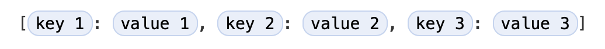

# 콜렉션 타입 \(Collection Types\)

Swift는 콜렉션의 값을 저장하기 위한 배열 \(array\), 집합 \(set\), 딕셔너리 \(dictionary\)와 같은 3개의 원시적인 _콜렉션 타입 \(collection types\)_ 을 제공합니다. 배열은 콜렉션 값에 순서를 가지고 있습니다. 집합은 반복되지 않은 값에 순서가 없는 콜렉션 타입입니다. 딕셔너리는 키-값 쌍의 순서가 없는 콜렉션 타입입니다.


Swift에 배열, 집합, 그리고 딕셔너리는 저장할 수 있는 값의 타입과 키에 대해 항상 명확합니다. 이것은 실수로 콜렉션에 잘못된 타입을 추가할 수 없다는 의미입니다. 또한 콜렉션에서 검색할 값에 대해 타입이 명확하다는 것을 의미합니다.

> NOTE  
> Swift의 배열, 집합, 그리고 딕셔너리 타입은 _제너릭 콜렉션 \(generic collections\)_ 으로 구현됩니다. 제너릭 타입과 콜렉션에 대한 자세한 내용은 [제너릭 \(Generics\)](generics.md) 을 참고 바랍니다.

## 콜렉션의 가변성 \(Mutablility of Collections\)

배열, 집합, 또는 딕셔너리를 생성하고 변수에 할당하면 생성된 콜렉션은 _변경 가능 \(mutable\)_ 합니다. 이것은콜렉션이 생성된 후에 콜렉션의 아이템을 추가, 삭제, 또는 변경 할 수 있다는 뜻입니다. 배열, 집합, 또는 딕셔너리를 상수에 할당하면 이 콜렉션은 불가변성이며 크기와 콘텐츠를 변경할 수 없습니다.

> NOTE  
> 콜렉션을 변경할 필요가 없는 모든 경우에 변경 불가능한 콜렉션을 만드는 것이 좋습니다. 이렇게 하면 코드에 대해 더 쉽게 추론할 수 있고 Swift 컴파일러가 생성한 콜렉션의 성능을 최적화 할 수 있습니다.

## 배열 \(Arrays\)

_배열 \(array\)_ 은 순서대로 같은 타입의 값을 저장합니다. 같은 값은 배열에 다른 순서로 존재할 수 있습니다.

> NOTE  
> Swift의 `Array` 타입은 Foundation의 `NSArray` 클래스와 연결됩니다.
>
> Foundation과 Cocoa의 `Array` 사용에 대한 자세한 내용은 [Array와 NSArray 사이의 연결 \(Bridging Between Array and NSArray\)](https://developer.apple.com/documentation/swift/array#2846730) 을 참고 바랍니다.

### 배열 타입 구문 \(Array Type Shorthand Syntax\)

Swift 배열의 타입은 `Element` 는 저장할 배열 값의 타입을 나타내는 `Array<Element>` 로 작성합니다. 또한 짧게 `[Element]` 로 작성할 수도 있습니다. 두 형식이 기능적으로 동일하지막 짧은 표현이 선호되며 배열 타입을 참조할 때 이 가이드 전체에서 사용됩니다.

### 빈 배열 생성 \(Creating an Empty Array\)

초기화 구문을 사용하여 타입을 포함한 빈 배열을 생성할 수 있습니다:

```swift
var someInts: [Int] = []
print("someInts is of type [Int] with \(someInts.count) items.")
// Prints "someInts is of type [Int] with 0 items."
```

`someInts` 변수의 타입은 초기화 타입을 통해 `[Int]` 로 추론됩니다.

또는 컨텍스트가 함수 인자나 이미 타입이 명시 된 변수 또는 상수와 같은 타입 정보를 제공하는 경우 `[]` \(빈 대괄호 쌍\)으로 빈 배열을 생성할 수 있습니다:

```swift
someInts.append(3)
// someInts now contains 1 value of type Int
someInts = []
// someInts is now an empty array, but is still of type [Int]
```

### 기본값 배열 생성 \(Creating an Array with a Default Value\)

Swift의 `Array` 타입은 같은 기본 값으로 설정하고 크기를 고정하여 배열을 생성하는 초기화도 제공합니다. 적합한 타입 \(파라미터 명 `repeating`\)의 기본값과 새로운 배열에 반복될 값의 횟수 \(파라미터 명 `count`\)를 초기화에 전달합니다:

```swift
var threeDoubles = Array(repeating: 0.0, count: 3)
// threeDoubles is of type [Double], and equals [0.0, 0.0, 0.0]
```

### 배열을 더해 생성 \(Creating Array by Adding Two Arrays Together\)

동등한 타입의 2개의 존재하는 배열을 더하기 연산자 \(`+`\)를 통해 합쳐서 새로운 배열을 생성할 수 있습니다. 새로운 배열의 타입은 합쳐진 2개의 배열의 타입으로 부터 추론됩니다:

```swift
var anotherThreeDoubles = Array(repeating: 2.5, count: 3)
// anotherThreeDoubles is of type [Double], and equals [2.5, 2.5, 2.5]

var sixDoubles = threeDoubles + anotherThreeDoubles
// sixDoubles is inferred as [Double], and equals [0.0, 0.0, 0.0, 2.5, 2.5, 2.5]
```

### 배열 리터럴로 생성 \(Creating an Array with an Array Literal\)

배열 콜렉션으로 하나 이상의 값을 작성하여 _배열 리터럴 \(array literal\)_ 로 배열을 생성할 수 있습니다. 배열 리터럴은 값을 목록으로 작성하고 콤마로 구분하며 대괄호로 둘러싸서 작성합니다:


아래 예제는 `String` 값을 저장하는 `shoppingList` 배열을 생성하는 예입니다:

```swift
var shoppingList: [String] = ["Eggs", "Milk"]
// shoppingList has been initialized with two initial items
```

`shoppingList` 변수는 `[String]` 으로 쓰고 "문자열 값의 배열"로 선언됩니다. 이 배열은 `String` 의 값 타입을 가지고 있기 때문에 `String` 값만 저장이 가능합니다. 여기서 `shoppingList` 배열은 배열 리터럴 안에 쓰여진 2개의 `String` 값 \(`"Eggs"` 와 `"Milk"`\)으로 초기화 되었습니다.

> NOTE  
> 아래 예제에서 쇼핑 리스트에 더 많은 아이템이 추가되기 때문에 `shoppingList` 배열은 상수 \(`let` 으로 선언\)가 아닌 변수 \(`var` 로 선언\)로 선언되었습니다.

이 경우 배열 리터럴은 2개의 `String` 값을 포함합니다. 이것은 `shoppingList` 변수의 선언 타입 \(`String` 값만 포함될 수 있는 배열\)과 일치하므로 2개의 초기 항목으로 `shoppingList` 를 초기화하는 방법으로 배열 리터럴의 할당이 허용됩니다.

Swift의 타입 추론에 덕분에 같은 타입의 값을 포함하는 배열 리터럴로 초기화하면 배열의 타입을 명시할 필요가 없습니다. `shoppingList` 의 초기화는 아래와 같이 간단하게 작성될 수 있습니다:

```swift
var shoppingList = ["Eggs", "Milk"]
```

배열 리터럴 안에 모든 값은 같은 타입이기 때문에 Swift는 `[String]` 가 `shoppingList` 변수를 사용하는데 올바른 타입이라는 것을 유추할 수 있습니다.

### 배열 접근과 수정 \(Accessing and Modifying an Array\)

메서드와 프로퍼티 또는 서브 스크립트 구문을 사용하여 배열에 접근 및 수정이 가능합니다.

배열에 아이템 갯수를 알려면 읽기 전용 `count` 프로퍼티로 확인하면 됩니다:

```swift
print("The shopping list contains \(shoppingList.count) items.")
// Prints "The shopping list contains 2 items."
```

부울 `isEmpty` 프로퍼티를 사용하여 배열의 `count` 프로퍼티 값이 `0` 인지 아닌지 빠르게 판단할 수 있습니다:

```swift
if shoppingList.isEmpty {
    print("The shopping list is empty.")
} else {
    print("The shopping list is not empty.")
}
// Prints "The shopping list is not empty."
```

배열의 `append(_:)` 메서드를 호출하여 배열의 끝에 새로운 아이템을 추가할 수 있습니다:

```swift
shoppingList.append("Flour")
// shoppingList now contains 3 items, and someone is making pancakes
```

또한 하나 이상의 동등한 아이템의 배열은 덧셈 대입 연산자 \(`+=`\)를 통해 추가할 수 있습니다:

```swift
shoppingList += ["Baking Powder"]
// shoppingList now contains 4 items
shoppingList += ["Chocolate Spread", "Cheese", "Butter"]
// shoppingList now contains 7 items
```

_서브 스크립트 구문 \(subscript syntax\)_ 를 사용하여 배열의 값을 가져올 수 있습니다. 배열의 이름 뒤에 바로 대괄호를 붙이고 가져올 값의 인덱스를 넣어 해당 값을 가져올 수 있습니다:

```swift
var firstItem = shoppingList[0]
// firstItem is equal to "Eggs"
```

> NOTE  
> 배열안에 첫번째 아이템은 인덱스가 `1` 이 아닌 `0` 입니다. Swift에 배열은 항상 제로-인덱스 \(zero-indexed\) 입니다.

서브 스크립트 구문을 사용하여 존재하는 값을 변경할 수 있습니다:

```swift
shoppingList[0] = "Six eggs"
// the first item in the list is now equal to "Six eggs" rather than "Eggs"
```

서브 스크립트 구문을 사용할 때 인덱스는 유효해야 합니다. 예를 들어 `shoppingList[shoppingList.count] = "Salt"` 으로 배열 끝에 추가하려고 하면 런타임 에러가 발생합니다.

변경할 값들이 변경할 범위라 다른 길이를 가지고 있더라도 서브 스크립트 구문으로 범위 안에 값을 한번에 변경할 수 있습니다. 아래 예제는 `"Chocolate Spread"`, `"Cheese"` 를 `"Bananas"` 와 `"Apples"` 로 대체합니다:

```swift
shoppingList[4...6] = ["Bananas", "Apples"]
// shoppingList now contains 6 items
```

배열에 특정 인덱스에 아이템을 추가하려면 배열의 `insert(_:at:)` 메서드를 호출합니다:

```swift
shoppingList.insert("Maple Syrup", at: 0)
// shoppingList now contains 7 items
// "Maple Syrup" is now the first item in the list
```

`insert(_:at:)` 메서드를 호출하면 인덱스가 `0` 인 쇼핑 리스트에 가장 맨 앞에 `"Maple Syrup"` 의 값을 가진 새로운 아이템을 추가합니다.

비슷하게 `remove(at:)` 메서드를 통해 배열의 아이템을 삭제할 수 있습니다. 이 메서드는 해당 인덱스의 아이템을 삭제하고 삭제한 아이템을 반환합니다 \(반환된 값이 필요 없으면 무시해도 됨\):

```swift
let mapleSyrup = shoppingList.remove(at: 0)
// the item that was at index 0 has just been removed
// shoppingList now contains 6 items, and no Maple Syrup
// the mapleSyrup constant is now equal to the removed "Maple Syrup" string
```

> NOTE  
> 배열의 범위를 넘는 인덱스로 값에 접근 또는 수정을 할 경우 런타임 에러가 발생합니다. 배열의 `count` 프로퍼티를 사용하여 인덱스가 유효한지 확인할 수 있습니다. 배열은 0부터 인덱스 되기 때문에 배열에서 가장 큰 유효한 인덱스는 `count - 1` 입니다. 그러나 `count` 가 `0` 이면 \(배열이 비어있음\) 유효한 인덱스가 없다는 의미입니다.

아이템이 삭제되면 배열에 어떤 간격도 닫히므로 인덱스 `0` 인 값은 `"Six eggs"` 와 같습니다:

```swift
firstItem = shoppingList[0]
// firstItem is now equal to "Six eggs"
```

배열의 마지막 아이템을 삭제하고 싶다면 배열의 `count` 프로퍼티의 사용을 피하기 위해 `remove(at:)` 메서드 보다 `removeLast()` 메서드를 사용하십시오. `remove(at:)` 메서드와 같이 `removeLast()` 메서드는 삭제된 아이템을 반환합니다:

```swift
let apples = shoppingList.removeLast()
// the last item in the array has just been removed
// shoppingList now contains 5 items, and no apples
// the apples constant is now equal to the removed "Apples" string
```

### 배열 반복 \(Iterating Over an Array\)

`for`-`in` 루프를 사용하여 배열의 전체 값을 알 수 있습니다:

```swift
for item in shoppingList {
    print(item)
}
// Six eggs
// Milk
// Flour
// Baking Powder
// Bananas
```

각 아이템의 인덱스 뿐만 아니라 값도 필요하다면 `enumerated()` 메서드를 사용합니다. 배열의 각 아이템에 대해 `enumerated()` 메서드는 정수와 아이템을 조합하여 튜플로 반환합니다. 정수는 0부터 시작하여 각 아이템에 대해 1씩 증가합니다. 전체 배열을 열거하는 경우 이 정수는 아이템의 인덱스와 일치합니다. 튜플을 임시의 상수 또는 변수도 분해할 수 있습니다:

```swift
for (index, value) in shoppingList.enumerated() {
    print("Item \(index + 1): \(value)")
}
// Item 1: Six eggs
// Item 2: Milk
// Item 3: Flour
// Item 4: Baking Powder
// Item 5: Bananas
```

`for`-`in` 루프에 대한 자세한 내용은 [For-In 루프 \(For-In Loops\)](control-flow.md#for-in-for-in-loops) 을 참고 바랍니다.

## 집합 \(Sets\)

_집합 \(set\)_ 은 콜렉션에 순서와 상관없이 같은 타입의 다른 값을 저장합니다. 아이템의 순서가 중요하지 않거나 아이템이 반복되면 안될 때 배열 대신에 집합을 사용할 수 있습니다.

> NOTE  
> Swift의 집합 타입은 Foundation의 `NSSet` 클래스와 연결됩니다.
>
> Foundation과 Cocoa의 `Set` 에 대해 더 자세한 내용은 [Set과 NSSet 사이의 연결 \(Bridging Between Set and NSSet\)](https://developer.apple.com/documentation/swift/set#2845530) 을 참고 바랍니다.

### 집합 타입을 위한 해쉬 값 \(Hash Values for Set Types\)

집합 \(set\) 에 저장하기 위해 타입은 반드시 _hashable_ 여야 합니다. 즉, _해쉬 값 \(hash value\)_ 을 계산할 수 있는 방법을 타입은 제공해야 합니다. 해쉬 값은 동일하게 비교되는 모든 객체에 대해 동일한 `Int` 값으로 `a == b` 이면 `a.hashValue == b.hashValue` 를 따릅니다.

Swift의 모든 기본 타입 \(`String`, `Int`, `Double`, 그리고 `Bool`\)은 기본적으로 hashable 이고 집합의 값 타입 또는 딕셔너리의 키 타입으로 사용할 수 있습니다. 연관된 값이 없는 열거형 \(Enumeration\) 케이스 값 \([열거형 \(Enumerations\)](enumerations.md)\)은 기본적으로 hashable 입니다.

> NOTE  
> 집합 값 타입 또는 딕셔너리 키 타입으로 사용자화 타입을 사용하려면 Swift 표준 라이브러리의 `Hashable` 프로토콜을 준수해야 사용할 수 있습니다. 필수인 `hash(into:)` 메서드를 구현하는 것에 대한 자세한 내용은 [`Hashable`](https://developer.apple.com/documentation/swift/hashable) 을 참고 바랍니다. 프로토콜 준수에 대한 자세한 내용은 [프로토콜 \(Protocols\)](protocols.md) 를 참고 바랍니다.

### 집합 타입 구문 \(Set Type Syntax\)

Swift 집합의 타입은 `Element` 가 집합의 저장할 값의 타입을 나타내는 `Set<Element>` 로 작성됩니다. 배열과 반대로 집합은 짧은 등가 형식이 없습니다.

### 빈 집합 생성과 초기화 \(Creating Initializing an Empty Set\)

초기화 구문을 사용하여 타입을 포함한 빈 집합을 생성할 수 있습니다:

```swift
var letters = Set<Character>()
print("letters is of type Set<Character> with \(letters.count) items.")
// Prints "letters is of type Set<Character> with 0 items."
```

> NOTE  
> `letters` 변수의 타입은 초기화의 타입으로 부터 `Set<Character>` 로 추론됩니다.

또한 컨텍스트가 함수 인자 또는 이미 타입이 명시된 변수 또는 상수로 타입 정보를 이미 제공한다면 빈 배열 리터럴을 사용하여 빈 집합을 생성할 수 있습니다:

```swift
letters.insert("a")
// letters now contains 1 value of type Character
letters = []
// letters is now an empty set, but is still of type Set<Character>
```

### 배열 리터럴로 집합 생성 \(Creating a Set with an Array Literal\)

집합 콜렉션으로 하나 이상의 값으로 짧은 방법과 같이 배열 리터럴을 사용하여 집합을 초기화 할 수도 있습니다.

아래 예제는 `String` 값을 저장하는 `favoriteGenres` 라는 집합을 생성합니다:

```swift
var favoriteGenres: Set<String> = ["Rock", "Classical", "Hip hop"]
// favoriteGenres has been initialized with three initial items
```

`favoriteGenres` 변수는 `Set<String>` 라고 쓰고 "`String` 값의 집합" 으로 선언됩니다. 이 집합은 특정 `String` 타입의 값을 가지고 있기 때문에 `String` 값만 저장할 수 있습니다. 여기서 `favoriteGenres` 집합은 배열 리터럴 안에 적힌 3개의 `String` 값 \(`"Rock"`, `"Classical"`, `"Hip hop"`\)으로 초기화 됩니다.

> NOTE  
> `favoriteGenres` 집합은 아래 예제에서 아이템을 추가하거나 삭제하기 때문에 상수 \(`let`\)가 아닌 변수 \(`var`\)로 선언되었습니다.

집합 타입은 배열 리터럴에서 추론할 수 없기 때문에 `Set` 타입은 명시적으로 선언해야 합니다. 그러나 Swift의 타입 유추 때문에 배열 리터럴로 초기화 할 때 하나의 타입의 값이 포함되어 있는 경우 집합 요소의 타입을 명시하지 않아도 됩니다. `favoriteGenres` 초기화는 짧게 쓸 수 있습니다:

```swift
var favoriteGenres: Set = ["Rock", "Classical", "Hip hop"]
```

배열 리터럴 안에 값은 같은 타입이기 때문에 Swift는 `favoriteGenres` 변수를 사용하는데 `Set<String>` 이라고 유추할 수 있습니다.

### 집합 접근과 수정 \(Accessing and Modifying a Set\)

메서드와 프로퍼티로 집합에 접근과 수정할 수 있습니다.

읽기 전용 `count` 프로퍼티로 집합의 아이템 갯수를 알 수 있습니다:

```swift
print("I have \(favoriteGenres.count) favorite music genres.")
// Prints "I have 3 favorite music genres."
```

`count` 프로퍼티가 `0` 과 같은지를 부울 `isEmpty` 프로퍼티를 사용해 확인할 수 있습니다:

```swift
if favoriteGenres.isEmpty {
    print("As far as music goes, I'm not picky.")
} else {
    print("I have particular music preferences.")
}
// Prints "I have particular music preferences."
```

집합의 `insert(_:)` 메서드를 호출하여 집합에 새로운 아이템을 추가할 수 있습니다:

```swift
favoriteGenres.insert("Jazz")
// favoriteGenres now contains 4 items
```

집합의 `remove(_:)` 메서드를 호출하여 집합의 아이템을 삭제할 수 있습니다. `remove(_:)` 메서드는 집합에 아이템이 있을 경우 삭제하고 삭제된 값을 반환하거나 해당 아이템이 없을 경우 `nil` 을 반환합니다. 또한 `removeAll()` 메서드를 사용하여 전체 아이템을 삭제할 수 있습니다.

```swift
if let removedGenre = favoriteGenres.remove("Rock") {
    print("\(removedGenre)? I'm over it.")
} else {
    print("I never much cared for that.")
}
// Prints "Rock? I'm over it."
```

`contain(_:)` 메서드를 사용하여 집합에 특정 아이템이 포함되어 있는지 알 수 있습니다.

```swift
if favoriteGenres.contains("Funk") {
    print("I get up on the good foot.")
} else {
    print("It's too funky in here.")
}
// Prints "It's too funky in here."
```

### 집합 반복 \(Iterating Over a Set\)

`for`-`in` 루프와 함께 집합에 값을 반복할 수 있습니다.

```swift
for genre in favoriteGenres {
    print("\(genre)")
}
// Classical
// Jazz
// Hip hop
```

`for`-`in` 루프에 대해 자세한 내용은 [For-In 루프 \(For-In Loops\)](control-flow.md#for-in-for-in-loops) 를 참고 바랍니다.

Swift의 `Set` 타입은 정의된 순서를 가지고 있지 않습니다. 특정 순서로 집합의 값을 반복하려면 집합의 요소를 `<` 연산자를 사용하여 정렬하여 반환하는 `sorted()` 메서드를 사용합니다.

```swift
for genre in favoriteGenres.sorted() {
    print("\(genre)")
}
// Classical
// Hip hop
// Jazz
```

## 집합 연산 수행 \(Performing Set Operations\)

두 집합을 합치거나 두 집합의 공통 값을 구하거나 두 집합이 모두 같은 값을 갖고 있거나 한쪽에만 존재하거나 아예 없거나와 같은 기본적인 집합 연산을 효율적으로 수행할 수 있습니다.

### 기본 집합 연산 \(Fundamental Set Operations\)

아래 그림은 두 집합 `a` 와 `b` 의 여러가지 집합 연산에 대한 결과를 나타냅니다.


* `intersection(_:)` 메서드를 사용하면 두 집합의 공통 값을 가지는 새로운 집합을 생성합니다.
* `symmetricDifference(_:)` 메서드를 사용하면 두 집합의 공통 값을 제외한 새로운 집합을 생성합니다.
* `union(_:)` 메서드를 사용하면 두 집합의 모든 값으로 새로운 집합을 생성합니다.
* `subtracting(_:)` 메서드를 사용하면 특정 집합의 공통 값을 제외한 새로운 집합을 생성합니다.

```swift
let oddDigits: Set = [1, 3, 5, 7, 9]
let evenDigits: Set = [0, 2, 4, 6, 8]
let singleDigitPrimeNumbers: Set = [2, 3, 5, 7]

oddDigits.union(evenDigits).sorted()
// [0, 1, 2, 3, 4, 5, 6, 7, 8, 9]
oddDigits.intersection(evenDigits).sorted()
// []
oddDigits.subtracting(singleDigitPrimeNumbers).sorted()
// [1, 9]
oddDigits.symmetricDifference(singleDigitPrimeNumbers).sorted()
// [1, 2, 9]
```

### 집합 멤버십과 동등성 \(Set Membership and Equality\)

아래 그림은 세 집합 `a`, `b`, `c` 를 나타내며 집합의 공통 요소는 겹쳐서 표현하고 있습니다. `a` 는 `b` 의 모든 요소를 포함하므로 집합 `a` 는 `b` 의 _초집합 \(superset\)_ 이라 합니다. 반대로 `b` 의 모든 요소가 `a` 에 포함되어 있으므로 집합 `b` 는 집합 `a` 의 _부분집합 \(subset\)_ 이라 합니다. 집합 `b` 와 집합 `c` 는 공통 요소가 없으므로 _분리집합 \(disjoint\)_ 이라 합니다.


* 두 집합이 같은 값을 모두 포함하고 있는지 판단하려면 "같음" 연산자 \(`==`\)를 사용합니다.
* `isSubset(of:)` 메서드를 사용하면 집합이 특정 집합에 모든 값이 포함되어 있는지 판단합니다.
* `isSuperset(of:)` 메서드를 사용하면 집합에 특정 집합에 모든 값을 포함 하는지 판단합니다.
* `isStrictSubset(of:)` 또는 `isStrictSuperset(of:)` 메서드를 사용하면 집합이 특정 집합과 같지 않고 부분집합인지 초집합인지 판단합니다.
* `isDisjoint(with:)` 메서드를 사용하면 두 집합이 공통 값이 없는지 판단합니다.

```swift
let houseAnimals: Set = ["🐶", "🐱"]
let farmAnimals: Set = ["🐮", "🐔", "🐑", "🐶", "🐱"]
let cityAnimals: Set = ["🐦", "🐭"]

houseAnimals.isSubset(of: farmAnimals)
// true
farmAnimals.isSuperset(of: houseAnimals)
// true
farmAnimals.isDisjoint(with: cityAnimals)
// true
```

## 딕셔너리 \(Dictionaries\)

_딕셔너리 \(dictionary\)_ 는 순서와 상관없이 콜렉션에 같은 타입의 키 \(key\)와 같은 타입의 값 \(value\)를 저장합니다. 각 값은 딕셔너리 내부에서 값에 대한 식별자로 동작하는 유니크한 _키_ 와 조합됩니다. 배열의 아이템과 다르게 딕셔너리의 아이템은 특정 순서를 가지고 있지 않습니다. 특정 단어를 찾기위해 사전을 찾는 방법과 같이 식별자를 기준을 값을 찾을 때 딕셔너리를 사용합니다.

> NOTE  
> Swift의 `Dictionary` 타입은 Foundation의 `NSDictionary` 클래스와 연결됩니다.
>
> Foundation과 Cocoa에서 `Dictionary` 사용에 대한 자세한 내용은 [Dictionary와 NSDictionary의 연결 \(Bridging Between Dictionary and NSDictionary\)](https://developer.apple.com/documentation/swift/dictionary#2846239) 을 참고 바랍니다.

### 딕셔너리 타입 짧은 구문 \(Dictionary Type Shorthand Syntax\)

Swift 딕셔너리의 타입은 `Dictionary<Key, Value>` 로 적으며 `Key` 는 딕셔너리 키로 사용되는 값의 타입이고 `Value` 는 딕셔너리에 저장될 값의 타입 입니다.

> NOTE  
> 딕셔너리 `Key` 타입은 집합의 값 타입과 같이 반드시 `Hashable` 프로토콜을 준수해야 합니다.

`[Key: Value]` 와 같이 짧은 형식으로 딕셔너리 타입을 작성할 수도 있습니다. 두 형식은 기능적으로 동일하지만 이 가이드에서는 짧은 형식을 더 선호합니다.

### 빈 딕셔너리 생성 \(Creating an Empty Dictionary\)

배열 처럼 초기화 구문을 사용하여 타입을 포함한 빈 `Dictionary` 를 생성할 수 있습니다:

```swift
var namesOfIntegers = [Int: String]()
// namesOfIntegers is an empty [Int: String] dictionary
```

이 예제에서 정수 값에 사람이 읽을 수 있는 이름을 저장하는 `[Int: String]` 타입의 빈 딕셔너리를 생성합니다. 키는 `Int` 타입이고 값은 `String` 타입 입니다.

컨텍스트가 이미 타입 정보를 제공한다면 `[:]` \(대괄호 안에 콜론을 포함해야 함\)와 같이 작성하여 빈 딕셔너리 리터럴로 빈 딕셔너리를 생성할 수 있습니다:

```swift
namesOfIntegers[16] = "sixteen"
// namesOfIntegers now contains 1 key-value pair
namesOfIntegers = [:]
// namesOfIntegers is once again an empty dictionary of type [Int: String]
```

### 딕셔너리 리터럴로 딕셔너리 생성 \(Creating a Dictionary with a Dictionary Literal\)

앞서 배열 리터럴과 비슷한 구문을 가진 _딕셔너리 리터럴 \(dictionary literal\)_ 로 딕셔너리를 초기화 할 수 있습니다. 딕셔너리 리터럴은 `Dictionary` 콜렉션으로 하나 이상의 키-값 쌍으로 작성하는 짧은 작성법 입니다.

_키-값 쌍_ 은 키와 값의 결합입니다. 딕셔너리 리터럴에서 각 키-값 쌍의 키와 값은 콜론으로 구분됩니다. 키-값 쌍은 콤마로 구분하고 대괄호로 둘러싸 목록 형식으로 작성됩니다:



아래 예제는 국제 공항의 이름을 저장하는 딕셔너리를 생성합니다. 딕셔너리에 키는 3글자로 된 국제 항공 운송 협회 \(Air Transport Association\) 코드이고 값은 공항 이름입니다:

```swift
var airports: [String: String] = ["YYZ": "Toronto Pearson", "DUB": "Dublin"]
```

`airports` 딕셔너리는 `Dictionary` 키는 `String` 타입이고 값은 `String` 타입인 `[String: String]` 타입을 갖도록 선언됩니다.

> NOTE  
> `airports` 딕셔너리는 아래 예제에서 딕셔너리에 더 많은 공항이 추가되므로 상수 \(`let`\)가 아닌 변수 \(`var`\)로 선언됩니다.

`airports` 딕셔너리는 2개의 키-값 쌍을 포함한 딕셔너리 리터럴로 초기화 됩니다. 첫번째 쌍은 `"YYZ"` 의 키와 `"Toronto Pearson"` 값을 가집니다. 두번째 쌍은 `"DUB"` 의 키와 `"Dublin"` 값을 가집니다.

딕셔너리 리터럴은 2개의 `String: String` 쌍을 포함합니다. 키-값 타입은 `airports` 변수 선언 \(딕셔너리는 `String` 키와 `String`값만 가능\) 타입과 동일하며 `airports` 딕셔너리에 2개의 초기 아이템을 포함하여 초기화 하는 것은 가능합니다.

배열과 마찬가지로 키와 값이 일관된 타입을 갖는 딕셔너리 리터럴로 초기화하는 경우 딕셔너리 타입을 작성할 필요가 없습니다. `airports` 의 초기화는 짧은 표현으로 작성 가능합니다:

```swift
var airports = ["YYZ": "Toronto Pearson", "DUB": "Dublin"]
```

리터럴 안에 모든 키와 값이 각각 같은 타입이기 때문에 Swift는 `airports` 딕셔너리를 사용하기 위해 `[String: String]` 이 올바른 타입이라는 것을 유추할 수 있습니다.

### 딕셔너리 접근과 수정 \(Accessing and Modifying a Dictionary\)

메서드와 프로퍼티 또는 서브 스크립트 구분을 사용하여 딕셔너리에 접근과 수정이 가능합니다.

배열과 마찬가지로 읽기 전용 `count` 프로퍼티로 `Dictionary` 에 아이템의 갯수를 확인할 수 있습니다:

```swift
print("The airports dictionary contains \(airports.count) items.")
// Prints "The airports dictionary contains 2 items."
```

`count` 프로퍼티가 `0` 과 같은지 아닌지 부울 `isEmpty` 프로퍼티를 이용하여 확인할 수 있습니다:

```swift
if airports.isEmpty {
    print("The airports dictionary is empty.")
} else {
    print("The airports dictionary is not empty.")
}
// Prints "The airports dictionary is not empty."
```

서브 스크립트 구문을 사용하여 딕셔너리에 새로운 아이템을 추가할 수 있습니다. 적절한 키의 타입을 서브 스크립트 인덱스로 사용하고 적절한 값의 타입을 할당 합니다:

```swift
airports["LHR"] = "London"
// the airports dictionary now contains 3 items
```

특정 키를 서브 스크립트 구문으로 사용하여 값을 변경할 수 있습니다:

```swift
airports["LHR"] = "London Heathrow"
// the value for "LHR" has been changed to "London Heathrow"
```

서브 스크립트 외에 딕셔너리의 `updateValue(_:forKey:)` 메서드를 사용하여 특정 키에 값을 설정하거나 업데이트 할 수 있습니다. 위의 서브 스크립트 예제와 같이 `updateValue(_:forKey:)` 메서드는 해당 키에 값이 존재하지 않으면 값을 설정 하거나 해당 키에 값이 존재하면 값을 업데이트 합니다. 그러나 서브 스크립트와 다르게 `updateValue(_:forKey:)` 메서드는 업데이트 수행 후에 _이전_ 값을 반환합니다. 이를 통해 업데이트가 발생했는지 여부를 알 수 있습니다.

`updateValue(_:forKey:)` 메서드는 딕셔너리의 값 타입의 옵셔널 값을 반환합니다. 예를 들어 딕셔너리에 `String` 값을 저장하면 `String?` 타입 또는 "옵셔널 `String`"을 메서드는 반환합니다. 이 옵셔널 값은 해당 키에 존재한 업데이트 전에 값 또는 존재한 값이 없었을 때는 `nil` 을 포함합니다:

```swift
if let oldValue = airports.updateValue("Dublin Airport", forKey: "DUB") {
    print("The old value for DUB was \(oldValue).")
}
// Prints "The old value for DUB was Dublin."
```

특정 키로 딕셔너리에 값을 가져올 때 서브 스크립트 구문을 사용할 수도 있습니다. 값이 없는 키로 요청이 가능하기 때문에 딕셔너리의 서브 스크립트는 딕셔너리의 값 타입의 옵셔널 값을 반환합니다. 딕셔너리에 요쳥된 키의 값이 있는 경우 서브 스크립트는 그 값의 옵셔널 값을 반환합니다. 반대로는 서브 스크립트는 `nil` 을 반환합니다:

```swift
if let airportName = airports["DUB"] {
    print("The name of the airport is \(airportName).")
} else {
    print("That airport is not in the airports dictionary.")
}
// Prints "The name of the airport is Dublin Airport."
```

딕셔너리의 해당 키에 `nil` 값을 할당하여 키-값 쌍을 서브 스크립트 구문을 사용하여 삭제할 수 있습니다:

```swift
airports["APL"] = "Apple International"
// "Apple International" is not the real airport for APL, so delete it
airports["APL"] = nil
// APL has now been removed from the dictionary
```

또한 딕셔너리에 `removeValue(forKey:)` 메서드를 사용하여 키-값 쌍을 삭제할 수 있습니다. 이 메서드는 키-값 쌍이 존재하면 삭제하고 삭제된 값을 반환하거나 값이 존재하지 않으면 `nil` 을 반환합니다:

```swift
if let removedValue = airports.removeValue(forKey: "DUB") {
    print("The removed airport's name is \(removedValue).")
} else {
    print("The airports dictionary does not contain a value for DUB.")
}
// Prints "The removed airport's name is Dublin Airport."
```

### 딕셔너리 반복 \(Iterating Over a Dictionary\)

`for`-`in` 루프로 딕셔너리에 키-값 쌍을 반복할 수 있습니다. 딕셔너리의 각 아이템은 `(key, value)` 튜플로 반환되고 튜플의 멤버를 임시 상수 또는 변수로 분리할 수 있습니다:

```swift
for (airportCode, airportName) in airports {
    print("\(airportCode): \(airportName)")
}
// LHR: London Heathrow
// YYZ: Toronto Pearson
```

`for`-`in` 루프에 대한 자세한 설명은 [For-In 루프 \(For-In Loops\)](control-flow.md#for-in-for-in-loops) 를 참고 바랍니다.

딕셔너리의 `keys` 와 `values` 프로퍼티로 딕셔너리의 키 또는 값에 반복 가능한 콜렉션을 가져올 수도 있습니다:

```swift
for airportCode in airports.keys {
    print("Airport code: \(airportCode)")
}
// Airport code: LHR
// Airport code: YYZ

for airportName in airports.values {
    print("Airport name: \(airportName)")
}
// Airport name: London Heathrow
// Airport name: Toronto Pearson
```

딕셔너리의 키 또는 값을 `Array` 인스턴스의 API를 사용해야 할 경우 `keys` 또는 `values` 프로퍼티로 새로운 배열을 초기화 하십시오:

```swift
let airportCodes = [String](airports.keys)
// airportCodes is ["LHR", "YYZ"]

let airportNames = [String](airports.values)
// airportNames is ["London Heathrow", "Toronto Pearson"]
```

Swift의 `Dictionary` 타입은 정의된 순서를 가지고 있지 않습니다. 특정 순서로 딕셔너리의 키 또는 값을 반복하려면 `keys` 또는 `values` 프로퍼티에 `sorted()` 메서드를 사용 하십시오.

