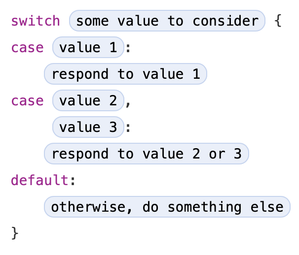

# 제어 흐름 \(Control Flow\)

<!--
Swift provides a variety of control flow statements. These include while loops to perform a task multiple times; if, guard, and switch statements to execute different branches of code based on certain conditions; and statements such as break and continue to transfer the flow of execution to another point in your code.

Swift also provides a for-in loop that makes it easy to iterate over arrays, dictionaries, ranges, strings, and other sequences.

Swift’s switch statement is considerably more powerful than its counterpart in many C-like languages. Cases can match many different patterns, including interval matches, tuples, and casts to a specific type. Matched values in a switch case can be bound to temporary constants or variables for use within the case’s body, and complex matching conditions can be expressed with a where clause for each case.
-->

Swift는 다양한 제어 흐름 \(control flow\) 구문을 제공합니다. 이것은 여러번 작업을 수행하는 `while` 루프를 포함하고 조건에 따라 다르게 실행되는 `if`, `guard`, `switch` 구문과 코드에서 다른 포인트로 실행 플로우를 전달하는 `break` 와 `continue` 를 포함합니다.

Swift는 또한 배열, 딕셔너리, 범위, 문자열, 그리고 다른 연속적인 것에 대한 반복을 쉽게 만들어 주는 `for`-`in` 루프를 제공합니다.

Swift의 `switch` 구문은 C와 유사한 언어의 해당 구문보다 훨씬 더 강력합니다. 케이스들은 간격 매치, 튜플, 그리고 특정 타입으로의 캐스트를 포함하여 다른 많은 패턴을 비교할 수 있습니다. `switch` 케이스에서 매치된 값은 케이스 문 안에서 사용할 수 있는 임시의 상수 또는 변수로 사용이 가능하고 복잡한 매칭 조건은 각 케이스에 대해 `where` 절로 표현될 수 있습니다.

## For-In 루프 \(For-In Loops\)

<!--
You use the for-in loop to iterate over a sequence, such as items in an array, ranges of numbers, or characters in a string.

This example uses a for-in loop to iterate over the items in an array:
-->

배열에 아이템, 범위의 숫자, 또는 문자열에 문자와 같은 연속된 것에 대해 `for`-`in` 루프를 사용하여 반복할 수 있습니다.

이 예제는 `for`-`in` 루프를 사용하여 배열의 아이템을 반복합니다:

```swift
let names = ["Anna", "Alex", "Brian", "Jack"]
for name in names {
    print("Hello, \(name)!")
}
// Hello, Anna!
// Hello, Alex!
// Hello, Brian!
// Hello, Jack!
```

<!--
You can also iterate over a dictionary to access its key-value pairs. Each item in the dictionary is returned as a (key, value) tuple when the dictionary is iterated, and you can decompose the (key, value) tuple’s members as explicitly named constants for use within the body of the for-in loop. In the code example below, the dictionary’s keys are decomposed into a constant called animalName, and the dictionary’s values are decomposed into a constant called legCount.
-->

딕셔너리의 키-값 쌍 접근을 위해 반복을 사용할 수도 있습니다. 딕셔너리의 각 아이템은 딕셔너리가 반복될 때 `(key, value)` 튜플로 반환되고 `for`-`in` 루프 본문 내에서 사용하기 위해 `(key, value)` 튜플의 멤버를 명시적으로 이름을 가진 상수로 분해할 수 있습니다. 아래의 예제에서 딕셔너리의 키는 `animalName` 상수로 분해되고 딕셔너리의 값은 `legCount` 상수로 분해됩니다.

```swift
let numberOfLegs = ["spider": 8, "ant": 6, "cat": 4]
for (animalName, legCount) in numberOfLegs {
    print("\(animalName)s have \(legCount) legs")
}
// cats have 4 legs
// ants have 6 legs
// spiders have 8 legs
```

<!--
The contents of a Dictionary are inherently unordered, and iterating over them doesn’t guarantee the order in which they will be retrieved. In particular, the order you insert items into a Dictionary doesn’t define the order they’re iterated. For more about arrays and dictionaries, see Collection Types.

You can also use for-in loops with numeric ranges. This example prints the first few entries in a five-times table:
-->

`Dictionary` 의 콘텐츠는 기본적으로 순서가 없으며 반복으로 가져올 아이템에 대한 순서를 보장하지 않습니다. 특히 아이템을 딕셔너리에 삽입하는 순서는 아이템이 반복되는 순서를 정의하지 않습니다. 배열과 딕셔너리의 자세한 내용은 [콜렉션 타입 \(Collection Types\)](collection-types.md) 을 참고 바랍니다.

숫자 범위에 대해 `for`-`in` 루프를 사용할 수도 있습니다. 이 예제는 5의 배수 항목을 몇개 출력합니다:

```swift
for index in 1...5 {
    print("\(index) times 5 is \(index * 5)")
}
// 1 times 5 is 5
// 2 times 5 is 10
// 3 times 5 is 15
// 4 times 5 is 20
// 5 times 5 is 25
```

<!--
The sequence being iterated over is a range of numbers from 1 to 5, inclusive, as indicated by the use of the closed range operator (...). The value of index is set to the first number in the range (1), and the statements inside the loop are executed. In this case, the loop contains only one statement, which prints an entry from the five-times table for the current value of index. After the statement is executed, the value of index is updated to contain the second value in the range (2), and the print(_:separator:terminator:) function is called again. This process continues until the end of the range is reached.

In the example above, index is a constant whose value is automatically set at the start of each iteration of the loop. As such, index doesn’t have to be declared before it’s used. It’s implicitly declared simply by its inclusion in the loop declaration, without the need for a let declaration keyword.

If you don’t need each value from a sequence, you can ignore the values by using an underscore in place of a variable name.
-->

이 반복되는 시퀀스는 닫힌 범위 연산자 \(`...`\)를 사용하여 표시되는 `1` 부터 `5` 까지의 숫자 범위 입니다. `index` 의 값은 범위의 첫번째 숫자 \(`1`\)로 설정되고 루프 안의 구문이 실행됩니다. 이 경우 루프는 `index` 의 현재 값을 5배 하여 출력하는 하나의 구문만 포함합니다. 구문이 실행된 후에 `index` 의 값은 범위의 두번째 값 \(`2`\)로 업데이트 되고 `print(_:separator:terminator:)` 함수가 다시 호출됩니다. 이 프로세스는 범위의 끝에 도달할 때까지 계속 됩니다.

위의 예제에서 `index` 는 루프의 각 반복이 시작할 때 자동으로 설정되는 값인 상수입니다. 따라서 `index` 를 사용하기 전에 선언할 필요가 없습니다. `let` 선언 키워드가 필요없이 루프 선언에 포함되어 암시적으로 선언됩니다.

시퀀스로 부터 각 값이 필요하지 않으면 변수 이름의 위치에 언더바를 사용하여 값을 무시할 수 있습니다.

```swift
let base = 3
let power = 10
var answer = 1
for _ in 1...power {
    answer *= base
}
print("\(base) to the power of \(power) is \(answer)")
// Prints "3 to the power of 10 is 59049"
```

<!--
The example above calculates the value of one number to the power of another (in this case, 3 to the power of 10). It multiplies a starting value of 1 (that is, 3 to the power of 0) by 3, ten times, using a closed range that starts with 1 and ends with 10. For this calculation, the individual counter values each time through the loop are unnecessary—the code simply executes the loop the correct number of times. The underscore character (_) used in place of a loop variable causes the individual values to be ignored and doesn’t provide access to the current value during each iteration of the loop.

In some situations, you might not want to use closed ranges, which include both endpoints. Consider drawing the tick marks for every minute on a watch face. You want to draw 60 tick marks, starting with the 0 minute. Use the half-open range operator (..<) to include the lower bound but not the upper bound. For more about ranges, see Range Operators.
-->

위의 예는 한 숫자의 값을 다른 숫자의 제곱으로 계산합니다 \(이 경우 `3` 에서 `10` 제곱\). `1` 로 시작하고 `10` 으로 끝나는 닫힌 범위를 사용하여 시작값 `1` \(즉, `3` 의 `0` 제곱\)에 `3` 을 `10` 번 곱합니다. 이 계산에서 루프의 각 카운터 값은 불필요 합니다. 즉 이 코드는 간단하게 올바른 숫자만큼 실행됩니다. 루프 변수 위치에 사용된 언더바 문자 \(`_`\)는 각 값을 무시하고 루프의 각 반복동안 현재 값에 접근하는 것을 제공하지 않습니다.

어떤 상황에선 양 끝점을 포함하는 닫힌 범위를 사용하지 않을 수 있습니다. 시계 페이스에 매 분마다 눈금을 그리는 것을 생각해 봅시다. `0` 분을 시작으로 `60` 개의 눈금을 그려야 합니다. 이럴 경우 반열림 범위 연산자 \(`..<`\)를 사용하여 가장 최소 값은 포함하지만 최대 값은 포함되지 않게 사용할 수 있습니다. 범위에 대한 자세한 내용은 [범위 연산자 \(Range Operators\)](basic-operators.md#range-operators) 를 참고 바랍니다.

```swift
let minutes = 60
for tickMark in 0..<minutes {
    // render the tick mark each minute (60 times)
}
```

<!--
Some users might want fewer tick marks in their UI. They could prefer one mark every 5 minutes instead. Use the stride(from:to:by:) function to skip the unwanted marks.
-->

어떤 사용자는 UI에 더 적은 눈금을 원할 수도 있습니다. 매 5분마다 눈금을 그리기 원할 수 있습니다. 원하지 않는 눈금을 건너뛰기 위해 `stride(from:to:by:)` 함수를 사용 하십시오.

```swift
let minuteInterval = 5
for tickMark in stride(from: 0, to: minutes, by: minuteInterval) {
    // render the tick mark every 5 minutes (0, 5, 10, 15 ... 45, 50, 55)
}
```

<!--
Closed ranges are also available, by using stride(from:through:by:) instead:
-->

`stride(from:through:by:)` 사용하여 닫힌 범위도 가능합니다:

```swift
let hours = 12
let hourInterval = 3
for tickMark in stride(from: 3, through: hours, by: hourInterval) {
    // render the tick mark every 3 hours (3, 6, 9, 12)
}
```

<!--
The examples above use a for-in loop to iterate ranges, arrays, dictionaries, and strings. However, you can use this syntax to iterate any collection, including your own classes and collection types, as long as those types conform to the Sequence protocol.
-->

위의 예제는 범위, 배열, 딕셔너리, 그리고 문자열을 조회하기 위해 `for`-`in` 루프를 사용합니다. 자체 클래스와 콜렉션 타입을 포함하여 모든 콜렉션을 조회하기 위해 [시퀀스 \(Sequence\)](https://developer.apple.com/documentation/swift/sequence) 프로토콜을 준수하는 한 이 구문을 사용할 수 있습니다.

## While 루프 \(While Loops\)

<!--
A while loop performs a set of statements until a condition becomes false. These kinds of loops are best used when the number of iterations isn’t known before the first iteration begins. Swift provides two kinds of while loops:

* while evaluates its condition at the start of each pass through the loop.
* repeat-while evaluates its condition at the end of each pass through the loop.
-->

`while` 루프는 조건이 `false` 가 될 때까지 구문의 집합을 수행합니다. 이러한 루프는 첫번째 반복이 시작되기 전에 반복 횟수를 알 수 없을 때 가장 잘 사용됩니다. Swift는 2종류의 `while` 루프를 제공합니다:

* `while` 은 루프가 시작할 때마다 조건을 비교합니다.
* `repeat`-`while` 은 루프가 끝날 때 마다 조건을 비교합니다.

### While

<!--
A while loop starts by evaluating a single condition. If the condition is true, a set of statements is repeated until the condition becomes false.

Here’s the general form of a while loop:
-->

`while` 루프는 단일 조건을 평가함으로 시작합니다. 조건이 `true` 이면 조건이 `false` 가 될 때까지 구문의 집합은 반복 됩니다.

여기 `while` 루프의 기본 형식 입니다:


<!--
This example plays a simple game of Snakes and Ladders (also known as Chutes and Ladders):
-->

이 예제는 _Snakes and Ladders_ \(또는 _Chutes and Ladders_\) 게임을 플레이 합니다:


<!--
The rules of the game are as follows:

* The board has 25 squares, and the aim is to land on or beyond square 25.
* The player’s starting square is “square zero”, which is just off the bottom-left corner of the board.
* Each turn, you roll a six-sided dice and move by that number of squares, following the horizontal path indicated by the dotted arrow above.
* If your turn ends at the bottom of a ladder, you move up that ladder.
* If your turn ends at the head of a snake, you move down that snake.

The game board is represented by an array of Int values. Its size is based on a constant called finalSquare, which is used to initialize the array and also to check for a win condition later in the example. Because the players start off the board, on “square zero”, the board is initialized with 26 zero Int values, not 25.
-->

게임의 규칙은 아래와 같습니다:

* 이 보드는 25개의 정사각형을 가지고 있고 착륙 또는 25를 넘는 것이 목표입니다.
* 플레이어의 시작 정사각형을 보드의 좌측 하단의 모서리로 "정사각형 0" 이라 합니다.
* 각 턴마다 주사위를 굴리고 위의 점선 화살표 방향으로 각 숫자만큼 정사각형을 이동합니다.
* 턴이 사다리의 바닥에서 끝나면 사다리를 타고 올라갑니다.
* 턴이 뱀의 머리에서 끝나면 뱀의 꼬리로 내려갑니다.

게임 보드는 `Int` 값의 배열로 표현됩니다. 크기는 `finalSquare` 라는 상수를 기반으로 하며 배열을 초기화하고 나중에 예제에서 승리 조건을 확인하는데 사용됩니다. "정사각형 0"에서 플레이어는 시작하기 때문에 보드는 0 `Int` 값을 포함하여 25가 아닌 26의 크기로 초기화 됩니다.

```swift
let finalSquare = 25
var board = [Int](repeating: 0, count: finalSquare + 1)
```

<!--
Some squares are then set to have more specific values for the snakes and ladders. Squares with a ladder base have a positive number to move you up the board, whereas squares with a snake head have a negative number to move you back down the board.
-->

그런 다음 일부 사각형은 뱀과 사다리에 대해 더 구체적인 값을 갖도록 설정됩니다. 사다리 기반의 정사각형은 보드의 위로 이동하기 때문에 양수를 가지는 반면에 뱀 머리의 정사각형은 보드의 아래로 이동하기 때문에 음수를 가집니다.

```swift
board[03] = +08; board[06] = +11; board[09] = +09; board[10] = +02
board[14] = -10; board[19] = -11; board[22] = -02; board[24] = -08
```

<!--
Square 3 contains the bottom of a ladder that moves you up to square 11. To represent this, board[03] is equal to +08, which is equivalent to an integer value of 8 (the difference between 3 and 11). To align the values and statements, the unary plus operator (+i) is explicitly used with the unary minus operator (-i) and numbers lower than 10 are padded with zeros. (Neither stylistic technique is strictly necessary, but they lead to neater code.)
-->

정사각형 3은 정사각형 11로 이동하는 사다리 바닥이 포함됩니다. 이것을 표현하기 위해 `board[03]` 은 정수값 `8` \(`3` 과 `11` 의 차이\)과 동등한 `+08` 을 대입합니다. 값과 구문을 정렬하기 위해 단항 덧셈 연산자 \(`+i`\)는 단항 빼기 연산자 \(`-i`\)를 명시적으로 사용하고 10보다 작은 숫자의 앞에 0을 채웁니다 \(두 스타일 모두 꼭 필요한 것은 아니지만 코드가 깔끔해 집니다\).

```swift
var square = 0
var diceRoll = 0
while square < finalSquare {
    // roll the dice
    diceRoll += 1
    if diceRoll == 7 { diceRoll = 1 }
    // move by the rolled amount
    square += diceRoll
    if square < board.count {
        // if we're still on the board, move up or down for a snake or a ladder
        square += board[square]
    }
}
print("Game over!")
```

<!--
The example above uses a very simple approach to dice rolling. Instead of generating a random number, it starts with a diceRoll value of 0. Each time through the while loop, diceRoll is incremented by one and is then checked to see whether it has become too large. Whenever this return value equals 7, the dice roll has become too large and is reset to a value of 1. The result is a sequence of diceRoll values that’s always 1, 2, 3, 4, 5, 6, 1, 2 and so on.

After rolling the dice, the player moves forward by diceRoll squares. It’s possible that the dice roll may have moved the player beyond square 25, in which case the game is over. To cope with this scenario, the code checks that square is less than the board array’s count property. If square is valid, the value stored in board[square] is added to the current square value to move the player up or down any ladders or snakes.
-->

위의 예는 주사위 굴리기에 매우 간단한 접근 방식을 사용합니다. 난수를 생성하는 대신에 `diceRoll` 은 `0` 의 값으로 시작합니다. 매 `while` 루프를 실행할 때 마다 `diceRoll` 은 1씩 증가하고 너무 커졌는지 확인합니다. 반환된 값이 `7` 과 같을 때마다 주사위 굴림이 너무 커지므로 값을 `1` 로 재설정 합니다. 그 결과 `diceRoll` 값은 항상 `1`, `2`, `3`, `4`, `5`, `6`, `1`, `2` 등과 같이 시퀀스 입니다.

주사위를 굴리고 난 후에 플레이어는 `diceRoll` 정사각형으로 앞으로 이동합니다. 주사위 굴림이 플레이어를 정사각형 25를 넘어 이동할 수 있으며 이럴 경우 게임이 끝납니다. 이 시나리오에 대처하기 위해 `board` 배열의 `count` 프로퍼티가 `square` 보다 작은지 확인합니다. `square` 가 유효하다면 `board[square]` 에 저장된 값은 현재 `square` 값이 추가되어 플레이어를 사다리나 뱀의 위나 아래로 이동합니다.

<!--
NOTE
If this check isn’t performed, board[square] might try to access a value outside the bounds of the board array, which would trigger a runtime error.
-->

> NOTE  
> 확인을 수행하지 않으면 `board[square]` 는 `board` 배열의 범위를 넘는 값을 접근하려 시도할 수 있습니다. 이런 경우 런타임 에러가 발생합니다.

<!--
The current while loop execution then ends, and the loop’s condition is checked to see if the loop should be executed again. If the player has moved on or beyond square number 25, the loop’s condition evaluates to false and the game ends.

A while loop is appropriate in this case, because the length of the game isn’t clear at the start of the while loop. Instead, the loop is executed until a particular condition is satisfied.
-->

현재 `while` 루프의 실행이 끝나면 루프를 다시 실행해야 되는지 알기위해 조건을 확인합니다. 플레이어가 정사각형 숫자 `25` 에 위치하거나 넘으면 루프 조건은 `false` 가 되고 게임은 종료됩니다.

`while` 루프가 시작될 때 게임의 길이가 명확하지 않으므로 이러한 경우 `while` 루프가 적절합니다. 대신에 루프는 특정 조건이 만족할 때까지 실행됩니다.

### Repeat-While

<!--
The other variation of the while loop, known as the repeat-while loop, performs a single pass through the loop block first, before considering the loop’s condition. It then continues to repeat the loop until the condition is false.
-->

`while` 루프의 다른 하나는 루프의 조건을 판단하기 _전에_ 루프 블럭을 처음에 한번 먼저 통과하는 `repeat`-`while` 루프가 있습니다. 조건이 `false` 가 될 때까지 루프를 반복합니다.

<!--
NOTE
The repeat-while loop in Swift is analogous to a do-while loop in other languages.
-->

> NOTE  
> Swift에 `repeat`-`while` 루프는 다른 언어의 `do`-`while` 루프와 유사합니다.

<!--
Here’s the general form of a repeat-while loop:
-->

여기 `repeat`-`while` 루프의 일반적인 형식입니다:


<!--
Here’s the Snakes and Ladders example again, written as a repeat-while loop rather than a while loop. The values of finalSquare, board, square, and diceRoll are initialized in exactly the same way as with a while loop.
-->

_Snakes and Ladders_ 예제에서 `while` 루프보다 `repeat`-`while` 루프를 쓰는 것이 더 좋습니다. `finalSquare`, `board`, `square`, `diceRoll` 의 값은 `while` 루프에서와 같은 방식으로 명시적으로 초기화 됩니다.

```swift
let finalSquare = 25
var board = [Int](repeating: 0, count: finalSquare + 1)
board[03] = +08; board[06] = +11; board[09] = +09; board[10] = +02
board[14] = -10; board[19] = -11; board[22] = -02; board[24] = -08
var square = 0
var diceRoll = 0
```

<!--
In this version of the game, the first action in the loop is to check for a ladder or a snake. No ladder on the board takes the player straight to square 25, and so it isn’t possible to win the game by moving up a ladder. Therefore, it’s safe to check for a snake or a ladder as the first action in the loop.

At the start of the game, the player is on “square zero”. board[0] always equals 0 and has no effect.
-->

이 게임의 버전에서는 루프에서 _첫번째_ 행동은 사다리 또는 뱀인지 확인합니다. 보드에 사다리가 없으면 플레이어는 바로 정사각형 25로 이동하게 되고 사다리를 위로 이동하여 게임에서 이길 수 없습니다. 따라서 루프의 첫번째 동작으로 뱀 또는 사다리를 확인하는 것이 안전합니다.

게임 시작할 때 플레이어는 "정사각형 0"에 있습니다. `board[0]` 은 항상 `0` 과 같으며 영향이 없습니다.

```swift
repeat {
    // move up or down for a snake or ladder
    square += board[square]
    // roll the dice
    diceRoll += 1
    if diceRoll == 7 { diceRoll = 1 }
    // move by the rolled amount
    square += diceRoll
} while square < finalSquare
print("Game over!")
```

<!--
After the code checks for snakes and ladders, the dice is rolled and the player is moved forward by diceRoll squares. The current loop execution then ends.

The loop’s condition (while square < finalSquare) is the same as before, but this time it’s not evaluated until the end of the first run through the loop. The structure of the repeat-while loop is better suited to this game than the while loop in the previous example. In the repeat-while loop above, square += board[square] is always executed immediately after the loop’s while condition confirms that square is still on the board. This behavior removes the need for the array bounds check seen in the while loop version of the game described earlier.
-->

뱀과 사다리를 코드는 확인 후에 주사위를 굴리고 플레이어를 `diceRoll` 정사각형에 따라 앞으로 이동합니다. 그러면 현재 루프는 종료됩니다.

루프의 조건 \(`while square < finalSquare`\)은 이전과 같지만 루프를 통과하는 첫번째 실행의 끝까지는 동일하지 않습니다. 이전 예제의 `while` 루프보다 이 게임에서는 `repeat`-`while` 루프가 더 적합합니다. 위의 `repeat`-`while` 루프에서 `square += board[square]` 는 루프의 `while` 조건이 `square` 가 항상 보드 위에 있는 것을 확인 한 직후에 실행 됩니다. 이 동작은 이전 예제에서 `while` 루프 버전에서 배열의 범위를 체크할 필요가 없습니다.

## 조건 구문 \(Conditional Statements\)

<!--
It’s often useful to execute different pieces of code based on certain conditions. You might want to run an extra piece of code when an error occurs, or to display a message when a value becomes too high or too low. To do this, you make parts of your code conditional.

Swift provides two ways to add conditional branches to your code: the if statement and the switch statement. Typically, you use the if statement to evaluate simple conditions with only a few possible outcomes. The switch statement is better suited to more complex conditions with multiple possible permutations and is useful in situations where pattern matching can help select an appropriate code branch to execute.
-->

조건이 포함하는 코드 기반의 다른 조각을 실행할 때 유용한 경우가 있습니다. 에러가 발생하거나 값이 너무 크거나 작을 때 메세지를 출력하려고 할 때 코드의 별도의 부분을 실행하고 싶을 수 있습니다. 이러한 동작을 위해 코드 조건부의 부분을 만들어야 합니다.

Swift는 코드에 조건부를 추가하는 방법은 `if` 구문과 `switch` 구문으로 2가지 제공합니다. 일반적으로 `if` 구문은 가능한 결과가 적은 간단한 조건에 적합합니다. `switch` 구문은 가능한 결과가 여러개이며 더 복잡한 조건에 적합하고 실행해야 할 적절한 코드 분기를 선택해야 하는 패턴 매칭 상태에 유용합니다.

### If

<!--
In its simplest form, the if statement has a single if condition. It executes a set of statements only if that condition is true.
-->

가장 간단한 형식으로 `if` 구문은 단일 `if` 조건을 갖습니다. 조건이 `true` 일 경우에만 구문을 실행합니다.

```swift
var temperatureInFahrenheit = 30
if temperatureInFahrenheit <= 32 {
    print("It's very cold. Consider wearing a scarf.")
}
// Prints "It's very cold. Consider wearing a scarf."
```

<!--
The example above checks whether the temperature is less than or equal to 32 degrees Fahrenheit (the freezing point of water). If it is, a message is printed. Otherwise, no message is printed, and code execution continues after the if statement’s closing brace.

The if statement can provide an alternative set of statements, known as an else clause, for situations when the if condition is false. These statements are indicated by the else keyword.
-->

위 예제는 기온이 화씨 32도 보다 작거나 같은지 확인합니다. 만약 화씨 32도 보다 작거나 같으면 메세지가 출력됩니다. 반대는 메세지가 출력되지 않으며 코드는 `if` 구문의 닫힘 중괄호 이후를 계속 실행합니다.

`if` 구문은 `if` 조건이 `false` 일 때 그밖의 다른 구문을 제공할 수 있습니다. 이 구문은 `else` 키워드로 표기합니다.

```swift
temperatureInFahrenheit = 40
if temperatureInFahrenheit <= 32 {
    print("It's very cold. Consider wearing a scarf.")
} else {
    print("It's not that cold. Wear a t-shirt.")
}
// Prints "It's not that cold. Wear a t-shirt."
```

<!--
One of these two branches is always executed. Because the temperature has increased to 40 degrees Fahrenheit, it’s no longer cold enough to advise wearing a scarf and so the else branch is triggered instead.

You can chain multiple if statements together to consider additional clauses.
-->

2개의 중괄호 중 하나는 항상 실행됩니다. 기온이 증가하여 화씨 `40` 도를 가지므로 더이상 추워서 스카프를 해야 한다고 충고하지 않으며 `else` 구문이 실행 됩니다.

추가 절을 고려하기 위해 여러 `if` 구문을 연결할 수 있습니다.

```swift
temperatureInFahrenheit = 90
if temperatureInFahrenheit <= 32 {
    print("It's very cold. Consider wearing a scarf.")
} else if temperatureInFahrenheit >= 86 {
    print("It's really warm. Don't forget to wear sunscreen.")
} else {
    print("It's not that cold. Wear a t-shirt.")
}
// Prints "It's really warm. Don't forget to wear sunscreen."
```

<!--
Here, an additional if statement was added to respond to particularly warm temperatures. The final else clause remains, and it prints a response for any temperatures that are neither too warm nor too cold.

The final else clause is optional, however, and can be excluded if the set of conditions doesn’t need to be complete.
-->

여기 `if` 구문은 특정 따뜻한 기온에 응답하기 위해 추가 되었습니다. 마지막 `else` 절은 남아있고 어떤 기온이 너무 따뜻하거나 너무 춥지 않을 경우에 응답을 출력합니다.

그러나 마지막 `else` 절은 옵셔널이고 이 조건이 완벽하게 필요가 없으면 제외할 수 있습니다.

```swift
temperatureInFahrenheit = 72
if temperatureInFahrenheit <= 32 {
    print("It's very cold. Consider wearing a scarf.")
} else if temperatureInFahrenheit >= 86 {
    print("It's really warm. Don't forget to wear sunscreen.")
}
```

<!--
Because the temperature is neither too cold nor too warm to trigger the if or else if conditions, no message is printed.
-->

기온이 너무 춥지도 따뜻하지도 않아 `if` 또는 `else if` 조건에 포함되지 않으므로 아무런 메세지가 출력되지 않습니다.

### Switch

<!--
A switch statement considers a value and compares it against several possible matching patterns. It then executes an appropriate block of code, based on the first pattern that matches successfully. A switch statement provides an alternative to the if statement for responding to multiple potential states.

In its simplest form, a switch statement compares a value against one or more values of the same type.
-->

`switch` 구문은 값을 고려하고 가능한 여러 일치 패턴과 비교합니다. 그런 다음 첫번째로 일치하는 패턴을 기반으로 적절한 코드 블럭을 실행합니다. `switch` 구문은 여러 가능한 상태에 응답하기 위해 `if` 구문의 대체 구문으로 제공합니다.

가장 간단한 형식으로 `switch` 구문은 하나 이상의 같은 타입의 값과 비교합니다.



<!--
Every switch statement consists of multiple possible cases, each of which begins with the case keyword. In addition to comparing against specific values, Swift provides several ways for each case to specify more complex matching patterns. These options are described later in this chapter.

Like the body of an if statement, each case is a separate branch of code execution. The switch statement determines which branch should be selected. This procedure is known as switching on the value that’s being considered.

Every switch statement must be exhaustive. That is, every possible value of the type being considered must be matched by one of the switch cases. If it’s not appropriate to provide a case for every possible value, you can define a default case to cover any values that aren’t addressed explicitly. This default case is indicated by the default keyword, and must always appear last.

This example uses a switch statement to consider a single lowercase character called someCharacter:
-->

모든 `switch` 구문은 각각 `case` 키워드로 시작하는 여러개의 가능한 _케이스_ 로 구성되어 있습니다. 특정 값과 비교하는 것 외에도 Swift는 각 케이스에 대해 더 복잡한 일치 패턴을 지정하는 여러가지 방법을 제공합니다. 이 옵션은 이 챕터 뒤에서 다루겠습니다.

`if` 구문의 본문과 같이 각 `case` 는 코드 실행 부분이 분리되어 있습니다. `switch` 구문은 실행 될 부분을 선택합니다. 이 절차를 값에 _스위칭 \(switching\)_ 이라 알려져 있습니다.

모든 `switch` 구문은 _완벽_ 해야 합니다. 이것은 고려중인 타입의 가능한 모든 값은 `switch` 케이스 중 하나와 일치해야 합니다. 가능한 모든 값에 대한 케이스를 제공하는 것이 적절하지 않은 경우 명시적으로 해결되지 않은 모든 값을 포함하도록 기본 케이스를 정의할 수 있습니다. 기본 케이스는 `default` 키워드로 나타내고 항상 마지막에 위치합니다.

이 예제는 `switch` 구문을 사용하여 `someCharacter` 의 소문자를 고려합니다:

```swift
let someCharacter: Character = "z"
switch someCharacter {
case "a":
    print("The first letter of the alphabet")
case "z":
    print("The last letter of the alphabet")
default:
    print("Some other character")
}
// Prints "The last letter of the alphabet"
```

<!--
The switch statement’s first case matches the first letter of the English alphabet, a, and its second case matches the last letter, z. Because the switch must have a case for every possible character, not just every alphabetic character, this switch statement uses a default case to match all characters other than a and z. This provision ensures that the switch statement is exhaustive.
-->

`switch` 구문의 첫번째 케이스는 영어 알파벳의 첫번째 문자인 `a` 와 일치하고 두번째 케이스는 마지막 문자인 `z` 와 일치합니다. `switch` 는 모든 알파벳 문자 뿐만 아니라 모든 가능한 문자에 대한 케이스를 가지고 있어야 하므로 이 `switch` 구문은 `a` 와 `z` 을 제외한 다른 모든 문자는 `default` 케이스를 사용합니다. 이렇게 함으로 `switch` 구문은 완벽하다는 것을 보장합니다.

### 명시적 Fallthrough \(No Implicit Fallthrough\)

<!--
In contrast with switch statements in C and Objective-C, switch statements in Swift don’t fall through the bottom of each case and into the next one by default. Instead, the entire switch statement finishes its execution as soon as the first matching switch case is completed, without requiring an explicit break statement. This makes the switch statement safer and easier to use than the one in C and avoids executing more than one switch case by mistake.
-->

C와 Objective-C의 `switch` 구문과 다르게 Swift의 `switch` 구문은 기본적으로 각 케이스의 바닥에서 다음 케이스로 바로 실행되지 않습니다. 명시적으로 `break` 구문 요청 없이 처음 일치하는 `switch` 케이스가 완료되자마자 `switch` 구문 전체가 끝납니다. 이러한 점은 `switch` 구문을 더 안전하고 C의 `switch` 구문보다 사용하기 쉽게 해주고 실수로 `switch` 케이스가 하나 이상 실행되는 것을 피할 수 있습니다.

<!--
NOTE
Although break isn’t required in Swift, you can use a break statement to match and ignore a particular case or to break out of a matched case before that case has completed its execution. For details, see Break in a Switch Statement.
-->

> NOTE  
> Swift에서 `break` 는 요구되지 않지만 특정 케이스를 무시하거나 일치하는 케이스의 실행이 완료되기 전에 빠져나와야 할 경우 `break` 구문을 사용할 수 있습니다. 자세한 내용은 [Switch 구문에서 Break \(Break in a Switch Statement\)](control-flow.md#switch-break-break-in-a-switch-statement) 를 참고 바랍니다.

<!--
The body of each case must contain at least one executable statement. It isn’t valid to write the following code, because the first case is empty:
-->

각 케이스의 본문은 _반드시_ 적어도 하나의 실행가능한 구문이 포함되어야 합니다. 아래의 코드는 첫번째 케이스가 비어 있으므로 유효하지 않습니다:

```swift
let anotherCharacter: Character = "a"
switch anotherCharacter {
case "a": // Invalid, the case has an empty body
case "A":
    print("The letter A")
default:
    print("Not the letter A")
}
// This will report a compile-time error.
```

<!--
Unlike a switch statement in C, this switch statement doesn’t match both "a" and "A". Rather, it reports a compile-time error that case "a": doesn’t contain any executable statements. This approach avoids accidental fallthrough from one case to another and makes for safer code that’s clearer in its intent.

To make a switch with a single case that matches both "a" and "A", combine the two values into a compound case, separating the values with commas.
-->

C의 `switch` 구문과 다르게 이 `switch` 구문은 `"a"` 와 `"A"` 둘다 일치하지 않습니다. `case "a":` 에 어떠한 실행가능한 구문이 없기 때문에 컴파일 때 에러가 발생합니다. 이 접근 방식은 한 케이스에서 다른 케이스로의 우발적인 실행을 방지하고 의도를 더 명확하게 하고 안전한 코드를 만듭니다.

`"a"` 와 `"A"` 모두 일치하는 단일 케이스의 `switch` 를 만드려면 두 값을 콤마로 구분하여 하나로 결합하여 구성합니다.

```swift
let anotherCharacter: Character = "a"
switch anotherCharacter {
case "a", "A":
    print("The letter A")
default:
    print("Not the letter A")
}
// Prints "The letter A"
```

<!--
For readability, a compound case can also be written over multiple lines. For more information about compound cases, see Compound Cases.
-->

읽기 쉽게 하기위해 합성 케이스는 여러줄로 작성할 수도 있습니다. 합성 케이스에 대한 자세한 내용은 [합성 케이스 \(Compound Cases\)](control-flow.md#compound-cases) 를 참고 바랍니다.

<!--
NOTE
To explicitly fall through at the end of a particular switch case, use the fallthrough keyword, as described in Fallthrough.
-->

> NOTE  
> 특정 `switch` 케이스에 끝에서 명시적으로 다음 케이스로 떨어뜨리려면 [Fallthrough](control-flow.md#fallthrough) 에서 설명한대로 `fallthrough` 키워드를 사용합니다.

### 간격 일치 \(Interval Matching\)

<!--
Values in switch cases can be checked for their inclusion in an interval. This example uses number intervals to provide a natural-language count for numbers of any size:
-->

`switch` 케이스 안에 값은 간격을 포함하여 확인할 수 있습니다. 이 예제는 숫자 간격을 사용하여 모든 크기의 숫자에 대한 자연어 갯수를 제공합니다:

```swift
let approximateCount = 62
let countedThings = "moons orbiting Saturn"
let naturalCount: String
switch approximateCount {
case 0:
    naturalCount = "no"
case 1..<5:
    naturalCount = "a few"
case 5..<12:
    naturalCount = "several"
case 12..<100:
    naturalCount = "dozens of"
case 100..<1000:
    naturalCount = "hundreds of"
default:
    naturalCount = "many"
}
print("There are \(naturalCount) \(countedThings).")
// Prints "There are dozens of moons orbiting Saturn."
```

<!--
In the above example, approximateCount is evaluated in a switch statement. Each case compares that value to a number or interval. Because the value of approximateCount falls between 12 and 100, naturalCount is assigned the value "dozens of", and execution is transferred out of the switch statement.
-->

위의 예제에서 `approximateCount` 는 `switch` 구문에서 판단됩니다. 각 `case` 는 숫자 값 또는 간격을 비교합니다. `approximateCount` 의 값은 12와 100 사이에 속하므로 `naturalCount` 는 `"dozens of"` 값이 할당되고 `switch` 구문을 빠져나옵니다.

### 튜플 \(Tuples\)

<!--
You can use tuples to test multiple values in the same switch statement. Each element of the tuple can be tested against a different value or interval of values. Alternatively, use the underscore character (_), also known as the wildcard pattern, to match any possible value.

The example below takes an (x, y) point, expressed as a simple tuple of type (Int, Int), and categorizes it on the graph that follows the example.
-->

같은 `switch` 구문에 여러 값인 튜플을 사용할 수 있습니다. 튜플의 각 요소는 다른 값 또는 값의 간격을 판단할 수 있습니다. 가능한 어떠한 값도 일치하도록 와일드카드 패턴 \(wildcard pattern\)으로 알려진 언더바 문자 \(`_`\)를 사용할 수 있습니다.

아래 예제는 타입 `(Int, Int)` 의 간단한 튜플로 표현된 \(x, y\) 포인트를 가지며 그래프에서 분류합니다.

```swift
let somePoint = (1, 1)
switch somePoint {
case (0, 0):
    print("\(somePoint) is at the origin")
case (_, 0):
    print("\(somePoint) is on the x-axis")
case (0, _):
    print("\(somePoint) is on the y-axis")
case (-2...2, -2...2):
    print("\(somePoint) is inside the box")
default:
    print("\(somePoint) is outside of the box")
}
// Prints "(1, 1) is inside the box"
```

<!--
The switch statement determines whether the point is at the origin (0, 0), on the red x-axis, on the green y-axis, inside the blue 4-by-4 box centered on the origin, or outside of the box.

Unlike C, Swift allows multiple switch cases to consider the same value or values. In fact, the point (0, 0) could match all four of the cases in this example. However, if multiple matches are possible, the first matching case is always used. The point (0, 0) would match case (0, 0) first, and so all other matching cases would be ignored.
-->


`switch` 구문은 점이 원점 \(0, 0\) 인지, 빨간색 x축 위에 있는지, 초록색 y축 위에 있는지, 원점이 중심인 파란색 4 x 4 박스 내부에 있는지 외부에 있는지 판단합니다.

C와 다르게 Swift는 여러 `switch` 케이스가 같은 값 또는 값들인지 고려하는 것이 가능합니다. 사실 점 \(0, 0\)은 이 예제의 모든 4개의 케이스에 일치합니다. 그러나 여러개가 일치할 수 있다면 첫번째 일치하는 케이스가 항상 사용됩니다. 점 \(0, 0\)은 첫번째 `case (0, 0)` 와 일치하고 다른 모든 케이스는 무시됩니다.

### 값 바인딩 \(Value Bindings\)

<!--
A switch case can name the value or values it matches to temporary constants or variables, for use in the body of the case. This behavior is known as value binding, because the values are bound to temporary constants or variables within the case’s body.

The example below takes an (x, y) point, expressed as a tuple of type (Int, Int), and categorizes it on the graph that follows:
-->

`switch` 케이스는 일치하는 값 또는 값들을 임시적 상수 또는 변수로 이름을 가질 수 있으며 케이스 본문 안에서 사용할 수 있습니다. 값은 케이스의 본문 내부에서 임시적 상수 또는 변수로 바인드 되기 때문에 이러한 동작을 _값 바인딩 \(value binding\)_ 이라 합니다.

아래 예제는 튜플의 타입 `(Int, Int)` 로 표현된 점 \(x, y\)를 가지며 그래프에 분류합니다:

```swift
let anotherPoint = (2, 0)
switch anotherPoint {
case (let x, 0):
    print("on the x-axis with an x value of \(x)")
case (0, let y):
    print("on the y-axis with a y value of \(y)")
case let (x, y):
    print("somewhere else at (\(x), \(y))")
}
// Prints "on the x-axis with an x value of 2"
```

<!--
The switch statement determines whether the point is on the red x-axis, on the green y-axis, or elsewhere (on neither axis).

The three switch cases declare placeholder constants x and y, which temporarily take on one or both tuple values from anotherPoint. The first case, case (let x, 0), matches any point with a y value of 0 and assigns the point’s x value to the temporary constant x. Similarly, the second case, case (0, let y), matches any point with an x value of 0 and assigns the point’s y value to the temporary constant y.

After the temporary constants are declared, they can be used within the case’s code block. Here, they’re used to print the categorization of the point.

This switch statement doesn’t have a default case. The final case, case let (x, y), declares a tuple of two placeholder constants that can match any value. Because anotherPoint is always a tuple of two values, this case matches all possible remaining values, and a default case isn’t needed to make the switch statement exhaustive.
-->


이 `switch` 구문은 점이 빨간색인 x축에 있는지, 초록색인 y축에 있는지, 또는 다른 곳 \(축 위가 아닌\)에 있는지 판단합니다.

이 3개의 `switch` 케이스는 자리 상수 `x` 와 `y` 를 선언하며 `anotherPoint` 에서 임시적으로 하나 또는 2개의 튜플 값을 받습니다. 첫번째 케이스인 `case (let x, 0)` 는 `y` 점 값이 `0` 이고 점의 `x` 값은 임시적 상수 `x` 에 할당한 것과 일치합니다. 비슷하게 두번째 케이스 `case (0, let y)` 는 점 `x` 값이 `0` 이고 점의 `y` 값은 임시적 상수 `y` 에 할당한 것과 일치합니다.

임시적 상수가 선언된 후에 케이스의 코드 블럭 안에서 사용될 수 있습니다. 여기서는 점의 분리해 출력합니다.

이 `switch` 구문은 `default` 케이스를 가지고 있지 않습니다. 마지막 케이스 `case let (x, y)` 는 어떠한 값도 일치할 수 있는 2개의 상수를 가지는 튜플로 선언합니다. `anotherPoint` 는 2개 값의 튜플이기 때문에 가능한 남아있는 모든 케이스와 일치하며 `switch` 구문을 완벽하게 하기위해 `default` 케이스가 필요치 않습니다.

### Where

<!--
A switch case can use a where clause to check for additional conditions.

The example below categorizes an (x, y) point on the following graph:
-->

`switch` 케이스는 추가 조건으로 `where` 절을 사용할 수 있습니다.

아래 예제는 그래프에 \(x, y\)를 분류합니다:

```swift
let yetAnotherPoint = (1, -1)
switch yetAnotherPoint {
case let (x, y) where x == y:
    print("(\(x), \(y)) is on the line x == y")
case let (x, y) where x == -y:
    print("(\(x), \(y)) is on the line x == -y")
case let (x, y):
    print("(\(x), \(y)) is just some arbitrary point")
}
// Prints "(1, -1) is on the line x == -y"
```


<!--
The switch statement determines whether the point is on the green diagonal line where x == y, on the purple diagonal line where x == -y, or neither.

The three switch cases declare placeholder constants x and y, which temporarily take on the two tuple values from yetAnotherPoint. These constants are used as part of a where clause, to create a dynamic filter. The switch case matches the current value of point only if the where clause’s condition evaluates to true for that value.

As in the previous example, the final case matches all possible remaining values, and so a default case isn’t needed to make the switch statement exhaustive.
-->

`switch` 구문은 `x == y` 인 초록색 대각선 위에 있는지, `x == -y` 인 보라색 대각선 위에 있거나 아니면 그 외에 위치하는지 판단합니다.

3개의 `switch` 케이스는 `yetAnotherPoint` 에서 임시적으로 2개의 튜플 값을 가지는 `x` 와 `y` 상수를 선언합니다. 이 상수는 다이나믹 필터를 생성하기 위해 `where` 에 부분적으로 사용됩니다. `switch` 케이스는 `where` 절의 조건이 `true` 일 때만 `point` 의 현재 값이 일치합니다.

이전 예제와 마찬가지로 마지막 케이스는 가능한 남아있는 값과 모두 일치하므로 `switch` 구문을 완벽하게 하기 위해 `default` 케이스가 필요치 않습니다.

### 혼합 케이스 \(Compound Cases\)

<!--
Multiple switch cases that share the same body can be combined by writing several patterns after case, with a comma between each of the patterns. If any of the patterns match, then the case is considered to match. The patterns can be written over multiple lines if the list is long. For example:
-->

같은 본문을 공유하는 여러개의 스위치 케이스는 `case` 다음에 각 패턴 사이에 콤마로 구분하여 여러개의 패턴으로 결합될 수 있습니다. 어떤 패턴이 일치한 케이스로 고려됩니다. 패턴이 길면 여러줄로 작성할 수 있습니다. 예를 들어:

```swift
let someCharacter: Character = "e"
switch someCharacter {
case "a", "e", "i", "o", "u":
    print("\(someCharacter) is a vowel")
case "b", "c", "d", "f", "g", "h", "j", "k", "l", "m",
     "n", "p", "q", "r", "s", "t", "v", "w", "x", "y", "z":
    print("\(someCharacter) is a consonant")
default:
    print("\(someCharacter) is not a vowel or a consonant")
}
// Prints "e is a vowel"
```

<!--
The switch statement’s first case matches all five lowercase vowels in the English language. Similarly, its second case matches all lowercase English consonants. Finally, the default case matches any other character.

Compound cases can also include value bindings. All of the patterns of a compound case have to include the same set of value bindings, and each binding has to get a value of the same type from all of the patterns in the compound case. This ensures that, no matter which part of the compound case matched, the code in the body of the case can always access a value for the bindings and that the value always has the same type.
-->

`switch` 구문의 첫번째 케이스는 영어의 5개의 소문자 모음이 일치합니다. 비슷하게 두번째 케이스는 모든 영어 소문자 자음이 일치합니다. 마지막으로 `default` 케이스는 다른 어떠한 문자와 일치합니다.

혼합 케이스 \(Compound cases\)는 값 바인딩을 포함할 수도 있습니다. 혼합 케이스의 모든 패턴은 값 바인딩의 같은 집합을 포함해야 하고 각 바인딩은 혼합 케이스에 모든 패턴으로 부터 같은 타입의 값을 얻어야 합니다. 혼합 케이스 부분이 일치하는 것과 상관없이 케이스의 본문에 코드는 바인딩을 위해 값에 항상 접근할 수 있고 값은 항상 같은 타입을 가집니다.

```swift
let stillAnotherPoint = (9, 0)
switch stillAnotherPoint {
case (let distance, 0), (0, let distance):
    print("On an axis, \(distance) from the origin")
default:
    print("Not on an axis")
}
// Prints "On an axis, 9 from the origin"
```

<!--
The case above has two patterns: (let distance, 0) matches points on the x-axis and (0, let distance) matches points on the y-axis. Both patterns include a binding for distance and distance is an integer in both patterns—which means that the code in the body of the case can always access a value for distance.
-->

위의 `case` 는 2개의 패턴을 가지고 있습니다: `(let distance, 0)` 은 x축 위의 점과 일치하고 `(0, let distance)` 는 y축 위의 점과 일치합니다. 두 패턴 모두 `distance` 바인딩을 포함하고 `distance` 는 두 패턴에서 정수입니다. 즉, `case` 의 본문 안에 코드는 항상 `distance` 로 값에 접근할 수 있다는 의미입니다.

## 제어 변경 구문 \(Control Transfer Statements\)

<!--
Control transfer statements change the order in which your code is executed, by transferring control from one piece of code to another. Swift has five control transfer statements:

* continue
* break
* fallthrough
* return
* throw

The continue, break, and fallthrough statements are described below. The return statement is described in Functions, and the throw statement is described in Propagating Errors Using Throwing Functions.
-->

_제어 변경 구문 \(Control transfer statements\)_ 은 한 코드에서 다른 코드로 제어를 변경하여 코드가 실행되는 순서를 변경합니다. Swift는 5개의 제어 변경 구문이 있습니다:

* `continue`
* `break`
* `fallthrough`
* `return`
* `throw`

`continue`, `break`, `fallthrough` 구문은 아래 설명되어 있습니다. `return` 구문은 [함수 \(Functions\)](https://docs.swift.org/swift-book/LanguageGuide/Functions.html) 에 설명되어 있고 `throw` 구문은 [Throwing 함수를 이용한 에러 전파 \(Propagating Errors Using Throwing Functions\)](https://docs.swift.org/swift-book/LanguageGuide/ErrorHandling.html#ID510) 에 설명되어 있습니다.

### Continue

<!--
The continue statement tells a loop to stop what it’s doing and start again at the beginning of the next iteration through the loop. It says “I am done with the current loop iteration” without leaving the loop altogether.

The following example removes all vowels and spaces from a lowercase string to create a cryptic puzzle phrase:
-->

`continue` 구문은 루프를 통해 다음 반복을 시작하려고 멈추기위해 부릅니다. 이것은 루프를 완전히 벗어나지 않고 "현재 루프 반복은 완료 되었습니다." 라고 말합니다.

아래 예제는 비밀의 퍼즐 구문을 생성하기 위해 소문자 문자열에서 모음과 공백을 삭제합니다:

```swift
let puzzleInput = "great minds think alike"
var puzzleOutput = ""
let charactersToRemove: [Character] = ["a", "e", "i", "o", "u", " "]
for character in puzzleInput {
    if charactersToRemove.contains(character) {
        continue
    }
    puzzleOutput.append(character)
}
print(puzzleOutput)
// Prints "grtmndsthnklk"
```

<!--
The code above calls the continue keyword whenever it matches a vowel or a space, causing the current iteration of the loop to end immediately and to jump straight to the start of the next iteration.
-->

위 코드는 모음 또는 공백이 일치하면 현재 반복의 루프를 종료하고 즉시 다음 반복을 시작하기 위해 `continue` 키워드를 호출합니다.

### Break

<!--
The break statement ends execution of an entire control flow statement immediately. The break statement can be used inside a switch or loop statement when you want to terminate the execution of the switch or loop statement earlier than would otherwise be the case.
-->

`break` 구문은 전체 제어흐름 구문을 즉시 종료합니다. `break` 구문은 `switch` 내부나 루프 구문에서 `switch` 또는 루프 구문을 다른 경우보다 일찍 종료시킬 때 사용될 수 있습니다.

#### 루프 구문에서 Break \(Break in a Loop Statement\)

<!--
When used inside a loop statement, break ends the loop’s execution immediately and transfers control to the code after the loop’s closing brace (}). No further code from the current iteration of the loop is executed, and no further iterations of the loop are started.
-->

루프 구문 내에서 사용할 때 `break` 는 루프의 실행을 즉시 종료하고 제어를 루프의 닫기 중괄호 \(`}`\) 다음으로 이전합니다. 루프의 현재 반복으로 부터 코드는 더이상 실행되지 않고 루프의 반복은 더이상 시작되지 않습니다.

#### Switch 구문에서 Break \(Break in a Switch Statement\)

<!--
When used inside a switch statement, break causes the switch statement to end its execution immediately and to transfer control to the code after the switch statement’s closing brace (}).

This behavior can be used to match and ignore one or more cases in a switch statement. Because Swift’s switch statement is exhaustive and doesn’t allow empty cases, it’s sometimes necessary to deliberately match and ignore a case in order to make your intentions explicit. You do this by writing the break statement as the entire body of the case you want to ignore. When that case is matched by the switch statement, the break statement inside the case ends the switch statement’s execution immediately.
-->

`switch` 구문 내에서 사용할 때 `break` 는 `switch` 구문을 즉시 종료하고 제어를 `switch` 구문의 닫힌 중괄호 \(`}`\) 다음으로 이동시킵니다.

이러한 동작은 일치할 때 사용될 수 있고 `switch` 구문에서 하나 또는 그 이상의 케이스를 무시할 때 사용됩니다. Swift의 `switch` 구문은 완벽하고 빈 케이스를 허락하지 않기 때문에 의도를 명시하기 위해 의도적으로 케이스를 일치시키고 무시해야 하는 경우가 있습니다. 무시할 케이스의 전체 본문으로 `break` 구문을 작성하여 이를 수행합니다. 해당 케이스가 `switch` 구문과 일치하면 케이스 내부의 `break` 구문이 `switch` 구문의 실행을 즉시 종료합니다.

<!--
NOTE
A switch case that contains only a comment is reported as a compile-time error. Comments aren’t statements and don’t cause a switch case to be ignored. Always use a break statement to ignore a switch case.
-->

> NOTE  
> `switch` 케이스에 주석만 포함되어 있으면 컴파일 시 에러가 발생합니다. 주석은 구문이 아니며 `switch` 케이스는 무시되지 않습니다. 항상 `switch` 케이스를 무시하려면 `break` 구문을 사용하십시오.

<!--
The following example switches on a Character value and determines whether it represents a number symbol in one of four languages. For brevity, multiple values are covered in a single switch case.
-->

아래 예제는 `Character` 값을 바꾸고 4개의 언어중 하나의 언어로 숫자 기호를 표기하는지 판단합니다. 간결함을 위해 단일 케이스에 여러 값이 포함됩니다.

```swift
let numberSymbol: Character = "三"  // Chinese symbol for the number 3
var possibleIntegerValue: Int?
switch numberSymbol {
case "1", "١", "一", "๑":
    possibleIntegerValue = 1
case "2", "٢", "二", "๒":
    possibleIntegerValue = 2
case "3", "٣", "三", "๓":
    possibleIntegerValue = 3
case "4", "٤", "四", "๔":
    possibleIntegerValue = 4
default:
    break
}
if let integerValue = possibleIntegerValue {
    print("The integer value of \(numberSymbol) is \(integerValue).")
} else {
    print("An integer value could not be found for \(numberSymbol).")
}
// Prints "The integer value of 三 is 3."
```

<!--
This example checks numberSymbol to determine whether it’s a Latin, Arabic, Chinese, or Thai symbol for the numbers 1 to 4. If a match is found, one of the switch statement’s cases sets an optional Int? variable called possibleIntegerValue to an appropriate integer value.

After the switch statement completes its execution, the example uses optional binding to determine whether a value was found. The possibleIntegerValue variable has an implicit initial value of nil by virtue of being an optional type, and so the optional binding will succeed only if possibleIntegerValue was set to an actual value by one of the switch statement’s first four cases.

Because it’s not practical to list every possible Character value in the example above, a default case handles any characters that aren’t matched. This default case doesn’t need to perform any action, and so it’s written with a single break statement as its body. As soon as the default case is matched, the break statement ends the switch statement’s execution, and code execution continues from the if let statement.
-->

이 예제는 `numberSymbol` 이 `1` 부터 `4` 의 숫자 기호가 라틴어, 아랍어, 중국어, 태국어 인지 판단합니다. 일치하는 것을 찾으면 `switch` 구문의 케이스 중에 하나는 적절한 정수 값을 `possibleIntegerValue` 라 불리는 옵셔널 `Int?` 변수에 할당합니다.

`switch` 구문 이후에 이 예제는 값이 존재하는지 옵셔널 바인딩을 사용합니다. `possibleIntegerValue` 변수는 옵셔널 타입이기 때문에 초기값은 `nil` 이므로 `possibleIntegerValue` 가 `switch` 구문의 케이스 중 하나와 일치하여 실제 값이 설정된다면 옵셔널 바인딩은 성공할 것입니다.

위 예제에서 가능한 모든 `Character` 값을 목록화 할 수 없기 때문에 `default` 케이스로 일치되지 않는 문자를 처리합니다. `default` 케이스는 어떠한 동작도 수행할 필요가 없으므로 `break` 구문만 적습니다. `default` 케이스에 일치되자마자 `break` 구문은 `switch` 구문의 실행을 종료하고 이어서 `if let` 구문을 실행합니다.

### Fallthrough

<!--
In Swift, switch statements don’t fall through the bottom of each case and into the next one. That is, the entire switch statement completes its execution as soon as the first matching case is completed. By contrast, C requires you to insert an explicit break statement at the end of every switch case to prevent fallthrough. Avoiding default fallthrough means that Swift switch statements are much more concise and predictable than their counterparts in C, and thus they avoid executing multiple switch cases by mistake.

If you need C-style fallthrough behavior, you can opt in to this behavior on a case-by-case basis with the fallthrough keyword. The example below uses fallthrough to create a textual description of a number.
-->

Swift에서 `switch` 구문은 각 케이스의 맨 아래에서 다음 케이스로 넘어가지 않습니다. 첫번째 케이스가 일치하자마자 `switch` 구문의 실행은 완료됩니다. 반대로 C는 다음 케이스로 넘어가는 것을 막기 위해 모든 `switch` 케이스 마지막에 명시적으로 `break` 구문을 명시적으로 넣어야 합니다. 기본적으로 다음 케이스로 넘어가지 않는다는 것은 Swift의 `switch` 구문이 C의 대응문 보다 훨씬 간결하고 예측 가능하다는 것을 의미하므로 실수로 여러 `switch` 케이스를 실행하지 않습니다.

C 처럼 다음 케이스로 넘어가려면 `fallthrough` 키워드로 케이스 별로 동작을 선택할 수 있습니다. 아래 예에서 `fallthrough` 를 사용하여 숫자의 설명을 생성합니다.

```swift
let integerToDescribe = 5
var description = "The number \(integerToDescribe) is"
switch integerToDescribe {
case 2, 3, 5, 7, 11, 13, 17, 19:
    description += " a prime number, and also"
    fallthrough
default:
    description += " an integer."
}
print(description)
// Prints "The number 5 is a prime number, and also an integer."
```

<!--
This example declares a new String variable called description and assigns it an initial value. The function then considers the value of integerToDescribe using a switch statement. If the value of integerToDescribe is one of the prime numbers in the list, the function appends text to the end of description, to note that the number is prime. It then uses the fallthrough keyword to “fall into” the default case as well. The default case adds some extra text to the end of the description, and the switch statement is complete.

Unless the value of integerToDescribe is in the list of known prime numbers, it isn’t matched by the first switch case at all. Because there are no other specific cases, integerToDescribe is matched by the default case.

After the switch statement has finished executing, the number’s description is printed using the print(_:separator:terminator:) function. In this example, the number 5 is correctly identified as a prime number.
-->

이 예제는 `description` 이라 불리는 새로운 `String` 변수를 선언하고 초기값을 할당합니다. 이 함수는 `switch` 구문을 사용하여 `integerToDescribe` 의 값을 고려합니다. `integerToDescribe` 의 값이 목록에서의 소수 중 하나이면 소수라는 것을 나타내는 텍스트를 `description` 뒤에 추가합니다. 그러면 `fallthrough` 키워드를 사용하여 `default` 케이스 또한 동작하게 됩니다. `default` 케이스는 추가 설명을 덧붙이고 `switch` 구문은 완료됩니다.

`integerToDescribe` 의 값이 목록에 없는 소수이면 첫번째 `switch` 케이스와 전혀 일치하지 않습니다. 특정 케이스가 없기 때문에 `integerToDescribe` 는 `default` 케이스와 일치됩니다.

`switch` 구문 실행이 완료된 후에 숫자의 설명은 `print(_:separator:terminator:)` 함수를 사용하여 출력됩니다. 이 예제에서 숫자 `5` 는 소수로써 유효합니다.

<!--
NOTE
The fallthrough keyword doesn’t check the case conditions for the switch case that it causes execution to fall into. The fallthrough keyword simply causes code execution to move directly to the statements inside the next case (or default case) block, as in C’s standard switch statement behavior.
-->

> NOTE  
> `fallthrough` 키워드는 `switch` 케이스 실행을 위한 케이스 조건을 확인하지 않습니다. `fallthrough` 키워드는 간단하게 C의 표준 `switch` 구문 동작처럼 다음 케이스 또는 `default` 케이스로 코드 실행을 직접적으로 이동시킵니다.

### 라벨이 있는 구문 \(Labeled Statements\)

<!--
In Swift, you can nest loops and conditional statements inside other loops and conditional statements to create complex control flow structures. However, loops and conditional statements can both use the break statement to end their execution prematurely. Therefore, it’s sometimes useful to be explicit about which loop or conditional statement you want a break statement to terminate. Similarly, if you have multiple nested loops, it can be useful to be explicit about which loop the continue statement should affect.

To achieve these aims, you can mark a loop statement or conditional statement with a statement label. With a conditional statement, you can use a statement label with the break statement to end the execution of the labeled statement. With a loop statement, you can use a statement label with the break or continue statement to end or continue the execution of the labeled statement.

A labeled statement is indicated by placing a label on the same line as the statement’s introducer keyword, followed by a colon. Here’s an example of this syntax for a while loop, although the principle is the same for all loops and switch statements:
-->

Swift에서 복잡한 제어흐름 구조를 생성하기 위해 루프와 조건 구문내에 다른 루프와 조건 구문을 중첩할 수 있습니다. 그러나 루프와 조건 구문은 모두 실행을 조기 종료하기 위해 `break` 구문을 사용할 수 있습니다. 따라서 `break` 구문으로 종료될 루프나 조건 구문에 라벨을 붙이는 것이 유용할 때가 있습니다. 마찬가지로 여러개의 중첩된 루프를 가지고 있다면 `continue` 구문에 영향을 받는 루프에 라벨을 붙이는 것이 유용할 수 있습니다.

이러한 목적을 달성하기 위해 루프 구문 또는 조건 구문에 _구문 라벨 \(statement label\)_ 을 표기할 수 있습니다. 조건 구문에서 라벨이 있는 구문에 실행을 종료하기 위해 `break` 구문과 구문 라벨을 사용할 수 있습니다. 루프 구문에서 라벨이 있는 구문에 실행을 종료하거나 이어서 진행하기 위해 `break` 또는 `continue` 구문과 구문 라벨을 사용할 수 있습니다.

라벨이 있는 구문 \(labeled statement\)은 구문의 소개자 키워드와 같은 줄에 위치하고 바로 다음에 콜론이 옵니다. 여기 예제는 `while` 루프에 대한 구문의 예입니다. 모든 루프와 `switch` 구문에 대해 동일합니다:


<!--
The following example uses the break and continue statements with a labeled while loop for an adapted version of the Snakes and Ladders game that you saw earlier in this chapter. This time around, the game has an extra rule:

* To win, you must land exactly on square 25.

If a particular dice roll would take you beyond square 25, you must roll again until you roll the exact number needed to land on square 25.

The game board is the same as before.
-->

다음 예제는 이 챕터의 이전에 봤던 _Snakes and Ladders_ 게임에 적절한 버전을 위해 라벨이 있는 `while` 루프와 `break` 와 `continue` 구문을 사용합니다. 이번에는 게임에 추가 규칙이 있습니다:

* 이기려면 정사각형 25에 _정확히_ 위치해야 합니다.

주사위를 굴려 정사각형 25를 넘어간다면 정확히 정사각형 25에 위치할 때까지 주사위를 굴려야 합니다.

게임 보드는 이전과 동일합니다.


<!--
The values of finalSquare, board, square, and diceRoll are initialized in the same way as before:
-->

`finalSquare`, `board`, `square`, `diceRoll` 은 이전과 동일하게 초기화 됩니다:

```swift
let finalSquare = 25
var board = [Int](repeating: 0, count: finalSquare + 1)
board[03] = +08; board[06] = +11; board[09] = +09; board[10] = +02
board[14] = -10; board[19] = -11; board[22] = -02; board[24] = -08
var square = 0
var diceRoll = 0
```

<!--
This version of the game uses a while loop and a switch statement to implement the game’s logic. The while loop has a statement label called gameLoop to indicate that it’s the main game loop for the Snakes and Ladders game.

The while loop’s condition is while square != finalSquare, to reflect that you must land exactly on square 25.
-->

이 게임 버전에서는 로직을 위해 `while` 루프와 `switch` 구문을 사용합니다. `while` 루프는 Snakes and Ladders 게임의 메인 게임 루프를 나타내는 `gameLoop` 라는 구문 라벨을 가지고 있습니다.

`while` 루프의 조건은 정사각형 25에 정확하게 착지를 위한 조건을 반영한 `while square != finalSquare` 입니다.

```swift
gameLoop: while square != finalSquare {
    diceRoll += 1
    if diceRoll == 7 { diceRoll = 1 }
    switch square + diceRoll {
    case finalSquare:
        // diceRoll will move us to the final square, so the game is over
        break gameLoop
    case let newSquare where newSquare > finalSquare:
        // diceRoll will move us beyond the final square, so roll again
        continue gameLoop
    default:
        // this is a valid move, so find out its effect
        square += diceRoll
        square += board[square]
    }
}
print("Game over!")
```

<!--
The dice is rolled at the start of each loop. Rather than moving the player immediately, the loop uses a switch statement to consider the result of the move and to determine whether the move is allowed:

* If the dice roll will move the player onto the final square, the game is over. The break gameLoop statement transfers control to the first line of code outside of the while loop, which ends the game.
* If the dice roll will move the player beyond the final square, the move is invalid and the player needs to roll again. The continue gameLoop statement ends the current while loop iteration and begins the next iteration of the loop.
* In all other cases, the dice roll is a valid move. The player moves forward by diceRoll squares, and the game logic checks for any snakes and ladders. The loop then ends, and control returns to the while condition to decide whether another turn is required.
-->

각 루프가 시작될 때 주사위는 굴려집니다. 즉시 플레이어를 이동하는 것보다 루프는 이동의 결과를 고려하고 이동이 가능한지 판단하기 위해 `switch` 구문을 사용합니다:

* 주사위 굴림이 플레이어를 마지막 정사각형으로 이동시킨다면 게임은 종료됩니다. `break gameLoop` 구문은 게임 종료를 위해 `while` 루프의 바깥으로 제어를 이동합니다.
* 주사위 굴림이 플레이어를 마지막 정사각형을 넘어 이동시킨다면 이 이동은 유효하지 않고 플레이어는 주사위를 다시 굴려야 합니다. `continue gameLoop` 구문은 현재 `while` 루프 반복을 종료하고 루프의 다음 반복을 시작합니다.
* 다른 모든 케이스에 해당하는 주사위 굴림은 유효합니다. 플레이어는 `diceRoll` 만큼 이동하고 게임 로직은 뱀과 사다리에 대해 확인합니다. 그러면 루프는 종료되고 다음 턴이 요구되는지 결정하기 위해 `while` 조건으로 되돌아 갑니다.

<!--
NOTE
If the break statement above didn’t use the gameLoop label, it would break out of the switch statement, not the while statement. Using the gameLoop label makes it clear which control statement should be terminated.

It isn’t strictly necessary to use the gameLoop label when calling continue gameLoop to jump to the next iteration of the loop. there’s only one loop in the game, and therefore no ambiguity as to which loop the continue statement will affect. However, there’s no harm in using the gameLoop label with the continue statement. Doing so is consistent with the label’s use alongside the break statement and helps make the game’s logic clearer to read and understand.
-->

> NOTE  
> 위에서 `break` 구문을 `gameLoop` 라벨 없이 사용하면 `while` 구문을 빠져나오는 것이 아니라 `switch` 구문을 빠져나옵니다. `gameLoop` 라벨을 사용하는 것은 제어 구문을 종료하기 위해 명확하도록 만들어 줍니다.
>
> 루프의 다음 반복으로 이동하기위해 `continue gameLoop` 호출할 때 `gameLoop` 라벨을 사용하는 것은 필요하지 않습니다. 게임에서 오직 하나의 루프만 존재하므로 루프는 `continue` 구문의 영향을 받습니다. 그러나 `continue` 구문과 함께 `gameLoop` 라벨을 사용해도 아무런 문제가 없습니다. 이렇게 하면 `break` 구문과 일치하며 게임의 로직을 더 명확하게 읽고 이해하는데 도움을 줍니다.

## 이른 종료 \(Early Exit\)

<!--
A guard statement, like an if statement, executes statements depending on the Boolean value of an expression. You use a guard statement to require that a condition must be true in order for the code after the guard statement to be executed. Unlike an if statement, a guard statement always has an else clause—the code inside the else clause is executed if the condition isn’t true.
-->

`if` 구문과 같이 `guard` 구문은 표현식의 부울 값에 따라 구문을 실행합니다. `guard` 구문은 `guard` 구문의 다음을 실행하기 위해 반드시 조건이 참인 것을 요구하기 위해 사용합니다. `if` 구문과 반대로 `guard` 구문은 항상 `else` 절을 가지고 있습니다. `else` 절 안의 코드는 조건이 참이 아닐 경우에 실행됩니다.

```swift
func greet(person: [String: String]) {
    guard let name = person["name"] else {
        return
    }

    print("Hello \(name)!")

    guard let location = person["location"] else {
        print("I hope the weather is nice near you.")
        return
    }

    print("I hope the weather is nice in \(location).")
}

greet(person: ["name": "John"])
// Prints "Hello John!"
// Prints "I hope the weather is nice near you."
greet(person: ["name": "Jane", "location": "Cupertino"])
// Prints "Hello Jane!"
// Prints "I hope the weather is nice in Cupertino."
```

<!--
If the guard statement’s condition is met, code execution continues after the guard statement’s closing brace. Any variables or constants that were assigned values using an optional binding as part of the condition are available for the rest of the code block that the guard statement appears in.

If that condition isn’t met, the code inside the else branch is executed. That branch must transfer control to exit the code block in which the guard statement appears. It can do this with a control transfer statement such as return, break, continue, or throw, or it can call a function or method that doesn’t return, such as fatalError(_:file:line:).

Using a guard statement for requirements improves the readability of your code, compared to doing the same check with an if statement. It lets you write the code that’s typically executed without wrapping it in an else block, and it lets you keep the code that handles a violated requirement next to the requirement.
-->

`guard` 구문의 조건이 충족되면 코드 실행은 `guard` 구문의 닫는 중괄호 다음으로 이어집니다. 조건의 일부로 옵셔널 바인딩을 사용하여 값이 할당된 모든 변수 또는 상수는 `guard` 문이 존재하는 나머지 코드 블럭에서 사용할 수 있습니다.

조건이 충족되지 않으면 `else` 안의 코드가 실행됩니다. 이 블럭은 반드시 `guard` 구문이 존재하는 코드 블럭을 종료하기 위해 제어를 이동해야 합니다. `return`, `break`, `continue`, `throw` 또는 `fatalError(_:file:line:)` 과 같은 되돌아 가지 않는 함수 또는 메서드 같은 구문으로 제어를 이동할 수 있습니다.

필요조건을 위한 `guard` 구문 사용은 같은걸 확인하는 `if` 구문과 비교하여 코드를 더 읽기 좋게 해줍니다. 이를 통해 일반적으로 실행되는 코드를 `else` 블럭으로 래핑하지 않고 작성할 수 있으며 요구에 충족하지 않는 부분을 요구사항 근처에서 처리할 수 있도록 해줍니다.

## 사용 가능한 API 확인 \(Checking API Availability\)

<!--
Swift has built-in support for checking API availability, which ensures that you don’t accidentally use APIs that are unavailable on a given deployment target.

The compiler uses availability information in the SDK to verify that all of the APIs used in your code are available on the deployment target specified by your project. Swift reports an error at compile time if you try to use an API that isn’t available.

You use an availability condition in an if or guard statement to conditionally execute a block of code, depending on whether the APIs you want to use are available at runtime. The compiler uses the information from the availability condition when it verifies that the APIs in that block of code are available.
-->

Swift는 주어진 타겟에서 사용 불가능한 API를 실수로 사용하는 것을 막기위해 사용 가능한 API 확인 \(checking API availability\)을 제공합니다.

컴파일러는 사용된 API가 프로젝트에 특정 타겟에서 사용 가능한지 확인하기 위해 SDK 안에 사용 가능한 정보를 사용합니다. Swift는 사용 불가능한 API에 대해 컴파일 시 에러를 발생합니다.

사용하려는 API를 런타임에 사용할 수 있는지 여부에 따라 `if` 또는 `guard` 구문에서 _가용성 조건 \(availability condition\)_ 을 사용하여 코드 블럭을 조건부로 실행합니다. 컴파일러는 해당 코드 블럭의 API를 사용할 수 있는지 확인할 때 가용성 조건의 정보를 사용합니다.

```swift
if #available(iOS 10, macOS 10.12, *) {
    // Use iOS 10 APIs on iOS, and use macOS 10.12 APIs on macOS
} else {
    // Fall back to earlier iOS and macOS APIs
}
```

<!--
The availability condition above specifies that in iOS, the body of the if statement executes only in iOS 10 and later; in macOS, only in macOS 10.12 and later. The last argument, *, is required and specifies that on any other platform, the body of the if executes on the minimum deployment target specified by your target.

In its general form, the availability condition takes a list of platform names and versions. You use platform names such as iOS, macOS, watchOS, and tvOS—for the full list, see Declaration Attributes. In addition to specifying major version numbers like iOS 8 or macOS 10.10, you can specify minor versions numbers like iOS 11.2.6 and macOS 10.13.3.
-->

iOS에서 위의 특정 가용성 조건의 `if` 구문의 본문은 iOS 10 이후 버전에서만 실행되고 macOS에서는 macOS 10.12 이후 버전에서만 실행됩니다. 마지막 인자 `*` 는 필수이며 다른 플랫폼에서 `if` 의 본문이 최소 타겟 버전에서 실행되도록 지정합니다.

일반적인 형식에서 가용성 조건은 플랫폼 이름 및 버전 목록을 사용합니다. `iOS`, `macOS`, `watchOS`, `tvOS` 와 같은 플랫폼 이름을 사용하고 자세한 내용은 [선언 속성 \(Declaration Attributes\)](https://docs.swift.org/swift-book/ReferenceManual/Attributes.html#ID348) 을 참고 바랍니다. iOS 8 또는 macOS 10.10과 같은 메이저 버전 번호를 지정하는 것 외에 iOS 11.2.6과 macOS 10.13.3과 같은 마이너 버전 번호로 지정할 수 있습니다.


<!--
When you use an availability condition with a guard statement, it refines the availability information that’s used for the rest of the code in that code block.
-->

`guard` 구문과 함께 가용성 조건을 사용할 때 이것은 코드 블럭에서 나머지 코드에 대한 가용성 정보를 구체화 합니다.

```swift
@available(macOS 10.12, *)
struct ColorPreference {
    var bestColor = "blue"
}

func chooseBestColor() -> String {
    guard #available(macOS 10.12, *) else {
        return "gray"
    }
    let colors = ColorPreference()
    return colors.bestColor
}
```

<!--
In the example above, the ColorPreference structure requires macOS 10.12 or later. The chooseBestColor() function begins with an availability guard. If the platform version is too old to use ColorPreference, it falls back to behavior that’s always available. After the guard statement, you can use APIs that require macOS 10.12 or later.

In addition to #available, Swift also supports the opposite check using an unavailability condition. For example, the following two checks do the same thing:
-->

위의 예제에서 `ColorPreference` 구조체는 macOS 10.12 이상을 요구합니다. `chooseBestColor()` 함수는 가용성 가드로 시작합니다. 플랫폼 버전이 `ColorPreference` 를 사용하기에 너무 예전 버전이면 항상 사용 가능한 동작으로 대체됩니다. `guard` 구문 이후는 macOS 10.12 이상 버전을 요구하는 API 를 사용할 수 있습니다.

`#available` 이외에도 Swift 는 비가용성 조건을 사용하여 반대로 확인할 수도 있습니다. 예를 들어, 아래의 내용은 동일한 내용을 확인합니다:

```swift
if #available(iOS 10, *) {
} else {
    // Fallback code
}

if #unavailable(iOS 10) {
    // Fallback code
}
```

<!--
Using the #unavailable form helps make your code more readable when the check contains only fallback code.
-->

`#unavailable` 를 사용하는 형식은 대체 코드만을 포함할 때 더 읽기 쉬운 코드로 만들어 줍니다.