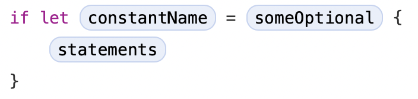

# 기본 \(The Basics\)

<!--
Swift is a new programming language for iOS, macOS, watchOS, and tvOS app development. Nonetheless, many parts of Swift will be familiar from your experience of developing in C and Objective-C.

Swift provides its own versions of all fundamental C and Objective-C types, including Int for integers, Double and Float for floating-point values, Bool for Boolean values, and String for textual data. Swift also provides powerful versions of the three primary collection types, Array, Set, and Dictionary, as described in Collection Types.

Like C, Swift uses variables to store and refer to values by an identifying name. Swift also makes extensive use of variables whose values can’t be changed. These are known as constants, and are much more powerful than constants in C. Constants are used throughout Swift to make code safer and clearer in intent when you work with values that don’t need to change.

In addition to familiar types, Swift introduces advanced types not found in Objective-C, such as tuples. Tuples enable you to create and pass around groupings of values. You can use a tuple to return multiple values from a function as a single compound value.

Swift also introduces optional types, which handle the absence of a value. Optionals say either “there is a value, and it equals x” or “there isn’t a value at all”. Using optionals is similar to using nil with pointers in Objective-C, but they work for any type, not just classes. Not only are optionals safer and more expressive than nil pointers in Objective-C, they’re at the heart of many of Swift’s most powerful features.

Swift is a type-safe language, which means the language helps you to be clear about the types of values your code can work with. If part of your code requires a String, type safety prevents you from passing it an Int by mistake. Likewise, type safety prevents you from accidentally passing an optional String to a piece of code that requires a non-optional String. Type safety helps you catch and fix errors as early as possible in the development process.
-->

Swift는 iOS, macOS, watchOS, 그리고 tvOS app 개발을 위한 새로운 프로그래밍 언어입니다. 그럼에도 불구하고 Swift에 많은 부분이 C와 Objective-C 개발경험과 비슷할 것입니다.

Swift는 정수에 대한 `Int`, 부동 소수점에 대한 `Double` 및 `Float`, 부울 값에 대한 `Bool` 및 텍스트 데이터에 대한 `String`을 포함하여 C와 Objective-C 모든 기초 타입을 자체 버전에 맞게 제공합니다. Swift는 또한 [콜렉션 타입 \(Collection Types\)](collection-types.md)에서 자세히 다룰 Array, Set, 그리고 Dictionary 인 3개의 기본 콜렉션 타입을 제공합니다.

C와 마찬가지로 Swift는 변수를 식별 가능한 이름으로 값을 저장하고 참조합니다. Swift는 또한 값을 변경할 수 없는 변수를 광범위하게 사용합니다. 이러한 변수를 상수라고 하며 C에서의 상수보다 훨씬 더 강력합니다. 상수는 Swift 전체에서 사용되며 변경할 필요가 없는 값으로 작업할 때 코드를 보다 안전하고 명확하게 만들 수 있습니다.

익숙한 타입 외에도 Swift는 Objective-C에는 없는 튜플 \(tuple\)이라는 고급 타입이 있습니다. 튜플은 값을 그룹화 하여 생성하거나 전달할 수 있습니다. 튜플을 사용하여 함수의 여러값을 단일 복합 값으로 반환할 수 있습니다.

Swift는 또한 값이 존재하지 않는 상태를 처리하기 위해 옵셔널 \(Optional\) 타입이 있습니다. 옵셔널은 _"값이 있고 x와 같다"_ 또는 _"값이 없다"_ 를 알려줍니다. 옵셔널을 사용하는 것은 Objective-C에서 포인터로 nil을 사용하는 것과 유사하지만 클래스 \(class\) 뿐만 아니라 모든 타입에서 사용할 수 있습니다. 옵셔널은 Objective-C에 nil 포인터보다 더 안전하고 광범위하게 사용되는 점이 Swift의 가장 강력한 핵심 기능입니다.

Swift는 _타입-세이프 \(type-safe\)_ 언어입니다. 타입 세이프란 언어가 값에 대해 타입을 명확하도록 도와주고 코드에서 같이 동작할 수 있도록 해줍니다. 타입 세이프티는 만약 `String`을 요구하는 코드에서 실수로 `Int`로 전달하는 것을 막아줍니다. 마찬가지로 옵셔널이 아닌 `String`을 요구하는 코드에 옵셔널 `String`을 전달하는 것을 막아줍니다. 타입 세이프티는 개발 단계에서 가능한 빠르게 에러를 찾고 고칠 수 있게 도와줍니다.

## 상수와 변수 \(Constants and Variables\)

<!--
Constants and variables associate a name (such as maximumNumberOfLoginAttempts or welcomeMessage) with a value of a particular type (such as the number 10 or the string "Hello"). The value of a constant can’t be changed once it’s set, whereas a variable can be set to a different value in the future.
-->

상수와 변수는 이름 \(`maximumNumberOfLoginAttempts` 또는 `welcomeMessage`\)과 특정 타입 \(숫자 `10` 또는 문자열 `"Hello"`와 같은 타입\)의 값을 연결합니다. _상수 \(Constant\)_ 의 값은 최초 지정 후 변경이 불가능하지만 _변수 \(Variable\)_ 는 다른 값으로 변경이 가능합니다.

### 상수와 변수 선언 \(Declaring Contants and Variables\)

<!--
Constants and variables must be declared before they’re used. You declare constants with the let keyword and variables with the var keyword. Here’s an example of how constants and variables can be used to track the number of login attempts a user has made:
-->

상수와 변수는 사용하기 전에 반드시 선언이 되어야 합니다. 상수는 `let` 키워드와 함께 선언하고 변수는 `var` 키워드와 함께 선언합니다. 다음의 예제는 상수와 변수를 사용하여 어떻게 사용자 로그인 시도 횟수를 추적하는지를 보여줍니다:

```swift
let maximumNumberOfLoginAttempts = 10
var currentLoginAttempt = 0
```

<!--
This code can be read as:

“Declare a new constant called maximumNumberOfLoginAttempts, and give it a value of 10. Then, declare a new variable called currentLoginAttempt, and give it an initial value of 0.”

In this example, the maximum number of allowed login attempts is declared as a constant, because the maximum value never changes. The current login attempt counter is declared as a variable, because this value must be incremented after each failed login attempt.

You can declare multiple constants or multiple variables on a single line, separated by commas:
-->

이 코드는 아래와 같이 읽을 수 있습니다:

_"`maximumNumberOfLoginAttempts` 인 새로운 상수를 선언하고 `10` 이라는 값을 설정합니다. 그리고 `currentLoginAttempt` 인 새로운 변수를 선언하고 `0` 이라는 값으로 초기화 하였습니다."_

이 예제에서 최대 로그인 시도 횟수는 최대값은 절대 변경되지 않아야 하므로 상수로 선언하였습니다. 현재 로그인 시도 횟수는 로그인 실패 시 값을 증가시켜야 하므로 변수로 선언하였습니다.

여러개의 상수 또는 여러개의 변수를 선언할 때 콤마로 구분하여 한줄로 선언이 가능합니다:

```swift
var x = 0.0, y = 0.0, z = 0.0
```

<!--
NOTE
If a stored value in your code won’t change, always declare it as a constant with the let keyword. Use variables only for storing values that need to be able to change.
-->

> NOTE  
> 코드에서 저장한 값이 변경되지 않는다면 항상 `let` 키워드로 상수로 선언해야 합니다. 변수는 오직 값을 저장하고 변경이 필요할 때 선언합니다.

### 타입 명시 \(Type Annotations\)

<!--
You can provide a type annotation when you declare a constant or variable, to be clear about the kind of values the constant or variable can store. Write a type annotation by placing a colon after the constant or variable name, followed by a space, followed by the name of the type to use.

This example provides a type annotation for a variable called welcomeMessage, to indicate that the variable can store String values:
-->

상수 또는 변수를 선언할 때 저장할 수 있는 값의 종류를 명확하게 하기위해 _타입 명시 \(Type Annotation\)_ 를 제공할 수 있습니다. 타입 명시는 상수 또는 변수 이름 뒤에 콜론과 공백 한칸 뒤에 사용할 타입 이름을 적어 사용합니다.

이 예제는 `welcomeMessage` 라는 변수에 `String` 값을 저장할 수 있는 변수를 나타내는 타입 명시를 제공합니다:

```swift
var welcomeMessage: String
```

<!--
The colon in the declaration means “…of type…,” so the code above can be read as:

“Declare a variable called welcomeMessage that’s of type String.”

The phrase “of type String” means “can store any String value.” Think of it as meaning “the type of thing” (or “the kind of thing”) that can be stored.

The welcomeMessage variable can now be set to any string value without error:
-->

위 코드에서 선언에 있는 콜론은 "...의 타입은..." 을 의미하므로 아래와 같이 읽을 수 있습니다:

_"선언한 변수는 `welcomeMessage` 라고 하며 이것의 타입은 `String` 입니다."_

"...의 타입은 `String` 입니다." 라는 의미는 "어떤 `String` 값은 저장 가능합니다." 입니다. 저장할 수 있는 "어떠한 타입" \(또는 "어떠한 종류"\) 라고 생각하십시오.

`welcomeMessage` 변수는 아무런 오류 없이 어떠한 문자열 값을 지정할 수 있습니다:

```swift
welcomeMessage = "Hello"
```

<!--
You can define multiple related variables of the same type on a single line, separated by commas, with a single type annotation after the final variable name:
-->

같은 타입에 여러개의 연관된 변수를 콤마로 변수 이름을 구분하고 마지막 변수 이름 뒤에 하나의 타입 명시를 통해 한줄로 선언할 수 있습니다:

```swift
var red, green, blue: Double
```

<!--
NOTE

It’s rare that you need to write type annotations in practice. If you provide an initial value for a constant or variable at the point that it’s defined, Swift can almost always infer the type to be used for that constant or variable, as described in Type Safety and Type Inference. In the welcomeMessage example above, no initial value is provided, and so the type of the welcomeMessage variable is specified with a type annotation rather than being inferred from an initial value.
-->

> NOTE  
> 실제로 타입 명시가 필요한 경우는 드뭅니다. 상수 또는 변수를 선언할 때 초기값을 지정하면 Swift는 [타입 세이프티와 타입 추론 \(Type Safety and Type Inference\)](the-basics.md#type-safety-and-type-inference) 에서 나와있는대로 해당 상수 또는 변수에 사용될 타입을 거의 항상 유추할 수 있습니다. 위의 `welcomeMessage` 예제에서 초기값을 지정하지 않았으므로 `welcomeMessage` 변수의 타입은 초기값에서 유추되지 않고 타입을 명시 하였습니다.

### 상수와 변수의 이름 \(Naming Constants and Variables\)

<!--
Constant and variable names can contain almost any character, including Unicode characters:
-->

상수와 변수 이름은 유니코드 \(Unicode\) 문자를 포함하여 대부분의 문자를 포함할 수 있습니다:

```swift
let n = 3.14159
let 你好 = "你好世界"
let 🐶🐮 = "dogcow"
```

<!--
Constant and variable names can’t contain whitespace characters, mathematical symbols, arrows, private-use Unicode scalar values, or line- and box-drawing characters. Nor can they begin with a number, although numbers may be included elsewhere within the name.

Once you’ve declared a constant or variable of a certain type, you can’t declare it again with the same name, or change it to store values of a different type. Nor can you change a constant into a variable or a variable into a constant.
-->

상수와 변수 이름은 공백, 수학적 기호, 화살표, 개인전용 유니코드 스칼라 값, 또는 선과 박스를 그리는 문자를 포함할 수 없습니다. 숫자는 이름의 다른곳에는 포함될 수 있지만 숫자로 시작하는 이름은 선언할 수 없습니다.

특정 타입으로 상수 또는 변수를 선언하면 동일한 이름으로 다시 선언하거나 다른 타입의 값을 저장하도록 변경하여 선언할 수 없습니다. 상수를 변수로 바꾸거나 변수를 상수로 바꿀 수도 없습니다.

<!--
NOTE
If you need to give a constant or variable the same name as a reserved Swift keyword, surround the keyword with backticks (`) when using it as a name. However, avoid using keywords as names unless you have absolutely no choice.
-->

> NOTE  
> Swift 키워드와 동일한 이름의 상수 또는 변수를 제공해야 한다면 이름을 백틱 \(\`\)으로 묶어야 합니다. 그러나 선택의 여지가 없을때까지는 키워드를 이름으로 사용하지 말아야 합니다.

<!--
You can change the value of an existing variable to another value of a compatible type. In this example, the value of friendlyWelcome is changed from "Hello!" to "Bonjour!":
-->

동일한 타입의 다른 값으로 이미 선언된 변수에 값을 변경할 수 있습니다. 예제에서 `friendlyWelcome` 값은 `"Hello!"` 에서 `"Bonjour!"` 변경됩니다:

```swift
var friendlyWelcome = "Hello!"
friendlyWelcome = "Bonjour!"
// friendlyWelcome is now "Bonjour!"
```

<!--
Unlike a variable, the value of a constant can’t be changed after it’s set. Attempting to do so is reported as an error when your code is compiled:
-->

변수와 달리 상수 값은 지정된 이후에는 변경할 수 없습니다. 값을 변경하려고 하면 코드가 컴파일 될 때 오류가 발생합니다:

```swift
let languageName = "Swift"
languageName = "Swift++"
// This is a compile-time error: languageName cannot be changed.
```

### 상수와 변수 출력 \(Printing Constants and Variables\)

<!--
You can print the current value of a constant or variable with the print(_:separator:terminator:) function:
-->

`print(_:separator:terminator:)` 함수로 상수 또는 변수의 현재 값을 출력할 수 있습니다:

```swift
print(friendlyWelcome)
// Prints "Bonjour!"
```

<!--
The print(_:separator:terminator:) function is a global function that prints one or more values to an appropriate output. In Xcode, for example, the print(_:separator:terminator:) function prints its output in Xcode’s “console” pane. The separator and terminator parameter have default values, so you can omit them when you call this function. By default, the function terminates the line it prints by adding a line break. To print a value without a line break after it, pass an empty string as the terminator—for example, print(someValue, terminator: ""). For information about parameters with default values, see Default Parameter Values.

Swift uses string interpolation to include the name of a constant or variable as a placeholder in a longer string, and to prompt Swift to replace it with the current value of that constant or variable. Wrap the name in parentheses and escape it with a backslash before the opening parenthesis:
-->

`print(_:separator:terminator:)` 함수는 하나 또는 그 이상의 값을 적절하게 출력하는 전역 함수입니다. 예를 들어 Xcode에서 `print(_:separator:terminator:)` 함수는 Xcode "콘솔 \(console\)" 창에 결과를 출력합니다. `separator` 와 `terminator` 파라미터는 기본 값을 가지고 있으므로 함수를 호출할 때 생략할 수 있습니다. 기본적으로 이 함수는 줄바꿈을 출력하고 종료됩니다. 줄바꿈 없이 값을 출력하려면 예를 들어 `print(someValue, terminator: "")` 와 같이 `terminator` 에 빈 문자열을 넘겨주면 됩니다. 파라미터 기본값에 대한 자세한 내용은 [파라미터 기본 값 \(Default Parameter Values\)](functions.md#default-parameter-values) 을 참고 바랍니다.

Swift는 긴 문자열에 상수 또는 변수의 이름을 포함하여 Swift가 상수 또는 변수의 현재 값으로 대체하기 위해 _문자열 삽입 \(String interpolation\)_ 을 사용합니다. 이름을 소괄호로 감싸고 여는 소괄호 전에 백슬래시를 추가해야 합니다:

```swift
print("The current value of friendlyWelcome is \(friendlyWelcome)")
// Prints "The current value of friendlyWelcome is Bonjour!"
```

<!--
NOTE
All options you can use with string interpolation are described in String Interpolation.
-->

> NOTE  
> 문자열 삽입에서 사용할 수 있는 모든 옵션은 [문자열 삽입 \(String interpolation\)](strings-and-characters.md#string-interpolation) 에 자세히 설명되어 있습니다.

## 주석 \(Comments\)

<!--
Use comments to include nonexecutable text in your code, as a note or reminder to yourself. Comments are ignored by the Swift compiler when your code is compiled.

Comments in Swift are very similar to comments in C. Single-line comments begin with two forward-slashes (//):
-->

코드에서 설명 또는 기록을 위해 실행되지 않는 문자를 추가할 땐 주석 \(Comments\)을 사용합니다. 주석은 코드가 컴파일 될 때 Swift 컴파일러에 의해 무시됩니다.

Swift에서 주석은 C에서 주석을 다는 방법과 유사합니다. 한줄 주석은 두개의 슬래시 \(`//`\)로 시작합니다:

```swift
// This is a comment.
```

<!--
Multiline comments start with a forward-slash followed by an asterisk (/*) and end with an asterisk followed by a forward-slash (*/):
-->

여러줄 주석은 슬래시 뒤에 애스터리스크 \(`/*`_\) 로 시작하고 애스터리스크 뒤에 슬래시 \(`*/`_\)로 끝납니다:

```swift
/* This is also a comment
but is written over multiple lines. */
```

<!--
Unlike multiline comments in C, multiline comments in Swift can be nested inside other multiline comments. You write nested comments by starting a multiline comment block and then starting a second multiline comment within the first block. The second block is then closed, followed by the first block:
-->

C에서 여러줄 주석과 다르게 Swift는 여러줄 주석 안에 다른 여러줄 주석을 통해 중첩시킬 수 있습니다. 여러줄 주석 블럭을 시작한 다음 첫번째 블럭 내에서 두번째 여러줄 주석을 시작하여 중첩된 주석을 작성합니다. 그런다음 두번째 블럭을 닫은 다음 첫번째 블럭을 닫습니다:

```swift
/* This is the start of the first multiline comment.
 /* This is the second, nested multiline comment. */
This is the end of the first multiline comment. */
```

<!--
Nested multiline comments enable you to comment out large blocks of code quickly and easily, even if the code already contains multiline comments.
-->

중첩된 여러줄 주석을 사용하면 코드에 이미 여러줄 주석이 포함되어 있어도 큰 코드 블럭을 빠르고 쉽게 주석 처리할 수 있습니다.

## 세미콜론 \(Semicolons\)

<!--
Unlike many other languages, Swift doesn’t require you to write a semicolon (;) after each statement in your code, although you can do so if you wish. However, semicolons are required if you want to write multiple separate statements on a single line:
-->

많은 다른 언어와 다르게 Swift는 코드의 각 구문 후에 세미콜론 \(`;`\)은 필수조건이 아닙니다. 그러나 여러 구문을 한줄로 작성할 경우 세미콜론은 _필수로 작성되어야 합니다_:

```swift
let cat = "🐱"; print(cat)
// Prints "🐱"
```

## 정수 \(Integers\)

<!--
Integers are whole numbers with no fractional component, such as 42 and -23. Integers are either signed (positive, zero, or negative) or unsigned (positive or zero).

Swift provides signed and unsigned integers in 8, 16, 32, and 64 bit forms. These integers follow a naming convention similar to C, in that an 8-bit unsigned integer is of type UInt8, and a 32-bit signed integer is of type Int32. Like all types in Swift, these integer types have capitalized names.
-->

_정수 \(Integers\)_ 는 `42` 와 `-23` 과 같은 분수가 아닌 전체 숫자입니다. 정수는 _부호가 있는 정수 \(signed\) \(양수, 0, 또는 음수\)_ 또는 _부호가 없는 정수 \(unsigned\) \(양수 또는 0\)_ 이 있습니다.

Swift는 8, 16, 32, 그리고 64 비트 형태의 부호가 있는 정수와 부호가 없는 정수를 지원합니다. 이러한 정수는 8-bit 부호가 없는 정수는 `UInt8` 그리고 32-bit 부호가 있는 정수는 `Int32`와 같이 C와 비슷한 네이밍 형태를 가집니다. Swift의 모든 타입과 마찬가지로 정수 타입은 대문자로 시작합니다.

### 정수 범위 \(Integer Bounds\)

<!--
You can access the minimum and maximum values of each integer type with its min and max properties:
-->

각 정수 타입의 `min` 과 `max` 프로퍼티를 통해 각 정수 타입의 최소값과 최대값을 가져올 수 있습니다:

```swift
let minValue = UInt8.min  // minValue is equal to 0, and is of type UInt8
let maxValue = UInt8.max  // maxValue is equal to 255, and is of type UInt8
```

<!--
The values of these properties are of the appropriate-sized number type (such as UInt8 in the example above) and can therefore be used in expressions alongside other values of the same type.
-->

이러한 프로퍼티의 값은 적절한 크기의 숫자 타입 \(위 예에서 `UInt8`\)이므로 동일한 타입의 다른 값과 함께 표현식에 사용될 수 있습니다.

### Int

<!--
In most cases, you don’t need to pick a specific size of integer to use in your code. Swift provides an additional integer type, Int, which has the same size as the current platform’s native word size:

* On a 32-bit platform, Int is the same size as Int32.
* On a 64-bit platform, Int is the same size as Int64.

Unless you need to work with a specific size of integer, always use Int for integer values in your code. This aids code consistency and interoperability. Even on 32-bit platforms, Int can store any value between -2,147,483,648 and 2,147,483,647, and is large enough for many integer ranges.
-->

대부분의 경우 코드에서 사용할 정수의 특정 사이즈를 결정할 필요는 없습니다. Swift는 현재 플랫폼의 네이티브 사이즈와 같은 `Int` 인 정수 타입을 제공합니다:

* 32-bit 플랫폼에서 `Int` 는 `Int32` 와 같은 크기를 가짐
* 64-bit 플랫폼에서 `Int` 는 `Int64` 와 같은 크기를 가짐

특정 크기의 정수로 작업해야 하는 경우가 아니라면 항상 코드의 정수 값을 사용할 때 `Int` 를 사용하십시오. 이것은 코드 일관성과 상호 운용성을 지원합니다. 32-bit 플랫폼에서도 `Int` 는 `-2,147,483,648` 과 `2,147,483,647` 사이의 값을 저장할 수 있으며 일반적인 사용성에 문제가 없습니다.

### UInt

<!--
Swift also provides an unsigned integer type, UInt, which has the same size as the current platform’s native word size:

* On a 32-bit platform, UInt is the same size as UInt32.
* On a 64-bit platform, UInt is the same size as UInt64.
-->

Swift는 또한 현재 플랫폼의 네이티브 사이즈와 같은 `UInt` 인 정수 타입을 제공합니다:

* 32-bit 플랫폼에서 `UInt` 는 `UInt32` 와 같은 크기를 가짐
* 64-bit 플랫폼에서 `UInt` 는 `UInt64` 와 같은 크기를 가짐

<!--
NOTE
Use UInt only when you specifically need an unsigned integer type with the same size as the platform’s native word size. If this isn’t the case, Int is preferred, even when the values to be stored are known to be nonnegative. A consistent use of Int for integer values aids code interoperability, avoids the need to convert between different number types, and matches integer type inference, as described in Type Safety and Type Inference.
-->

> NOTE  
> `UInt` 는 플랫폼의 네이티브 사이즈와 같은 크기의 부호없는 정수 타입이 필요한 경우에만 사용하십시오. 저장될 값이 음수가 아니어도 `Int` 를 더 선호합니다. 정수값에 `Int` 를 일관되게 사용하면 코드 상호 운용성을 지원하고 [타입 세이프티 와 타입 유추 \(Type Safety and Type Inference\)](the-basics.md#type-safety-and-type-inference)에 설명 된대로 다른 숫자 형식간에 변환 할 필요가 없습니다.

## 부동 소수점 숫자 \(Floating-Point Numbers\)

<!--
Floating-point numbers are numbers with a fractional component, such as 3.14159, 0.1, and -273.15.

Floating-point types can represent a much wider range of values than integer types, and can store numbers that are much larger or smaller than can be stored in an Int. Swift provides two signed floating-point number types:

* Double represents a 64-bit floating-point number.
* Float represents a 32-bit floating-point number.
-->

_부동 소수점 숫자 \(Floating-point numbers\)_ 는 `3.14159`, `0.1`, 및 `-273.15`와 같은 분수 성분을 가진 숫자입니다.

부동 소수점은 정수 타입의 값 범위보다 더 넓은 범위의 표현이 가능하고 `Int` 보다 더 크거나 작은 값 저장이 가능합니다. Swift는 2개의 부호를 가진 부동 소수점 숫자 타입을 제공합니다:

* `Double` 은 64-bit 부동 소수점 숫자를 표기
* `Float` 는 32-bit 부동 소수점 숫자를 표기

<!--
NOTE
Double has a precision of at least 15 decimal digits, whereas the precision of Float can be as little as 6 decimal digits. The appropriate floating-point type to use depends on the nature and range of values you need to work with in your code. In situations where either type would be appropriate, Double is preferred.
-->

> NOTE  
> `Double` 은 최소 15자리의 소수점 정확도를 가지고 있는것에 반해 `Float` 는 더 적은 6자리의 정확도를 가집니다. 사용할 적절한 부동 소수점 타입은 코드에서 작업해야하는 값의 특성과 범위에 따라 다릅니다. 두 타입 중에는 `Double` 이 선호됩니다.

## 타입 세이프티와 타입 유추 \(Type Safety and Type Inference\)

<!--
Swift is a type-safe language. A type safe language encourages you to be clear about the types of values your code can work with. If part of your code requires a String, you can’t pass it an Int by mistake.

Because Swift is type safe, it performs type checks when compiling your code and flags any mismatched types as errors. This enables you to catch and fix errors as early as possible in the development process.

Type-checking helps you avoid errors when you’re working with different types of values. However, this doesn’t mean that you have to specify the type of every constant and variable that you declare. If you don’t specify the type of value you need, Swift uses type inference to work out the appropriate type. Type inference enables a compiler to deduce the type of a particular expression automatically when it compiles your code, simply by examining the values you provide.

Because of type inference, Swift requires far fewer type declarations than languages such as C or Objective-C. Constants and variables are still explicitly typed, but much of the work of specifying their type is done for you.

Type inference is particularly useful when you declare a constant or variable with an initial value. This is often done by assigning a literal value (or literal) to the constant or variable at the point that you declare it. (A literal value is a value that appears directly in your source code, such as 42 and 3.14159 in the examples below.)

For example, if you assign a literal value of 42 to a new constant without saying what type it is, Swift infers that you want the constant to be an Int, because you have initialized it with a number that looks like an integer:
-->

Swift는 _타입-세이프 \(type-safe\)_ 언어입니다. 타입 세이프 언어를 사용하면 코드가 사용할 수 있는 값의 타입을 명확하게 알 수 있습니다. 코드의 일부에서 `String` 이 필요한 경우 실수로 `Int` 를 전달할 수 없습니다.

Swift는 타입 세이프이기 때문에 코드를 컴파일 할 때 타입 검사를 수행하고 일치하지 않는 타입을 오류로 표시합니다. 이를 통해 개발 단계에서 가능한 빨리 오류를 포착하고 수정할 수 있습니다.

타입 검사는 다른 타입의 값으로 작업할 때 오류를 피하는데 도움이 됩니다. 그러나 이것이 선언하는 모든 상수와 변수의 타입을 지정해야 한다는 것은 아닙니다. 필요한 값의 특정 타입을 지정하지 않으면 Swift는 적절한 타입으로 _타입 유추 \(Type Inference\)_ 를 사용합니다. 타입 유추를 통해 컴파일러는 코드를 컴파일 할 때 제공한 값을 검사하여 특정 식의 타입을 자동으로 유추할 수 있습니다.

타입 유추 때문에 Swift는 C 또는 Objective-C와 같은 언어보다 타입 선언을 더 적게 요구됩니다. 상수와 변수는 여전히 명시적으로 타입을 지정하지만 타입을 지정하는 많은 동작을 도와줍니다.

타입 유추는 상수 또는 변수에 초기값을 선언할 때 아주 유용합니다. 이것은 종종 선언하는 시점에 상수 또는 변수에 리터럴 값 \(literal value\) 또는 리터럴 \(literal\)을 지정하여 수행됩니다. \(리터럴 값은 아래 예에서 42 및 3.14159와 같은 소스 코드에 직접 표시되는 값입니다\)

예를 들어 어떤 타입인지 선언하지 않고 새로운 상수를 42의 리터럴 값으로 지정하면 Swift는 정수처럼 보이는 숫자로 초기화 했기 때문에 상수가 `Int` 라고 추론합니다:

```swift
let meaningOfLife = 42
// meaningOfLife is inferred to be of type Int
```

<!--
Likewise, if you don’t specify a type for a floating-point literal, Swift infers that you want to create a Double:
-->

반대로 어떤 부동 소수점 리터럴의 타입인지 선언하지 않으면 Swift는 `Double` 이라고 추론합니다:

```swift
let pi = 3.14159
// pi is inferred to be of type Double
```

<!--
Swift always chooses Double (rather than Float) when inferring the type of floating-point numbers.

If you combine integer and floating-point literals in an expression, a type of Double will be inferred from the context:
-->

Swift는 부동 소수점 숫자의 타입을 추론할 때 항상 `Float` 보다 `Double` 을 선택합니다.

표현식에서 정수와 부동소수 리터럴을 결합하면 컨텍스트에서는 `Double` 타입으로 유추합니다:

```swift
let anotherPi = 3 + 0.14159
// anotherPi is also inferred to be of type Double
```

<!--
The literal value of 3 has no explicit type in and of itself, and so an appropriate output type of Double is inferred from the presence of a floating-point literal as part of the addition.
-->

`3` 인 리터럴 값에는 명시적인 타입이 없으므로 추가로 부동 소수점 리터럴이 존재하는 경우 `Double` 이 유추됩니다.

## 숫자 리터럴 \(Numberic Literals\)

<!--
Integer literals can be written as:

* A decimal number, with no prefix
* A binary number, with a 0b prefix
* An octal number, with a 0o prefix
* A hexadecimal number, with a 0x prefix

All of these integer literals have a decimal value of 17:
-->

정수 리터럴은 아래와 같이 쓸 수 있습니다:

* 접두사 없는 _10진수_
* `0b` 접두사로 _2진수_
* `0o` 접두사로 _8진수_
* `0x` 접두사로 _16진수_

아래의 예에서 모든 정수 리터럴은 10진수 `17` 의 값을 가집니다:

```swift
let decimalInteger = 17
let binaryInteger = 0b10001       // 17 in binary notation
let octalInteger = 0o21           // 17 in octal notation
let hexadecimalInteger = 0x11     // 17 in hexadecimal notation
```

<!--
Floating-point literals can be decimal (with no prefix), or hexadecimal (with a 0x prefix). They must always have a number (or hexadecimal number) on both sides of the decimal point. Decimal floats can also have an optional exponent, indicated by an uppercase or lowercase e; hexadecimal floats must have an exponent, indicated by an uppercase or lowercase p.

For decimal numbers with an exponent of exp, the base number is multiplied by 10exp:

* 1.25e2 means 1.25 x 102, or 125.0.
* 1.25e-2 means 1.25 x 10-2, or 0.0125.

For hexadecimal numbers with an exponent of exp, the base number is multiplied by 2exp:

* 0xFp2 means 15 x 22, or 60.0.
* 0xFp-2 means 15 x 2-2, or 3.75.

All of these floating-point literals have a decimal value of 12.1875:
-->

부동 소수점 리터럴은 10진수 \(접두사 없음\) 또는 16진수 \(접두사 `0x`\) 일 수 있습니다. 소수점 양쪽에 항상 숫자 \(또는 16진수\)가 있어야 합니다. 10진수는 대문자 또는 소문자 e로 표시되는 _지수_ 를 가질 수도 있습니다. 16진수는 대문자 또는 소문자 p로 표시되는 _지수_ 를 가질 수도 있습니다.

지수가 `exp` 인 10진수는 기본 숫자에 $$10^{exp}$$ 가 곱해집니다:

* `1.25e2` 는 1.25 x $$10^2$$, 또는 `125.0`
* `1.25e-2` 는 1.25 x $$10^{-2}$$ , 또는 `0.0125`

지수가 `exp` 인 16진수는 기본 숫자에 $$2^{exp}$$ 가 곱해집니다:

* `0xFp2` 는 15 x $$2^2$$ , 또는 `60.0`
* `0xFp-2` 는 15 x $$2^{-2}$$ , 또는 `3.75`

아래의 예에서 모든 부동 소수점 리터럴은 10진수 `12.1875` 를 가집니다:

```swift
let decimalDouble = 12.1875
let exponentDouble = 1.21875e1
let hexadecimalDouble = 0xC.3p0
```

<!--
Numeric literals can contain extra formatting to make them easier to read. Both integers and floats can be padded with extra zeros and can contain underscores to help with readability. Neither type of formatting affects the underlying value of the literal:
-->

숫자 리터럴은 읽기 쉽게 만드는 추가 포맷을 포함할 수 있습니다. 정수와 부동 소수점 모두 추가 0으로 채워질 수 있으며 가독성을 돕기 위해 밑줄을 포함할 수 있습니다. 어떤 형식도 리터럴의 기본 값에 영향을 주지 않습니다:

```swift
let paddedDouble = 000123.456
let oneMillion = 1_000_000
let justOverOneMillion = 1_000_000.000_000_1
```

## 숫자 타입 변환 \(Numeric Type Conversion\)

<!--
Use the Int type for all general-purpose integer constants and variables in your code, even if they’re known to be nonnegative. Using the default integer type in everyday situations means that integer constants and variables are immediately interoperable in your code and will match the inferred type for integer literal values.

Use other integer types only when they’re specifically needed for the task at hand, because of explicitly sized data from an external source, or for performance, memory usage, or other necessary optimization. Using explicitly sized types in these situations helps to catch any accidental value overflows and implicitly documents the nature of the data being used.
-->

음수를 사용하지 않더라도 코드에서 상수와 변수가 정수로 사용이 되면 `Int` 타입을 사용합니다. 일반적인 상황에서 기본 정수 타입을 사용하는 것은 정수 상수와 변수가 코드에서 즉시 상호 운용 가능하며 정수 리터럴 값의 유추 된 타입이 일치한다는 것을 의미합니다.

외부 소스에서 명시적으로 크기가 지정된 데이터 또는 성능, 메모리 사용, 또는 다른 성능 최적화를 위해 특별히 필요한 경우에만 다른 정수 타입을 사용하십시오. 이러한 상황에서 명시적으로 크기의 타입을 사용하면 실수로 인한 값 초과를 포착하고 사용중인 데이터의 특성을 알 수 있습니다.

### 정수 변환 \(Integer Conversion\)

<!--
The range of numbers that can be stored in an integer constant or variable is different for each numeric type. An Int8 constant or variable can store numbers between -128 and 127, whereas a UInt8 constant or variable can store numbers between 0 and 255. A number that won’t fit into a constant or variable of a sized integer type is reported as an error when your code is compiled:
-->

정수를 저장할 수 있는 상수 또는 변수의 숫자 범위는 각 숫자 타입에 따라 다릅니다. `Int8` 상수 또는 변수는 `-128` 과 `127` 사이의 숫자를 저장할 수 있는 반면에 `UInt8` 상수 또는 변수는 `0` 과 `255` 사이의 숫자를 저장할 수 있습니다. 크기가 지정된 정수 타입의 상수 또는 변수에 맞지않는 숫자는 컴파일 시에 오류가 발생합니다:

```swift
let cannotBeNegative: UInt8 = -1
// UInt8 cannot store negative numbers, and so this will report an error
let tooBig: Int8 = Int8.max + 1
// Int8 cannot store a number larger than its maximum value,
// and so this will also report an error
```

<!--
Because each numeric type can store a different range of values, you must opt in to numeric type conversion on a case-by-case basis. This opt-in approach prevents hidden conversion errors and helps make type conversion intentions explicit in your code.

To convert one specific number type to another, you initialize a new number of the desired type with the existing value. In the example below, the constant twoThousand is of type UInt16, whereas the constant one is of type UInt8. They can’t be added together directly, because they’re not of the same type. Instead, this example calls UInt16(one) to create a new UInt16 initialized with the value of one, and uses this value in place of the original:
-->

각 숫자 타입은 다른 범위의 값을 저장할 수 있으므로 숫자 타입 변환을 각 타입별로 선택해야 합니다. 이 옵트인 \(opt-in\) 방식은 숨겨진 변환 오류를 방지하고 코드에서 타입 변환 의도를 명시적으로 만드는데 도움을 줍니다.

특정 숫자 타입을 다른 숫자 타입으로 변환하려면 기존값으로 원하는 타입의 새 숫자를 초기화합니다. 아래의 예제에서 상수 `twoThousand` 는 `UInt16` 타입인 반면에 상수 `one` 은 `UInt8` 타입입니다. 두 상수는 타입이 다르기 때문에 직접 더할 수 없습니다. 대신 이 예제에서 `UInt16(one)` 을 호출하여 `one` 의 값을 새로운 `UInt16` 으로 초기화하면 기존 값 대신에 새로운 값을 사용합니다:

```swift
let twoThousand: UInt16 = 2_000
let one: UInt8 = 1
let twoThousandAndOne = twoThousand + UInt16(one)
```

<!--
Because both sides of the addition are now of type UInt16, the addition is allowed. The output constant (twoThousandAndOne) is inferred to be of type UInt16, because it’s the sum of two UInt16 values.

SomeType(ofInitialValue) is the default way to call the initializer of a Swift type and pass in an initial value. Behind the scenes, UInt16 has an initializer that accepts a UInt8 value, and so this initializer is used to make a new UInt16 from an existing UInt8. You can’t pass in any type here, however—it has to be a type for which UInt16 provides an initializer. Extending existing types to provide initializers that accept new types (including your own type definitions) is covered in Extensions.
-->

양쪽의 타입이 `UInt16` 이므로 덧셈은 이제 제대로 동작합니다. 출력 상수 \(`twoThousandAndOne`\)은 두 `UInt16` 값을 더하므로 `UInt16` 타입으로 유추됩니다.

`SomeType (ofInitialValue)` 는 Swift 타입의 초기화를 호출하고 초기화 값을 전달하는 기본적인 방법입니다. 이전에 `UInt16` 은 `UInt8` 값을 허용하는 초기화가 있으므로 초기화는 기존 `UInt8` 에서 새 `UInt16` 을 만드는데 사용됩니다. 그러나 `UInt16` 이 제공하는 초기화 타입 이외에는 전달할 수 없습니다. 기존 타입을 확장하여 새로운 타입 \(자신이 정의한 새로운 타입\)을 받아들이는 초기화를 제공하는 것은 [확장 \(Extensions\)](extensions.md) 에서 다룹니다.

### 정수와 부동 소수점 변환 \(Integer and Floating-Point Conversion\)

<!--
Conversions between integer and floating-point numeric types must be made explicit:
-->

정수와 부동 소수점 숫자 타입의 변환은 명시적으로 변환해야 합니다:

```swift
let three = 3
let pointOneFourOneFiveNine = 0.14159
let pi = Double(three) + pointOneFourOneFiveNine
// pi equals 3.14159, and is inferred to be of type Double
```

<!--
Here, the value of the constant three is used to create a new value of type Double, so that both sides of the addition are of the same type. Without this conversion in place, the addition would not be allowed.

Floating-point to integer conversion must also be made explicit. An integer type can be initialized with a Double or Float value:
-->

여기서 상수 `three` 는 타입 `Double` 의 새로운 값으로 생성하는데 사용되어 덧셈의 양쪽이 동일한 타입입니다. 이 변환이 없으면 덧셈이 허용되지 않습니다.

부동 소수점을 정수로 변환하는 것 또한 명시적으로 변환해야 합니다. 정수 타입은 `Double` 또는 `Float` 로 초기화 될 수 있습니다:

```swift
let integerPi = Int(pi)
// integerPi equals 3, and is inferred to be of type Int
```

<!--
Floating-point values are always truncated when used to initialize a new integer value in this way. This means that 4.75 becomes 4, and -3.9 becomes -3.
-->

부동 소수점 값은 새로운 정수 값으로 초기화할 때 소수점 아래를 버림합니다. 이것은 `4.75` 는 `4`, 그리고 `-3.9` 는 `-3` 이 된다는 의미입니다.

<!--
NOTE
The rules for combining numeric constants and variables are different from the rules for numeric literals. The literal value 3 can be added directly to the literal value 0.14159, because number literals don’t have an explicit type in and of themselves. Their type is inferred only at the point that they’re evaluated by the compiler.
-->

> NOTE  
> 숫자 상수와 변수를 결합하는 규칙은 숫자 리터럴 규칙과 다릅니다. 리터럴 값 `3` 은 숫자 리터럴에 명시적인 타입이 없으므로 리터럴 값 `0.14159` 에 직접 추가할 수 있습니다. 이것의 타입은 컴파일러가 실행되는 시점에서만 유추됩니다.

## 타입 별칭 \(Type Aliases\)

<!--
Type aliases define an alternative name for an existing type. You define type aliases with the typealias keyword.

Type aliases are useful when you want to refer to an existing type by a name that’s contextually more appropriate, such as when working with data of a specific size from an external source:
-->

_타입 별칭 \(Type aliases\)_ 은 이미 존재하는 타입을 다른 이름으로 정의합니다. 타입 별칭은 `typealias` 키워드를 사용하여 정의할 수 있습니다.

타입 별칭은 외부 소스에서 특정 크기의 데이터로 작업할 때와 같이 상황에 맞는 이름으로 기존 타입을 참조하려는 경우에 유용합니다:

```swift
typealias AudioSample = UInt16
```

<!--
Once you define a type alias, you can use the alias anywhere you might use the original name:
-->

타입 별칭을 정의하면 원래 이름을 사용할 수 있는 모든 위치에서 별칭을 사용할 수 있습니다:

```swift
var maxAmplitudeFound = AudioSample.min
// maxAmplitudeFound is now 0
```

<!--
Here, AudioSample is defined as an alias for UInt16. Because it’s an alias, the call to AudioSample.min actually calls UInt16.min, which provides an initial value of 0 for the maxAmplitudeFound variable.
-->

여기서 `AudioSample` 은 `UInt16` 의 별칭으로 정의됩니다. 별칭이므로 `AudioSample.min` 에 대한 호출은 실제로 `UInt16.min` 을 호출하며 `maxAmplitudeFound` 변수의 초기값은 `0` 입니다.

## 부울 \(Booleans\)

<!--
Swift has a basic Boolean type, called Bool. Boolean values are referred to as logical, because they can only ever be true or false. Swift provides two Boolean constant values, true and false:
-->

Swift는 `Bool` 이라 불리는 기본 _부울 \(Boolean\) 타입_ 이 있습니다. 부울 값은 오직 참 또는 거짓 값만 가지므로 _논리적 \(logical\)_으로 참조됩니다. Swift는 2개의 부울 상수 값인 `true` 와 `false` 를 제공합니다:

```swift
let orangesAreOrange = true
let turnipsAreDelicious = false
```

<!--
The types of orangesAreOrange and turnipsAreDelicious have been inferred as Bool from the fact that they were initialized with Boolean literal values. As with Int and Double above, you don’t need to declare constants or variables as Bool if you set them to true or false as soon as you create them. Type inference helps make Swift code more concise and readable when it initializes constants or variables with other values whose type is already known.

Boolean values are particularly useful when you work with conditional statements such as the if statement:
-->

`orangesAreOrange` 와 `turnipsAreDelicious` 의 타입은 부울 리터럴 값으로 초기화 되어 `Bool` 로 유추되었습니다. 위의 `Int` 와 `Double` 에서와 같이 상수 또는 변수를 초기화 시 `true` 또는 `false` 로 선언하면 상수 또는 변수를 `Bool` 타입으로 선언할 필요가 없습니다. 타입 유추는 Swift 코드가 이미 알고 있는 타입의 다른 값으로 상수 또는 변수를 초기화시에 더 간결하고 읽기 쉽습니다.

부울 값은 `if` 구문과 같은 조건문으로 동작할 때 특히 유용합니다:

```swift
if turnipsAreDelicious {
    print("Mmm, tasty turnips!")
} else {
    print("Eww, turnips are horrible.")
}
// Prints "Eww, turnips are horrible."
```

<!--
Conditional statements such as the if statement are covered in more detail in Control Flow.

Swift’s type safety prevents non-Boolean values from being substituted for Bool. The following example reports a compile-time error:
-->

`if` 구문 같은 조건문은 [제어 흐름 \(Control Flow\)](control-flow.md) 에서 자세히 다룹니다.

Swift의 타입 세이프티는 부울이 아닌 값이 `Bool` 로 대체되는 것을 방지합니다. 아래 예제는 컴파일 시 에러를 발생합니다:

```swift
let i = 1
if i {
    // this example will not compile, and will report an error
}
```

<!--
However, the alternative example below is valid:
-->

그러나 아래와 같은 예제는 정상 동작합니다:

```swift
let i = 1
if i == 1 {
    // this example will compile successfully
}
```

<!--
The result of the i == 1 comparison is of type Bool, and so this second example passes the type-check. Comparisons like i == 1 are discussed in Basic Operators.

As with other examples of type safety in Swift, this approach avoids accidental errors and ensures that the intention of a particular section of code is always clear.
-->

`i == 1` 비교 결과는 `Bool` 타입이므로 이 두번째 예제는 타입 검사를 정상적으로 수행할 수 있습니다. `i == 1` 과 같은 비교는 [기본 연산자 \(Basic Operators\)](basic-operators.md) 에서 설명합니다.

Swift의 타입 세이프티에 대한 다른 예제와 마찬가지로 이 방법은 실수로 인한 오류를 피하고 코드의 특정 섹션의 의도를 항상 명확하도록 보장합니다.

## 튜플 \(Tuples\)

<!--
Tuples group multiple values into a single compound value. The values within a tuple can be of any type and don’t have to be of the same type as each other.

In this example, (404, "Not Found") is a tuple that describes an HTTP status code. An HTTP status code is a special value returned by a web server whenever you request a web page. A status code of 404 Not Found is returned if you request a webpage that doesn’t exist.
-->

_튜플 \(Tuples\)_ 은 여러값을 단일 복합 값으로 그룹화 합니다. 튜플안에 값은 어떠한 타입도 가능하며 서로 같은 타입일 필요는 없습니다.

이 예제에서 `(404, "Not Found")` 는 _HTTP 상태 코드 \(HTTP status code\)_ 를 나타내는 튜플입니다. HTTP 상태 코드는 웹 페이지를 요청할 때마다 웹 서버가 반환하는 특정 값입니다. `404 Not Found` 상태 코드는 요청한 웹 페이지가 존재하지 않을 때 반환됩니다.

```swift
let http404Error = (404, "Not Found")
// http404Error is of type (Int, String), and equals (404, "Not Found")
```

<!--
The (404, "Not Found") tuple groups together an Int and a String to give the HTTP status code two separate values: a number and a human-readable description. It can be described as “a tuple of type (Int, String)”.

You can create tuples from any permutation of types, and they can contain as many different types as you like. There’s nothing stopping you from having a tuple of type (Int, Int, Int), or (String, Bool), or indeed any other permutation you require.

You can decompose a tuple’s contents into separate constants or variables, which you then access as usual:
-->

`(404, "Not Found")` 튜플은 HTTP 상태 코드에 2개의 개별 값인 숫자와 사람이 읽을 수 있는 설명을 제공하는 `Int` 와 `String` 을 함께 그룹화하여 제공합니다. 이것은 "튜플의 타입은 `(Int, String)`" 이라고 설명할 수 있습니다.

모든 타입의 튜플을 만들 수 있으며 원하는 만큼 다른 타입을 포함할 수 있습니다. 튜플의 타입 `(Int, Int, Int)` 또는 `(String, Bool)` 또는 실제로 필요한 다른 어떠한 것도 만들 수 있습니다.

튜플의 내용을 별도의 상수 또는 변수로 _분해_ 하여 평소와 같이 접근할 수 있습니다:

```swift
let (statusCode, statusMessage) = http404Error
print("The status code is \(statusCode)")
// Prints "The status code is 404"
print("The status message is \(statusMessage)")
// Prints "The status message is Not Found"
```

<!--
If you only need some of the tuple’s values, ignore parts of the tuple with an underscore (_) when you decompose the tuple:
-->

튜플의 값 중 일부만 필요한 경우 튜플을 분해할 때 밑줄 \(`_`\)로 튜플의 일부를 무시할 수 있습니다:

```swift
let (justTheStatusCode, _) = http404Error
print("The status code is \(justTheStatusCode)")
// Prints "The status code is 404"
```

<!--
Alternatively, access the individual element values in a tuple using index numbers starting at zero:
-->

또는 0에서 시작하는 인덱스를 사용하여 튜플의 개별 요소 값에 접근할 수 있습니다:

```swift
print("The status code is \(http404Error.0)")
// Prints "The status code is 404"
print("The status message is \(http404Error.1)")
// Prints "The status message is Not Found"
```

<!--
You can name the individual elements in a tuple when the tuple is defined:
-->

튜플을 정의할 때 튜플의 요소에 이름을 정할 수 있습니다:

```swift
let http200Status = (statusCode: 200, description: "OK")
```

<!--
If you name the elements in a tuple, you can use the element names to access the values of those elements:
-->

튜플 요소에 이름이 있다면 요소의 값에 요소 이름으로 접근이 가능합니다:

```swift
print("The status code is \(http200Status.statusCode)")
// Prints "The status code is 200"
print("The status message is \(http200Status.description)")
// Prints "The status message is OK"
```

<!--
Tuples are particularly useful as the return values of functions. A function that tries to retrieve a web page might return the (Int, String) tuple type to describe the success or failure of the page retrieval. By returning a tuple with two distinct values, each of a different type, the function provides more useful information about its outcome than if it could only return a single value of a single type. For more information, see Functions with Multiple Return Values.
-->

튜플은 함수의 반환 값으로 특히 유용합니다. 웹 페이지를 검색하는 함수는 페이지 검색의 성공 또는 실패를 설명하기위해 `(Int, String)` 튜플 타입을 반환할 수 있습니다. 이 함수는 각각 다른 타입의 2가지 고유한 값으로 튜플을 반환함으로써 단일 타입의 단일 값만 반환할 수 있는 경우보다 유용합니다. 자세한 내용은 [반환값이 여러개인 함수 \(Functions with Multiple Return Values\)](functions.md#functions-with-multiple-return-values) 를 참조 바랍니다.

<!--
NOTE
Tuples are useful for simple groups of related values. They’re not suited to the creation of complex data structures. If your data structure is likely to be more complex, model it as a class or structure, rather than as a tuple. For more information, see Structures and Classes.
-->

> NOTE  
> 튜플은 관련된 값의 간단한 그룹에 유용합니다. 복잡한 데이터 구조를 생성하는데는 맞지 않습니다. 데이터 구조가 복잡한 경우 튜플이 아닌 클래스 \(class\) 또는 구조체 \(structure\)를 사용하십시오. 자세한 내용은 [구조체와 클래스 \(Structures and Classes\)](structures-and-classes.md) 를 참조 바랍니다.

## 옵셔널 \(Optionals\)

<!--
You use optionals in situations where a value may be absent. An optional represents two possibilities: Either there is a value, and you can unwrap the optional to access that value, or there isn’t a value at all.
-->

값이 없는 경우에 _옵셔널 \(optionals\)_ 을 사용합니다. 옵셔널은 2가지 가능성이 있습니다: 값이 있고 옵셔널을 풀어서 값에 접근하거나 값이 없을 수도 있습니다.

<!--
NOTE
The concept of optionals doesn’t exist in C or Objective-C. The nearest thing in Objective-C is the ability to return nil from a method that would otherwise return an object, with nil meaning “the absence of a valid object.” However, this only works for objects—it doesn’t work for structures, basic C types, or enumeration values. For these types, Objective-C methods typically return a special value (such as NSNotFound) to indicate the absence of a value. This approach assumes that the method’s caller knows there’s a special value to test against and remembers to check for it. Swift’s optionals let you indicate the absence of a value for any type at all, without the need for special constants.
-->

> NOTE  
> 옵셔널의 개념은 C 또는 Objective-C 에는 존재하지 않는 개념입니다. Objective-C에서 가장 가까운 것은 객체를 반환하는 메서드에서 `nil` \(유효한 객체가 없음\)을 반환하는 것입니다. 그러나 이것은 오직 객체에 대해서만 동작하고 구조체, 기본 C 타입, 또는 열거형 값에서는 동작하지 않습니다. 이러한 타입의 경우 Objective-C 메서드는 일반적으로 값이 없음을 나타내는 `NSNotFound` 와 같은 특수한 값을 반환합니다. 이러한 방법은 메서드 호출자가 특수한 값에 대해 대응하고 체크해야 된다는 것을 알고 있다고 가정합니다. Swift의 옵셔널은 특수한 상수 없이 _어떠한 타입_ 에 대해서 값이 없음을 나타낼 수 있습니다.

<!--
Here’s an example of how optionals can be used to cope with the absence of a value. Swift’s Int type has an initializer which tries to convert a String value into an Int value. However, not every string can be converted into an integer. The string "123" can be converted into the numeric value 123, but the string "hello, world" doesn’t have an obvious numeric value to convert to.

The example below uses the initializer to try to convert a String into an Int:
-->

다음의 예는 옵셔널을 사용하여 값이 없는 상황에 대처하는 방법을 나타냅니다. Swift의 `Int` 타입은 `String` 값을 `Int` 값으로 변환하는 초기화가 존재합니다. 그러나 모든 문자열을 정수로 변환할 수 없습니다. 문자열 `"123"` 은 숫자값 `123` 으로 변환될 수 있지만 문자열 `"hello, world"` 는 변환할 숫자값이 없습니다.

아래 예제는 `String` 을 `Int` 로 초기화하는 것을 보여줍니다:

```swift
let possibleNumber = "123"
let convertedNumber = Int(possibleNumber)
// convertedNumber is inferred to be of type "Int?", or "optional Int"
```

<!--
Because the initializer might fail, it returns an optional Int, rather than an Int. An optional Int is written as Int?, not Int. The question mark indicates that the value it contains is optional, meaning that it might contain some Int value, or it might contain no value at all. (It can’t contain anything else, such as a Bool value or a String value. It’s either an Int, or it’s nothing at all.)
-->

초기화가 실패할 수 있으므로 `Int` 가 아닌 _옵셔널_ `Int` 를 반환합니다. 옵셔널 `Int` 는 `Int` 가 아닌 `Int?` 로 작성합니다. 물음표는 값의 포함여부가 옵셔널이라는 것을 나타내고 옵셔널이란 _어떠한_ `Int` 값이 있거나 값이 없을 수 있다는 의미입니다 \(여기서는 `Bool` 값 또는 `String` 값을 포함할 수 없고 `Int` 이거나 아무런 값이 없을 수 있습니다\).

### nil

<!--
You set an optional variable to a valueless state by assigning it the special value nil:
-->

옵셔널 변수에 특수한 값 `nil` 로 지정하여 값이 없는 상태를 나타낼 수 있습니다:

```swift
var serverResponseCode: Int? = 404
// serverResponseCode contains an actual Int value of 404
serverResponseCode = nil
// serverResponseCode now contains no value
```

<!--
NOTE
You can’t use nil with non-optional constants and variables. If a constant or variable in your code needs to work with the absence of a value under certain conditions, always declare it as an optional value of the appropriate type.
-->

> NOTE  
> 옵셔널이 아닌 상수와 변수에는 `nil` 을 사용할 수 없습니다. 코드에서 상수 또는 변수가 값이 없는 상태에서 동작이 필요하다면 항상 해당 타입의 옵셔널 값으로 선언해야 합니다.

<!--
If you define an optional variable without providing a default value, the variable is automatically set to nil for you:
-->

기본값이 없이 옵셔널 변수를 정의하면 이 변수는 자동적으로 `nil` 로 설정됩니다:

```swift
var surveyAnswer: String?
// surveyAnswer is automatically set to nil
```

<!--
NOTE
Swift’s nil isn’t the same as nil in Objective-C. In Objective-C, nil is a pointer to a nonexistent object. In Swift, nil isn’t a pointer—it’s the absence of a value of a certain type. Optionals of any type can be set to nil, not just object types.
-->

> NOTE  
> Swift의 `nil` 은 Objective-C의 `nil` 과 다릅니다. Objective-C에서의 `nil` 은 존재하지 않는 객체에 대한 포인터입니다. Swift에서의 `nil` 은 특정 타입의 값이 없음을 나타내며 포인터가 아닙니다. 객체 타입 뿐만 아니라 _모든_ 타입의 옵셔널을 `nil` 로 설정할 수 있습니다.

### if 구문과 강제로 풀기 \(If Statements and Forced Unwrapping\)

<!--
You can use an if statement to find out whether an optional contains a value by comparing the optional against nil. You perform this comparison with the “equal to” operator (==) or the “not equal to” operator (!=).

If an optional has a value, it’s considered to be “not equal to” nil:
-->

`if` 구문은 옵셔널과 `nil` 을 비교하여 옵셔널에 값이 포함되어 있는지 확인할 수 있습니다. "같음" 연산자 \(`==`\) 또는 "같지 않음" 연산자 \(`!=`\)로 비교를 수행할 수 있습니다.

옵셔널에 값이 있다면 `nil` 과 "같지 않음"으로 간주됩니다:

```swift
if convertedNumber != nil {
    print("convertedNumber contains some integer value.")
}
// Prints "convertedNumber contains some integer value."
```

<!--
Once you’re sure that the optional does contain a value, you can access its underlying value by adding an exclamation point (!) to the end of the optional’s name. The exclamation point effectively says, “I know that this optional definitely has a value; please use it.” This is known as forced unwrapping of the optional’s value:
-->

옵셔널에 값이 포함되어 있다고 확신하면 옵셔널 이름 끝에 느낌표 \(`!`\)를 추가하여 값에 접근할 수 있습니다. 여기서 느낌표란 "이 옵셔널은 확실히 값을 가지고 있습니다. 사용해도 괜찮습니다."라는 의미입니다. 이것을 옵셔널의 값에 대한 _강제로 풀기 \(forced unwrapping\)_ 라 합니다:

```swift
if convertedNumber != nil {
    print("convertedNumber has an integer value of \(convertedNumber!).")
}
// Prints "convertedNumber has an integer value of 123."
```

<!--
For more about the if statement, see Control Flow.
-->

[제어 흐름 \(Control Flow\)](control-flow.md) 에서 `if` 구문에 대해 자세히 다뤄보겠습니다.

<!--
NOTE
Trying to use ! to access a nonexistent optional value triggers a runtime error. Always make sure that an optional contains a non-nil value before using ! to force-unwrap its value.
-->

> NOTE  
> `!` 를 사용하여 값이 없는 옵셔널에 사용하면 런타임 에러가 발생합니다. 항상 `!` 를 사용하여 값을 강제로 풀기 전에 옵셔널에 `nil` 이 아닌 값이 있다는 것을 확실시 해야 합니다.

### 옵셔널 바인딩 \(Optional Binding\)

<!--
You use optional binding to find out whether an optional contains a value, and if so, to make that value available as a temporary constant or variable. Optional binding can be used with if and while statements to check for a value inside an optional, and to extract that value into a constant or variable, as part of a single action. if and while statements are described in more detail in Control Flow.

Write an optional binding for an if statement as follows:
-->

_옵셔널 바인딩 \(optional binding\)_ 은 옵셔널이 값을 포함하고 있는지 확인하고 값이 있는 경우 해당 값을 임시 상수 또는 변수로 사용할 수 있게 해줍니다. 옵셔널 바인딩은 `if` 와 `while` 구문에서 옵셔널에 값이 있는지 체크하고 단일 동작의 일부로 상수 또는 변수로 추출할 수 있습니다. `if` 와 `while` 구문은 [제어 흐름 \(Control Flow\)](control-flow.md) 에서 자세히 다룹니다.

`if` 구문에서 옵셔널 바인딩은 아래와 같이 사용합니다:



<!--
You can rewrite the possibleNumber example from the Optionals section to use optional binding rather than forced unwrapping:
-->

강제로 풀기 \(forced unwrapping\) 보다 옵셔널 바인딩을 사용하여 [옵셔널 \(Optionals\)](the-basics.md#optionals) 섹선에 있는 예제의 `possibleNumber` 를 다시 작성할 수 있습니다:

```swift
if let actualNumber = Int(possibleNumber) {
    print("The string \"\(possibleNumber)\" has an integer value of \(actualNumber)")
} else {
    print("The string \"\(possibleNumber)\" could not be converted to an integer")
}
// Prints "The string "123" has an integer value of 123"
```

<!--
This code can be read as:

“If the optional Int returned by Int(possibleNumber) contains a value, set a new constant called actualNumber to the value contained in the optional.”

If the conversion is successful, the actualNumber constant becomes available for use within the first branch of the if statement. It has already been initialized with the value contained within the optional, and so you don’t use the ! suffix to access its value. In this example, actualNumber is simply used to print the result of the conversion.

You can use both constants and variables with optional binding. If you wanted to manipulate the value of actualNumber within the first branch of the if statement, you could write if var actualNumber instead, and the value contained within the optional would be made available as a variable rather than a constant.

You can include as many optional bindings and Boolean conditions in a single if statement as you need to, separated by commas. If any of the values in the optional bindings are nil or any Boolean condition evaluates to false, the whole if statement’s condition is considered to be false. The following if statements are equivalent:
-->

이 코드는 아래와 같이 읽을 수 있습니다:

"`Int(possibleNumber)` 에 의해 반환된 옵셔널 `Int` 에 값이 포함되어 있으면 `actualNumber` 라는 새로운 상수에 옵셔널에 포함된 값을 설정합니다."

변환에 성공하면 `actualNumber` 상수는 `if` 구문에 첫번째 중괄호 내에서 사용할 수 있습니다. `actualNumber` 상수는 이미 옵셔널 _안_에 값을 가지고 초기화 되었으며 값에 접근하기 위해 `!` 접미사를 사용할 필요가 없습니다. 이 예제에서 `actualNumber` 는 간단하게 변환 결과를 출력하는데 사용됩니다.

옵셔널 바인딩은 상수와 변수 둘다 사용이 가능합니다. `if` 구문에 첫번째 중괄호에서 `actualNumber` 의 값을 변경하고 싶다면 `if var actualNumber` 로 대신 쓸 수 있으며 옵셔널에 포함된 값은 상수가 아닌 변수로 사용할 수 있습니다.

필요한 경우 `if` 구문에 쉼표로 구분하여 옵셔널 바인딩 및 부울 조건을 여러개 포함할 수 있습니다. 옵셔널 바인딩 값 중 하나가 `nil` 이거나 부울 조건이 `false` 로 판단되면 전체 `if` 구문의 조건은 `false` 로 간주됩니다. 다음의 예는 같은 `if` 구문입니다:

```swift
if let firstNumber = Int("4"), let secondNumber = Int("42"), firstNumber < secondNumber && secondNumber < 100 {
    print("\(firstNumber) < \(secondNumber) < 100")
}
// Prints "4 < 42 < 100"

if let firstNumber = Int("4") {
    if let secondNumber = Int("42") {
        if firstNumber < secondNumber && secondNumber < 100 {
            print("\(firstNumber) < \(secondNumber) < 100")
        }
    }
}
// Prints "4 < 42 < 100"
```

<!--
NOTE
Constants and variables created with optional binding in an if statement are available only within the body of the if statement. In contrast, the constants and variables created with a guard statement are available in the lines of code that follow the guard statement, as described in Early Exit.
-->

> NOTE  
> `if` 구문에서 옵셔널 바인딩으로 생성된 상수와 변수는 오직 `if` 구문의 본문 안에서만 사용가능합니다. 반면에 `guard` 구문으로 생성된 상수와 변수는 [이른 종료 \(Early Exit\)](control-flow.md#early-exit) 에 설명된 것처럼 `guard` 구문 다음 코드 라인부터 사용 가능합니다.

### 암시적으로 언래핑된 옵셔널 \(Implicitly Unwrapped Optionals\)

<!--
As described above, optionals indicate that a constant or variable is allowed to have “no value”. Optionals can be checked with an if statement to see if a value exists, and can be conditionally unwrapped with optional binding to access the optional’s value if it does exist.

Sometimes it’s clear from a program’s structure that an optional will always have a value, after that value is first set. In these cases, it’s useful to remove the need to check and unwrap the optional’s value every time it’s accessed, because it can be safely assumed to have a value all of the time.

These kinds of optionals are defined as implicitly unwrapped optionals. You write an implicitly unwrapped optional by placing an exclamation point (String!) rather than a question mark (String?) after the type that you want to make optional. Rather than placing an exclamation point after the optional’s name when you use it, you place an exclamation point after the optional’s type when you declare it.

Implicitly unwrapped optionals are useful when an optional’s value is confirmed to exist immediately after the optional is first defined and can definitely be assumed to exist at every point thereafter. The primary use of implicitly unwrapped optionals in Swift is during class initialization, as described in Unowned References and Implicitly Unwrapped Optional Properties.

An implicitly unwrapped optional is a normal optional behind the scenes, but can also be used like a non-optional value, without the need to unwrap the optional value each time it’s accessed. The following example shows the difference in behavior between an optional string and an implicitly unwrapped optional string when accessing their wrapped value as an explicit String:
-->

위에서 설명했듯이 옵셔널은 상수 또는 변수가 "값이 없음"을 허락하고 알려줍니다. 옵셔널은 값이 존재하는지 `if` 구문에서 체크할 수 있고 값이 존재한다면 옵셔널 값에 접근하기위해 옵셔널 바인딩을 이용할 수 있습니다.

때로는 프로그램 구조에서 옵셔널이 값을 처음 설정한 후에는 항상 값을 갖는 것은 분명합니다. 이러한 경우 _항상_ 값이 있다고 가정할 수 있으므로 접근할 때마다 옵셔널의 값을 확인하고 언래핑 할 필요가 없습니다.

이러한 옵셔널은 _암시적으로 언래핑된 옵셔널 \(implicitly unwrapped optionals\)_로 정의됩니다. 옵셔널을 만들기위해 타입뒤에 물음표 \(`String?`\)를 작성하는 대신에 느낌표 \(`String!`\) 로 암시적으로 언래핑된 옵셔널을 작성합니다. 사용할 때 옵셔널 이름의 뒤에 느낌표를 위치시키는 것보다 선언할 때 옵셔널 타입 뒤에 느낌표를 위치시키는 것이 더 좋습니다.

암시적으로 언래핑된 옵셔널은 옵셔널이 처음 정의된 직후에 옵셔널의 값이 존재하는 것으로 확인되고 그 이후 모든 시점에 존재한다고 가정할 수 있는 경우에 유용합니다. Swift에서 암시적으로 언래핑된 옵셔널은 [미소유 참조와 암시적으로 언래핑된 옵셔널 프로퍼티 \(Unowned References and Implicitly Unwrapped Optional Properties\)](automatic-reference-counting.md#unowned-references-and-implicitly-unwrapped-optional-properties) 에서 설명한 대로 클래스 초기화 중에 주로 사용합니다.

암시적으로 언래핑된 옵셔널은 내부적으로 옵셔널이지만 옵셔널에 접근할 때마다 옵셔널 값을 풀 필요없이 옵셔널이 아닌 값처럼 사용할 수도 있습니다. 다음 예제는 명시적 `String` 로서 랩핑된 값에 접근할 때 옵셔널 문자열과 암시적으로 언래핑된 옵셔널 문자열의 동작 차이를 보여줍니다:

```swift
let possibleString: String? = "An optional string."
let forcedString: String = possibleString! // requires an exclamation point

let assumedString: String! = "An implicitly unwrapped optional string."
let implicitString: String = assumedString // no need for an exclamation point
```

<!--
You can think of an implicitly unwrapped optional as giving permission for the optional to be force-unwrapped if needed. When you use an implicitly unwrapped optional value, Swift first tries to use it as an ordinary optional value; if it can’t be used as an optional, Swift force-unwraps the value. In the code above, the optional value assumedString is force-unwrapped before assigning its value to implicitString because implicitString has an explicit, non-optional type of String. In code below, optionalString doesn’t have an explicit type so it’s an ordinary optional.
-->

필요한 경우 암시적으로 언래핑된 옵셔널은 옵셔널을 강제로 언래핑을 허락하는 것으로 생각할 수 있습니다. 암시적으로 언래핑된 옵셔널을 사용할 때 Swift는 처음에 기존의 옵셔널 값으로 사용하려고 하고 사용이 불가능할 경우 Swift는 값을 강제로 언래핑 합니다. 위의 코드에서 옵셔널 값 `assumedString` 은 `implicitString` 이 명시적으로 옵셔널이 아닌 `String` 타입이기 때문에 `implicitString` 에 값을 할당하기 전에 강제로 언래핑 됩니다. 아래의 코드에서 `optionalString` 은 명시적 타입이 없으므로 기본적으로 옵셔널입니다.

```swift
let optionalString = assumedString
// The type of optionalString is "String?" and assumedString isn't force-unwrapped.
```

<!--
If an implicitly unwrapped optional is nil and you try to access its wrapped value, you’ll trigger a runtime error. The result is exactly the same as if you place an exclamation point after a normal optional that doesn’t contain a value.

You can check whether an implicitly unwrapped optional is nil the same way you check a normal optional:
-->

암시적으로 언래핑된 옵셔널이 `nil` 이고 래핑된 값에 접근하려고 하면 런타임 에러가 발생합니다. 이 결과는 값이 없는 옵셔널 뒤에 느낌표를 배치한 것과 같습니다.

암시적으로 언래핑된 옵셔널은 일반 옵셔널과 같은 방법으로 `nil` 체크를 할 수 있습니다:

```swift
if assumedString != nil {
    print(assumedString!)
}
// Prints "An implicitly unwrapped optional string."
```

<!--
You can also use an implicitly unwrapped optional with optional binding, to check and unwrap its value in a single statement:
-->

옵셔널 바인딩과 함께 암시적으로 언래핑된 옵셔널은 단일 구문으로 해당 값을 확인하고 언래핑할 수 있습니다.

```swift
if let definiteString = assumedString {
    print(definiteString)
}
// Prints "An implicitly unwrapped optional string."
```

<!--
NOTE
Don’t use an implicitly unwrapped optional when there’s a possibility of a variable becoming nil at a later point. Always use a normal optional type if you need to check for a nil value during the lifetime of a variable.
-->

> NOTE  
> 나중에 변수가 `nil` 이 될 가능성이 있다면 암시적으로 언래핑된 옵셔널을 사용하지 말아야 합니다. 변수의 수명에 따라 `nil` 값을 확인해야 한다면 항상 기본 옵셔널을 사용해야 합니다.

## 에러 처리 \(Error Handling\)

<!--
You use error handling to respond to error conditions your program may encounter during execution.

In contrast to optionals, which can use the presence or absence of a value to communicate success or failure of a function, error handling allows you to determine the underlying cause of failure, and, if necessary, propagate the error to another part of your program.

When a function encounters an error condition, it throws an error. That function’s caller can then catch the error and respond appropriately.
-->

프로그램이 실행되는 동안 에러가 발생할 때 처리하기위해 _에러 처리 \(error handling\)_를 사용합니다.

값의 존재 유무를 사용하여 함수의 성공 또는 실패를 전달할 수 있는 옵셔널과 달리 에러 처리를 사용하면 에러 원인을 판별하고 필요한 경우 에러를 프로그램의 다른 부분으로 전파 할 수 있습니다.

함수에 에러 조건이 되면 에러가 _발생_합니다. 해당 함수의 호출자는 에러를 _포착_하고 적절하게 응답할 수 있습니다.

```swift
func canThrowAnError() throws {
    // this function may or may not throw an error
}
```

<!--
A function indicates that it can throw an error by including the throws keyword in its declaration. When you call a function that can throw an error, you prepend the try keyword to the expression.

Swift automatically propagates errors out of their current scope until they’re handled by a catch clause.
-->

함수는 선언에 `throws` 키워드를 포함시켜 에러가 발생할 수 있음을 나타냅니다. 에러를 발생할 수 있는 함수를 호출할 때는 표현식 앞에 `try` 키워드를 붙여야 합니다.

Swift는 `catch` 절에 의해 처리될 때까지 현재 범위에서 에러를 자동으로 전파합니다.

```swift
do {
    try canThrowAnError()
    // no error was thrown
} catch {
    // an error was thrown
}
```

<!--
A do statement creates a new containing scope, which allows errors to be propagated to one or more catch clauses.

Here’s an example of how error handling can be used to respond to different error conditions:
-->

`do` 구문은 에러를 하나 이상의 `catch` 절로 전파할 수 있는 새로운 범위를 만듭니다.

다음은 에러 처리를 사용하여 다양한 에러 조건에 응답하는 방법의 예입니다:

```swift
func makeASandwich() throws {
    // ...
}

do {
    try makeASandwich()
    eatASandwich()
} catch SandwichError.outOfCleanDishes {
    washDishes()
} catch SandwichError.missingIngredients(let ingredients) {
    buyGroceries(ingredients)
}
```

<!--
In this example, the makeASandwich() function will throw an error if no clean dishes are available or if any ingredients are missing. Because makeASandwich() can throw an error, the function call is wrapped in a try expression. By wrapping the function call in a do statement, any errors that are thrown will be propagated to the provided catch clauses.

If no error is thrown, the eatASandwich() function is called. If an error is thrown and it matches the SandwichError.outOfCleanDishes case, then the washDishes() function will be called. If an error is thrown and it matches the SandwichError.missingIngredients case, then the buyGroceries(_:) function is called with the associated [String] value captured by the catch pattern.

Throwing, catching, and propagating errors is covered in greater detail in Error Handling.
-->

이 예에서 `makeASandwich()` 함수는 깨끗한 그릇을 사용할 수 없거나 재료가 없는 경우 에러가 발생할 것입니다. `makeASandwich()` 함수는 에러를 발생할 수 있으므로 `try` 표현식으로 래핑됩니다. 함수 호출을 `do` 구문으로 래핑하면 어떠한 에러도 `catch` 절로 전파됩니다.

에러가 발생하지 않으면 `eatASandwich()` 함수가 호출됩니다. `SandwichError.outOfCleanDishes` 에러가 발생하면 `washDishes()` 함수가 호출됩니다. `SandwichError.missingIngredients` 에러가 발생하면 `catch` 패턴에 의해 캡쳐된 `[String]` 값과 함께 `buyGroceries(_:)` 함수가 호출됩니다.

에러 발생, 포착, 전파는 [에러 처리 \(Error Handling\)](error-handling.md) 에서 자세히 다룹니다.

## 주장과 전제조건 \(Assertions and Preconditions\)

<!--
Assertions and preconditions are checks that happen at runtime. You use them to make sure an essential condition is satisfied before executing any further code. If the Boolean condition in the assertion or precondition evaluates to true, code execution continues as usual. If the condition evaluates to false, the current state of the program is invalid; code execution ends, and your app is terminated.

You use assertions and preconditions to express the assumptions you make and the expectations you have while coding, so you can include them as part of your code. Assertions help you find mistakes and incorrect assumptions during development, and preconditions help you detect issues in production.

In addition to verifying your expectations at runtime, assertions and preconditions also become a useful form of documentation within the code. Unlike the error conditions discussed in Error Handling above, assertions and preconditions aren’t used for recoverable or expected errors. Because a failed assertion or precondition indicates an invalid program state, there’s no way to catch a failed assertion.

Using assertions and preconditions isn’t a substitute for designing your code in such a way that invalid conditions are unlikely to arise. However, using them to enforce valid data and state causes your app to terminate more predictably if an invalid state occurs, and helps make the problem easier to debug. Stopping execution as soon as an invalid state is detected also helps limit the damage caused by that invalid state.

The difference between assertions and preconditions is in when they’re checked: Assertions are checked only in debug builds, but preconditions are checked in both debug and production builds. In production builds, the condition inside an assertion isn’t evaluated. This means you can use as many assertions as you want during your development process, without impacting performance in production.
-->

_주장과 전제조건 \(Assertions and preconditions\)_ 은 런타임시 발생하는 조건입니다. 추가 코드를 실행하기 전에 이를 사용하여 필수조건이 충족되는지 확인할 수 있습니다. 주장 또는 전제조건의 부울 조건이 `true` 이면 코드는 평소와 같이 진행됩니다. 조건이 `false` 로 판단되면 프로그램의 현재 상태는 유효하지 않아 코드 실행은 종료되고 앱은 종료됩니다.

주장과 전제조건은 가정과 기대치를 표현하므로 코드의 일부로 포함할 수 있습니다. 주장은 개발과정에서 실수와 잘못된 가정을 찾는데 도움이 되고 전제조건은 프로덕션 문제를 감지하는데 도움이 됩니다.

런타임 시 기대치를 확인하는 것 이외에 주장과 전제조건은 또한 코드 내에서 유용한 문서 형식이 됩니다. 위의 [에러 처리 \(Error Handling\)](the-basics.md#error-handling) 와 다르게 주장과 전제조건은 복구 가능하거나 예상되는 에러에 사용되지 않습니다. 실패한 주장 또는 전제조건은 유효하지 않은 프로그램 상태를 나타내기 때문에 실패한 상태를 잡을 방법은 없습니다.

주장과 전제조건을 사용하는 것은 유효하지 않는 조건이 발생하지 않게 코드를 디자인하기 위함입니다. 그러나 유효한 데이터 및 상태를 적용하기 위해 이를 사용하면 유효하지 않은 상태가 발생하면 앱이 종료되기 때문에 더 쉽게 문제에 대해 디버깅 할 수 있습니다. 유효하지 않은 상태가 감지되는 즉시 실행을 중지하면 해당 유효하지 않은 상태로 인한 피해를 제한하는데 도움이 됩니다.

주장과 전제조건의 차이점은 언제 체크되는지에 있습니다: 주장은 오직 디버그 빌드에서 체크되지만 전제조건은 디버그와 프로덕션 빌드에서 체크됩니다. 프로덕션 빌드일 때 주장 내부의 조건은 실행되지 않습니다. 이 의미는 프로덕션에서 성능의 영향이 없이 개발 단계에서 많은 양의 주장을 사용할 수 있다는 뜻입니다.

### 주장을 통한 디버깅 \(Debugging with Assertions\)

<!--
You write an assertion by calling the assert(_:_:file:line:) function from the Swift standard library. You pass this function an expression that evaluates to true or false and a message to display if the result of the condition is false. For example:
-->

Swift 표준 라이브러리에 [`assert(_:_:file:line:)`](https://developer.apple.com/documentation/swift/1541112-assert) 함수로 주장을 작성할 수 있습니다. 이 함수에 `true` 또는 `false` 로 판단될 표현식과 조건이 `false` 일 경우 출력될 메세지를 전달합니다. 예를 들어:

```swift
let age = -3
assert(age >= 0, "A person's age can't be less than zero.")
// This assertion fails because -3 is not >= 0.
```

<!--
In this example, code execution continues if age >= 0 evaluates to true, that is, if the value of age is nonnegative. If the value of age is negative, as in the code above, then age >= 0 evaluates to false, and the assertion fails, terminating the application.

You can omit the assertion message—for example, when it would just repeat the condition as prose.
-->

이 예에서 코드는 `age` 가 음수가 아니고 `age >= 0` 이 `true` 일 경우 이어서 실행됩니다. `age` 가 음수이면 `age >= 0` 은 `false` 가 되고 주장은 실패되고 애플리케이션은 종료됩니다.

예를 들어 평범하게 조건만 반복될 때 메세지를 생략할 수 있습니다.

```swift
assert(age >= 0)
```

<!--
If the code already checks the condition, you use the assertionFailure(_:file:line:) function to indicate that an assertion has failed. For example:
-->

코드가 이미 조건이 체크되었다면 주장이 실패되었는지를 알 수 있는 [`assertionFailure(_:file:line:)`](https://developer.apple.com/documentation/swift/1539616-assertionfailure) 함수를 사용합니다. 예를 들어:

```swift
if age > 10 {
    print("You can ride the roller-coaster or the ferris wheel.")
} else if age >= 0 {
    print("You can ride the ferris wheel.")
} else {
    assertionFailure("A person's age can't be less than zero.")
}
```

### 강제 전제조건 \(Enforcing Preconditions\)

<!--
Use a precondition whenever a condition has the potential to be false, but must definitely be true for your code to continue execution. For example, use a precondition to check that a subscript isn’t out of bounds, or to check that a function has been passed a valid value.

You write a precondition by calling the precondition(_:_:file:line:) function. You pass this function an expression that evaluates to true or false and a message to display if the result of the condition is false. For example:
-->

조건이 거짓 일 가능성이 있을 때마다 전제조건을 사용하지만 코드가 순차적으로 실행되려면 _확실하게_ 참이어야 합니다. 예를 들어 어떤 값들이 범위를 벗어나는지 또는 함수에 유효한 값이 전달되는지 체크하기위해 전제조건을 사용합니다.

[`precondition(_:_:file:line:)`](https://developer.apple.com/documentation/swift/1540960-precondition) 함수로 전제조건을 작성할 수 있습니다. 이 함수에 `true` 또는 `false` 로 판단될 표현식과 조건이 `false` 일 경우 출력될 메세지를 전달합니다. 예를 들어:

```swift
// In the implementation of a subscript...
precondition(index > 0, "Index must be greater than zero.")
```

<!--
You can also call the preconditionFailure(_:file:line:) function to indicate that a failure has occurred—for example, if the default case of a switch was taken, but all valid input data should have been handled by one of the switch’s other cases.
-->

[`preconditionFailure(_:file:line:)`](https://developer.apple.com/documentation/swift/1539374-preconditionfailure) 함수를 호출하여 실패가 발생했음을 알릴 수 있습니다. 예를 들어 유효한 데이터는 switch 의 default 케이스가 아닌 다른 케이스에서 처리되어야 합니다.

<!--
NOTE
If you compile in unchecked mode (-Ounchecked), preconditions aren’t checked. The compiler assumes that preconditions are always true, and it optimizes your code accordingly. However, the fatalError(_:file:line:) function always halts execution, regardless of optimization settings.

You can use the fatalError(_:file:line:) function during prototyping and early development to create stubs for functionality that hasn’t been implemented yet, by writing fatalError("Unimplemented") as the stub implementation. Because fatal errors are never optimized out, unlike assertions or preconditions, you can be sure that execution always halts if it encounters a stub implementation.
-->

> NOTE  
> 체크하지 않는 모드 \(`-Ounchecked`\)로 컴파일하면 전제조건은 체크하지 않습니다. 컴파일러는 전제조건은 항상 참이라고 가정하고 코드에 알맞게 최적화 합니다. 그러나 `fatalError(_:file:line:)` 함수는 최적화 설정과 무관하게 항상 중지를 실행합니다.
>
> 프로토타입과 초기 개발단계에서 아직 구현되지 않은 기능에서 `fatalError(_:file:line:)` 을 사용할 수 있으며 `fatalError("Unimplemented")` 와 같이 작성할 수 있습니다. 주장 또는 전제조건과 다르게 치명적인 에러는 절대 최적화 되지 않기 때문에 이 구현을 만나면 항상 중지됩니다.

